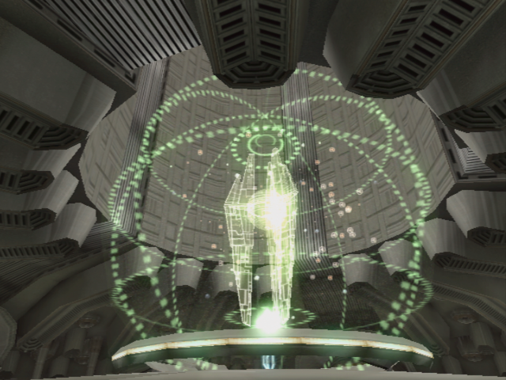

# Star Wars: Knights of the Old Republic - Guide Index

[< Back to the README](../../README.md)

## Setup

1. Modding
2. [Leveling Guide](../../submodules)

## Introduction

1. [Character Creation](./010_CharacterCreation.md)
2. [The Endar Spire](./011_EndarSpire.md)

## Taris

1. [The Upper City](./020_Taris.md)
2. [The Lower City](./021_Taris.md)
3. [Penetrating the Vulkar Base](./022_Taris.md)
4. [Escaping Taris](./023_Taris.md)

## Dantooine

1. [Jedi Training](./030_Dantooine.md)
2. [Trails in the Plains](./031_Dantooine.md)
3. [Side Quests](./032_Dantooine.md)

## Tatooine

1. [Anchorhead City](./040_Tatooine.md)
2. [The Dune Sea](./042_Tatooine.md)
3. [(Intermission) First Stop on Yavin](./049_YavinStation.md)

## Kashyyyk

1. [The Forest](./050_Kashyyyk.md)
1. [Star Map](./052_Kashyyyk.md)

## Manaan

1. [Atho City](./060_Manaan.md)
1. [Sith Base](./062_Manaan.md)

## The Leviathan

1. [Trapped](./070_Leviathan.md)
1. [(Intermission) Third Stop on Yavin](./079_PreKorriban.md)

## Korriban

1. [Sith Academy](./080_Korriban.md)
1. [(Intermission) Last Stop on Yavin](./089_YavinStation.md)

## Unknown World

1. [Cashed](./090_UnknownWorld.md)
1. [Star Forge](./091_StarForge.md)

## Misc

1. [Notes](./XXX_NotesAndThoughts.md)