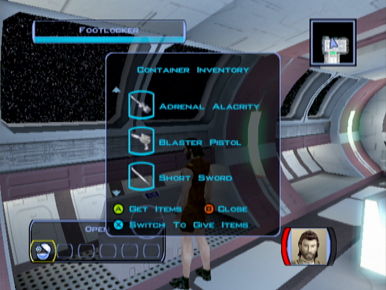

Attack on the Endar Spire
================

img[] { width: 200px; }

## Character Creation

- Create a Scout (a Male has been chosen for this walkthrough)

- Select custom character

## Wake-up

 - Automatic talk with Trask Ulgo  
   - **The Endar Spire? [PC Mouse Left Click.png this answer to select highlighted response.]**
   - Who's Bastila? [PC Mouse Left Click.png this answer to select highlighted response.]
   - Okay, let's go help Bastila!
 - Take the items in the chest behind
 - As a scout you get
   - Cardio Package
   - Adrenal Alacrity
   - Blaster Pistol
   - Short Sword
   - Clothing
   - Medpac (2)
 - Equip what you can (sword)
 
 
 
- Talk to Trask -> Joins
- Take Trask to open the 2 doors
- Kill the two Siths with PC
- Loot the republic soldier in the room if there is something
- Next room : Kill the two Siths + Loot
    - should have a better sword (and armor?)
- Next room : Grenade
- Launch grenade on the Sith in the middle -> 72% chance to kill everyone
- Go toward the Sith -> 2 others should spawn
- Loot everywhere
- Next room : Jedi!
- Kill two Sith + loot
- Loot the Jedi -> Sword improvement!
- Next room: Bridge
- Kill two firsts Sith -> Trask intervention
- Should level up (2)
- Loot everywhere
- Next room Trask sacrifice
- Take Elevator
 

 
## Looking for Carth
- Kill one Sith at the end of the corridor
- Next room : 2 siths -> Loot everywhere !
- Maximizing XP tip
    - Go to the droid -> repair all you can
    - Quickly go to the console -> destroy the power conduit
- Loot all Sith -> get the prototype vibroblade -> the best for a long time
- Next room -> Carth
    - Who are you?
- Take an escape pod

 
  