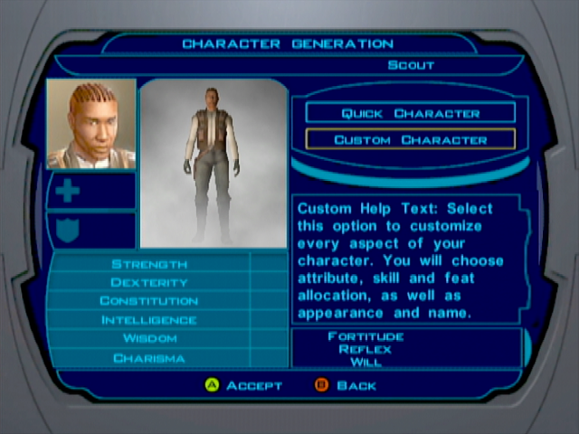
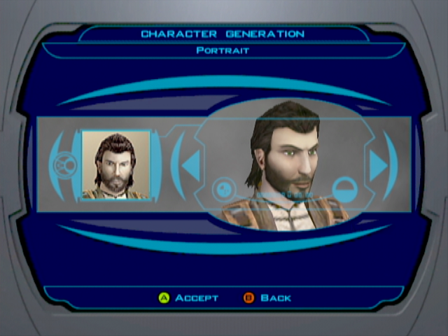
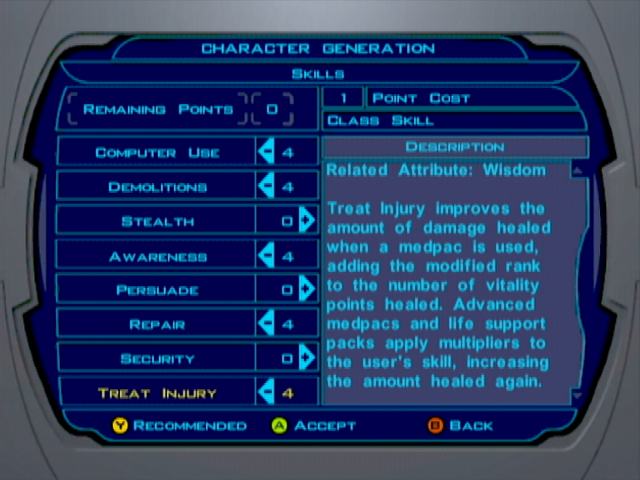

# New Game

[< Previous Page](../index.md) | [Back to the Index](../index.md) | [Next Page >](011_EndarSpire.md)

## Assumptions

This guide is (originally) intended to make a "canon" playthrough of Star Wars - Knights
of the Old Republic. It means that main character you play is a male which will make
light-side (LS) actions to complete the story.

In the future dark-side (DS) choices as well as female character options will be added to
this guide in parallel of the original configuration.  

## Character Creation

When you start a new game, you are invited to go through several setup screen (see bellow)
which ask you to specify few things regarding the character you will play.

If you're not familiar to western-RPGs this kind of specifications might appear quite 
complicated at first sight. Indeed, the character creation is part of heart of western-RPGs
which let you play with as much freedom as possible. So you are thrown into the game with a
bunch of parameters to specify even if you don't know anything about the game mechanics!
Of course, you can always select the minimum of option (automatic) and begin the story right
away, but this guide will try to make you experience a maximum of the embedded content.

The following stats we gonna attribute to the player are binded to the described walkthrough.
You're free to choose other classes/stats but it may drastically change your evolution in the
environments.

> The quality of the screenshots will improve while following this guide... I started writing
> while I did have the proper cables for my XBox to make descent screen captures at the 
> beginning. Be patient ;)

- Create a **Male Scout**

- Select custom character

- This portrait is often considered as the "canon" one.

> Yes, it is possible to mod your game on original XBox! 
> The procedure will be detailed in an appendix at some point...
> TODO: make a guide to explain how to mod the game on XBox.

- Now comes the "stat" part of the character creation
    - If you want to get more info on the meaning of all these variables you can refer to the StrategyWiki page:
    - https://strategywiki.org/wiki/Star_Wars:_Knights_of_the_Old_Republic/Character_generation
- Note that all stats, as well as character level ups are detailed in the submodule: kotor-leveling
    - You can find the repo in the folder `submodules/kotor-leveling/`
    - Or you can go to https://github.com/nadrino/kotor-leveling
    - In those, you will find a corresponding Excel file

- Those attribute points are distributed such as your player character (PC) is versatile enough for all our needs
- In (VERY) short:
    - Strengh: increase the damage you inflict on you enemy while on melee combat.
    - Dexterity: increase the damage you inflict with range weapons, and increase the chance of dodging enemy attacks
    - Constitution: increase your maximum health points
    - Intelligence: increase the number of skill points you have at each level up
    - Wisdom: decrease the amount of force point needed for each power
    - Charisma: increase the persuasion bonus

- Skill point allow you interact with your environement:
    - Computer Use (*)
        - Decrease the number of "computer spikes" (consumable) you need to perform a hacking action
    - Demolition (*)
        - Will allow you to deactivate and recover the mines you will find.
    - Stealth
        - Allow the character to disappear and not be seen by enemies
    - Awareness (*)
        - Ability to spot objects (mines) and hidden enemies
    - Persuade
        - Make "[Persuade]" dialogue options more likely to succeed
    - Repair (*)
        - Decrease the number of "repair parts" (consumable) you need to perform maintenance action on mechanics NPCs
    - Security
        - Ability to open locked chest/doors
    - Treat Injury (*)
        - Increase the number of vitality points you receive when you are healed
- (*) mean the corresponding sill is associated to the class we choose. 
- Then we only need 1 point to increment the skill instead of 2.

- Feats are special abilities/bonus your character will benefit
- We choose "Dueling"

[<< Previous Page](../index.md) | [Next Page >>](011_EndarSpire.md)