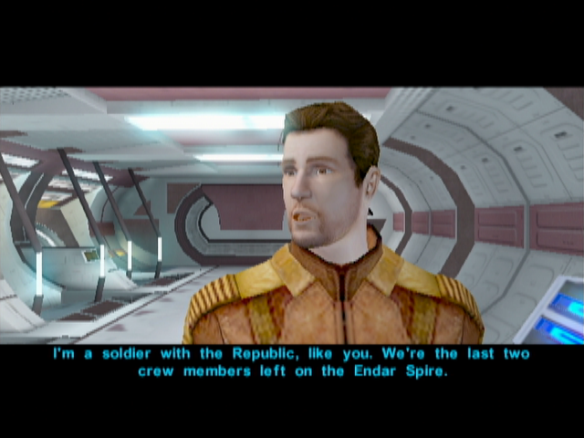

Attack on the Endar Spire
================

[< Previous Page](010_CharacterCreation.md) 
| [Back to the Index](../index.md) 
| [Next Page >](../020_Taris.md)

## Map of the Area

> Here is the map of the area.


> The numbers gives the visiting order of each point on the map: each number will be referenced in this guide as "(X)"
> where X is the tagged number.

## Escaping the Ship

#### (1) Wake-up!

<details>
  <summary>Unfold Test</summary>

Spoiler text. Note that it's important to have a space after the summary tag. You should be able to write any markdown you want inside the `<details>` tag... just make sure you close `<details>` afterward.

  ```javascript
  console.log("I'm a code block!");
  ```

</details>

 - Trask Ulgo is entering your quarter to help you  
   - **The Endar Spire?**
   - Who's Bastila?
   - Okay, let's go help Bastila!
 - Take the items in the chest behind
 - As a scout you get
   - Cardio Package
   - Adrenal Alacrity
   - Blaster Pistol
   - Short Sword
   - Clothing
   - Medpac (2)
 - Equip what you can (sword)
 
 
 
- Talk to Trask -> Joins
- Take Trask to open the 2 doors

#### (2) First fight with Sith soldiers

- Kill the two Siths with PC
- Loot the republic soldier in the room if there is something
- Next room : Kill the two Siths + Loot (3)
    - should have a better sword (and armor?)

#### (4) Learning about grenades

- Next room : Grenade
- Launch grenade on the Sith in the middle -> 72% chance to kill everyone
- Go toward the Sith -> 2 others should spawn
- Loot everywhere

#### (5) Jedi fight

- Next room : Jedi vs Sith!
- Kill two Sith + loot
- Loot the Jedi -> Sword improvement part

> Did you think a 2003 games would give you a light saber already? ;)

#### (6) Bridge of the Endar Spire

- Next room: Bridge
- Kill two firsts Sith -> Trask intervention
- Should level up (2)
- Loot everywhere

#### (7) Misterious Sith attacks you

- Next room: Trask sacrifice

> This dark jedi is Darth Bandon: you will meet him later during the game!

- Take Elevator
 


 
## Looking for Carth

- Kill one Sith at the end of the corridor (8)

#### (9) Control room

- Next room : 2 siths -> Loot everywhere !
- Maximizing XP tip:
    - Go to the droid -> repair all you can
    - Quickly go to the console -> destroy the power conduit
- Loot all Sith -> get the prototype vibroblade -> the best for a long time
- Next room -> Carth (10)
    - Who are you?
- Take an escape pod




[< Previous Page](010_CharacterCreation.md) 
| [Back to the Index](../index.md) 
| [Next Page >](../020_Taris.md)

