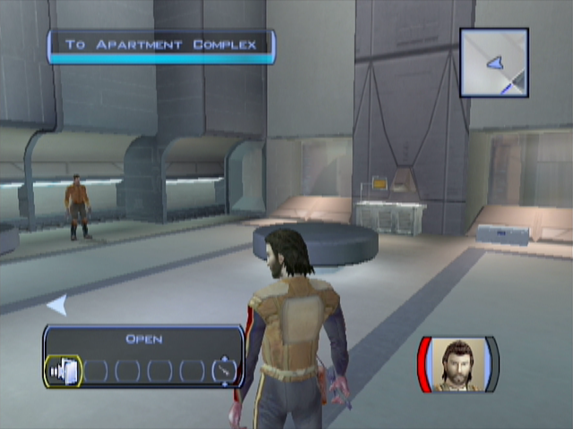
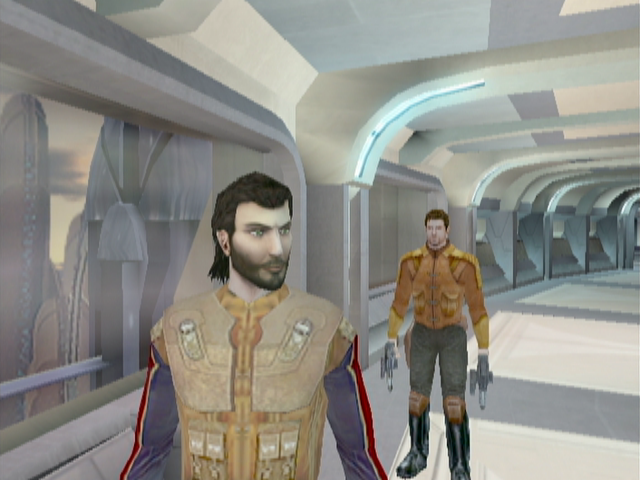
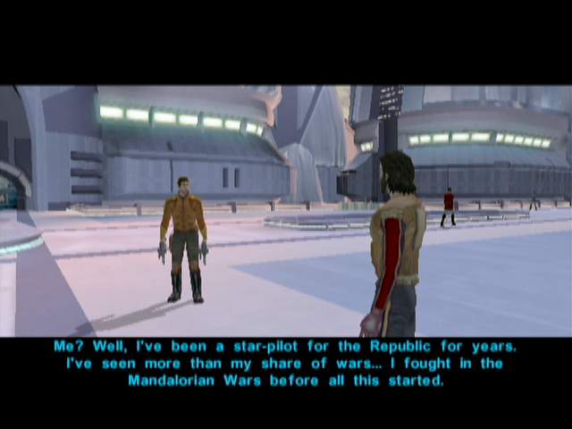
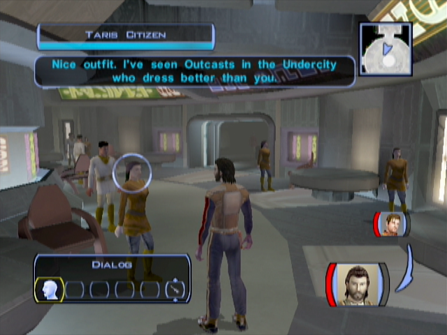
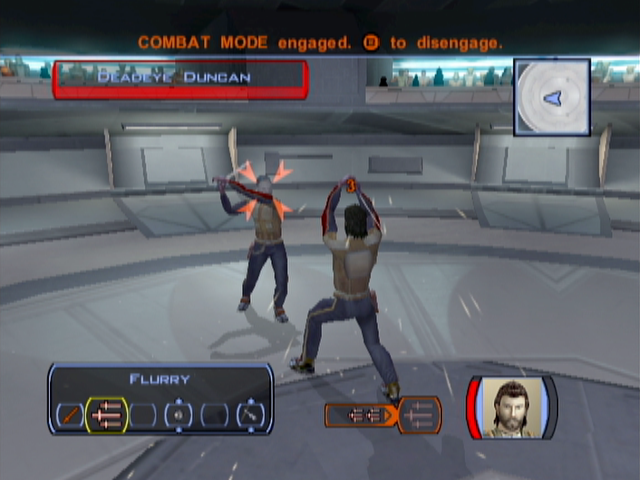
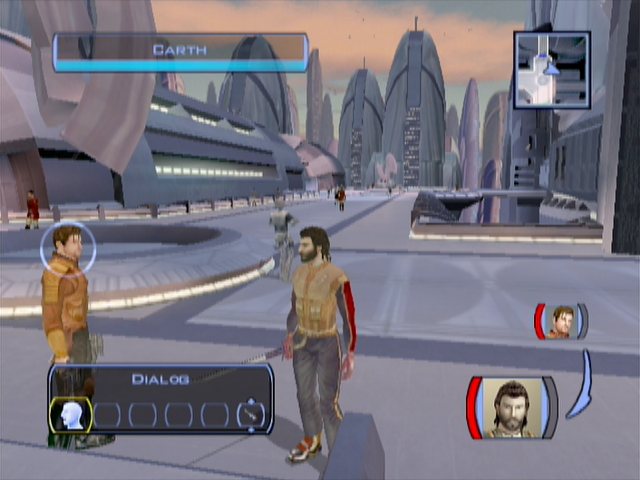
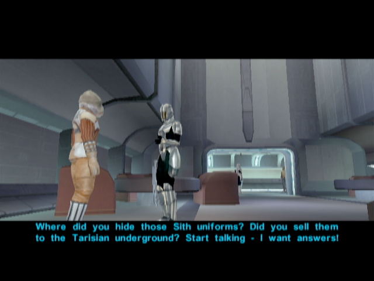
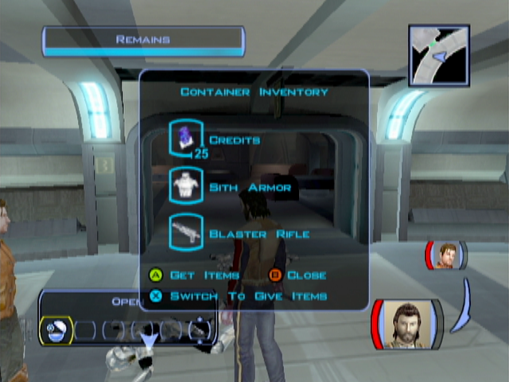
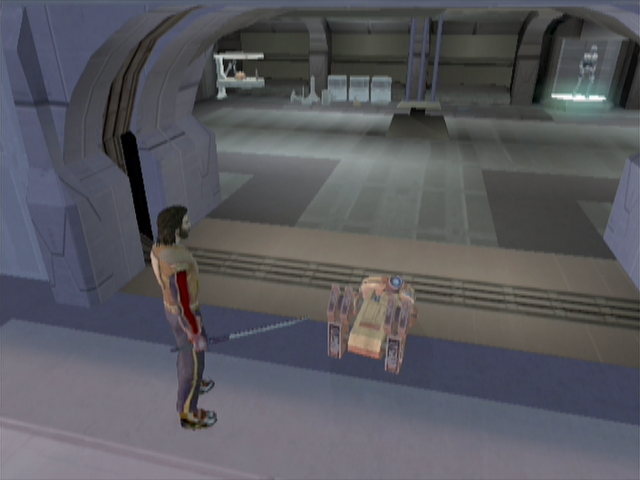
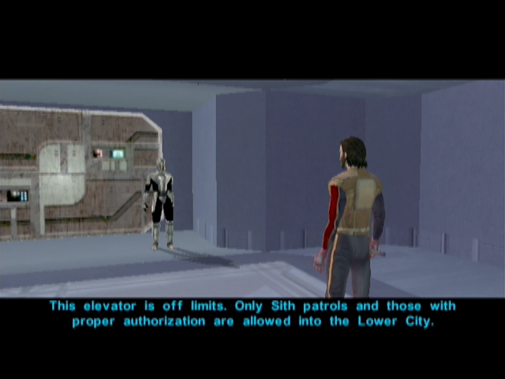

Taris - The Search for Bastila - Exploring the Upper City
=========================================================

[< Previous Page](./011_EndarSpire.md) | [Back to the Index](./000_Index.md) | [Next Page >](./021_Taris.md)

## Upper Taris - Safe Room

- Carth talks to you
    - **I had a strange dream. Like a vision or something.**
    - **I guess I owe you my life. Thanks.**
    - Bastila? She's the one from the Endar Spire, right?
    - How do you even know Bastila's still alive?
    - If Bastila's a Jedi, she can probably look after herself.
    - Battle Meditation? What's that?
    - //So what do you suggest we do next?
    - Any idea where we should start looking for Bastila?
    - I want to ask you some questions.
    - What can you tell me about this planet we're on?
    - What do you know about Malak and the Sith?
    - A Jedi? What do you mean?
    - I would like to ask you something else.
    - I'd like to know some more about you, Carth.
    - The sooner we start looking for Bastila the sooner we find her. Let's go.
- Loot and improve your sword
- Leave the room

## Upper Taris - South Apartments

- Kill the Sith and 2 droids -> You gonna meet the victim again later (XBox -> different voices ??)
  - Won't someone come searching for this patrol?
- Level Up! (3)
- First door on the right -> Loot -> **SAVE** -> Talk to the woman
  - I'm sorry. I was just investigating the area.
  - Holdan? Who's that?
  - What do you mean?
  - //**[Persuade] You can trust me. Maybe I can help.** -> Easy -> Level 3 = 50% (Keep it ? Not necessary -> no XP and not much sense while seeing Holdan later)
  - I want to ask you some questions.
  - I'll be going now.
- Talk to the Twi'lek Larrim
  - Pleased to meet you, Larrim. My name is Name.
  - What's so great about these energy shields?
  - Where did this technology...
  - ... Else?
  - Why do you have a kiosk set up here?
  - You mentioned something about illegal aliens living here.
  - Aren't you worried about getting caught?
  - I want to ask you some questions.
  - Let me see what you've got for sale.
- He has nothing interesting (or too expensive!)
- Loot around and talk to the old man -> tells you about the Cantina and Weapons
    - Sorry, I didn't mean any disrespect.
    - I want to ask you some questions.
    - Where can I get some equipment?
    - I want to ask you something else.
    - Tell me about Taris.
    - Where is the cantina?
    - What do you think of the Sith and this quarantine?
    - I'll be going now.

## Upper City South

- Take-off your weapons (let's be RP!)
- Talk to a Sith / People
- Talk to s Droid
  - What can you tell me about the Sith?
  - Is there some way I can get a shuttle off this planet?
  - Do you know anything about the gangs in the Lower City?
  - How come there are hardly any aliens around?
  - Who do you work for?
  - I don't need anything right now.
- Cross the street, in direction of the Equipment Emporium / Cantina
- **Proposition to talk with Carth (0/12)**
  - I'd like to know some more about you, Carth.
  - You're talking like it's your fault. Like you failed somehow. // or other
  - Them? Do you mean the people of your home world?
  

  
- Go to the Equipment Emporium and talk to Kebla Yurt
  - I want to ask you some questions.
  - I was wondering how you feel about the Sith?
  - I need some general information on Taris.
  - Swoop gangs? What can you tell me about them?
  - What do you know about Davik?
  - Is Davik working with the Sith?
  - Do you know anything about those escape pods that crashed here on Taris?
  - I'll be going now.
- We will discover her inventory later -> she has rather good weapons we gonna need later

## Upper City Cantina

- Go to the cantina talk to the old man (Garouk) an buy the paazaak deck (and make the tutorial)
  - Who are you?
  - You're giving up gambling? Why?
  - I can't afford that.
  - Sure, I'll buy your deck.
  - (I'd like a Pazaak lesson.)
- Talk to the girl (Sarna) on the right (Sith on permission) in the next room on the right.
- If you're a woman, you can talk to a guy in the other room (Yun Genda)
- _DONT try to persuade her. -> new quest -> **Sith party (BUT LESS XP)**_
  - You're from the military base? You don't look like one of the Sith.
  - Nice to meet you...
  - //So why do you do it?
  - You can't really blame people... you did conquer the planet.
  - You seem pretty touchy about this. Maybe you feel a little guilty about what you do.
  - //Sorry – I'm not trying to judge you.
  - //I'm not actually from Taris. I'm just stuck here until the quarantine ends.
  - //Being stuck on Taris isn't so bad... but the locals aren't much fun.
- Talk to other people around

- Go to the bar room
- Gana Lavin : Be rude -> more XP -> guy to kills after the cantina
  - Sorry, I'm not your waiter.
  - **I don't even work here!**
- Go to the Dueling Ring room
- Watch the match, talk to everybody
- Deadeye Duncan
    - Who are you?
    - You're the number five ranked duelist? Out of how many?
    - Dueling chambers?
    - Goodbye.
- Gerlon Two-Fingers
    - I want to ask you some questions.
- Ice
    - Wow – that was cold!
- Marl
    - Do I know you?
    - Tell me more about these duels.
    - I want to ask you about the duelists here.
        - Tell me about Duncan.
        - Tell me about Gerlon.
        - Tell me about Ice.
        - Tell me about yourself.
        - Tell me about Twitch.
        - Tell me about Bendak Starkiller.
    - I want to ask you some questions.
    - I just want some general information on Taris.
    - Do you know anything about the crashed Republic escape pods?
- Do the first match (Talk to Ajuur)
    - What are you talking about?
    - That's a terrible name!
    - I'm ready for a duel.
    - Let's do it.
    - //I just want to ask you some questions.
- Do the 2 firsts matches

    
- Go pazaak with Niklos near the entrance
    - Who are you?
    - Let's play.
- Talk to the girl near the entrance (Christya)
    - 20 credits? That seems expensive for a couple of drinks.
    - Sorry, not interested.
- Talk with Bendak Starkiller
    - Autoprints? What are you talking about?
    - How come you don't hang around with the other duelists?
    - I want to ask you some questions.
    - I'll be going now.
- Leave the Cantina
    

## Exploring Upper Taris

- Go towards your apartment -> you will meet Gana Lavin (the angry rich woman in the cantina) with two body guards. Kill the body guards and loot the swords.
- Follow the street
- Go to the clinic on the right

**_TEMPSAVE_** : Easy Persuade (Level 3 -> 50%)

- Talk to the doctor (Zelka Forn)
    - Medical facility? Is this some kind of hospital?
    - I want to ask you some questions.
    - How do you feel about the Sith?
    - Ask something else
    - I just want some general information about Taris.
    - Tell me about Upper Taris.
    - Tell me about the Lower City.
    - What do you know about Davik?
    - Tell me about the Undercity.
    - Outcasts?
    - Ratgoules disease?
    - Is there no cure?
    - Maybe I could find a way to get my hands on that serum for you.
    - Don't worry, Zelka – I'll get that serum for you!
    - **Do you know anything about the Republic escape pods that crashed in the Undercity?**
    - You seem awfully defensive about this.
    - **[Persuade] Don't worry, I'm not with the Sith. I won't betray your secret if you tell me.** (EASY - 50%)
    - **Is there anything I can do to help?** (LSP +2)
- Leave the medical facility: Gurney intervenes
    - An offer? What are you talking about?
    - Davik Kang? Who's that?
    - You mean Davik's a crime lord?
    - Why does Davik want the cure so badly?
    - Where can I find Davik if I want to give him the cure?
    - Why do you care who gets the cure?
    - What if I tell Zelka you're helping Davik get the cure?
    - I'll keep your offer in mind.
- Go near the entrance of the North street
- Bounty Hunters racketeering a Merchant
    - **Leave this man alone or you'll have to deal with me!** (LSP +2)
- Kill
    - Maybe I can help you.
    - **Here's 100 credits. Take them.** (LSP +2)
- Loop (50c on each corpse)

## Upper City North
 
- Cross the street and go to the North Apartments
- Begin on the left (it's a circle)
- Loot everywhere
- 3 Sith are arresting a guy
    - What's going on in there?
    - **Stop the interrogation right now!**
    - **I won't let you kill a defenceless prisoner!** (LSP +2)

- Kill them and talk to the Alien Prisoner
    - The Hidden Beks? Who are they?
    - What are the Hidden Beks planning?
    - Can you take me to Gadon?
    - Can I get one of those uniforms from you?
    - I should be going now.
- Loot the Sith corpse -> take the uniforms

- Go to Largo's Apartment
    - Don't worry – I'm not going to hurt you.
    - I'm just looking around. 
    - -> come back later for the bounty -> 200c again -> need the money at the moment
- Continue the north street **TEMPSAVE** 
- 3 guys -> agress them ? NO -> PCO but 150 XP instead of 60 (+90XP, is it necessary ?) and loot
    - **[Persuade] Hey, guys, we can all be friends here. Let me buy you a drink.** (LSP +2)
- Talk to the racist man (Gorton Colu)
    - Vermin and scum? What are you talking about?
    - I see... well, good luck in your crusade.
- On the left: the Droid store
- Talk to Janice
    - What do they have against Twi'leks?
    - Utility droids? What do they do?
    - Let me see your droids.
    - **Tell me about that top-of-the-line T3-M4 droid.**
    - I'll take the T3-H8 unit. Here's 50 credits.
- Leave the shop
- The droid blow up

    
- Go back in the shop
    - It blew up. I came to get my money back.
    - No hard feelings.
    - Let me see what you've got for sale.
    - Let me see your inventory.
- _She has parts and spikes, we gonna need some latter_
- Go to the elevator
- Sith talks with you
    - Can I ask you some questions? (other choices does not make sense)

[< Previous Page](./011_EndarSpire.md) | [Back to the Index](./000_Index.md) | [Next Page >](./021_Taris.md)

