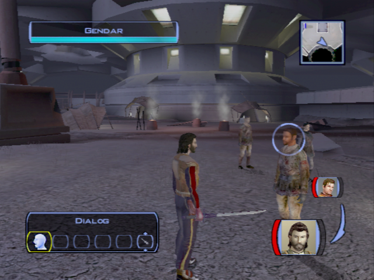
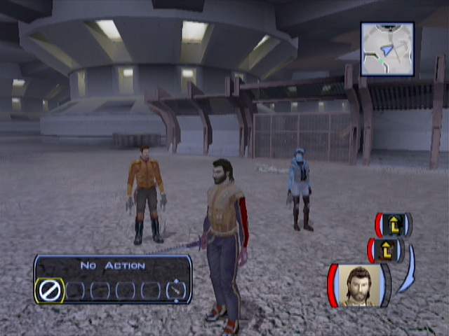
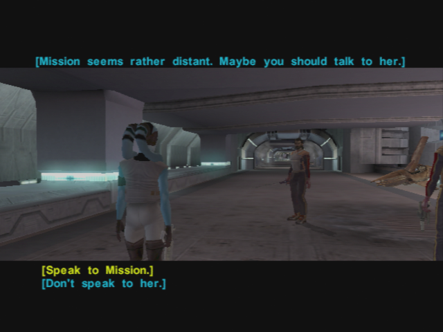

The Search for Bastila - The Lower City
=======================================

- (Visit the military base door)
- Go back home
- **Talk to Carth (1/12)**
    - Is this a good time to ask you some more questions?
    - I just would like to know you better.
    - This isn't an interrogation. I never said that.
    - Like you said when we first met: Bastila didn't have time to use her powers.
    - I'm a scout. I was recruited into the fleet for my skills, if you must know.
    - **You'd rather I wasn't?**
    - Are you implying *I* had something to do with the crash?
    - Why would Bastila request my transfer?
    - I'm telling you, Carth, I had nothing to do with the crash.
    - Are you always this suspicious?
    - I consider this important.
- Equip you (not carth, conversation with the sith will not make sense) with the Sith armor

- Go back to the elevator with the uniform (by foot ! -> funny talks)
- _(Don't talk to everybody since Carth is with you... -> Does not make much sense)_
- Talk to a Sith
- North street near the swoop bikes: meet the drunk men again!

- Talk to the racist guy!
**_SAVE_**
- Take the Elevator

## Lower Taris

- Gangs are fighting in the streets

- _Take back your melee weapon! (your PC sucks with guns!!)_
- Kill guys on the left (Use PC to tank, and Carth to shoot)
- Kill the other on the right near the Vulkar base door (WARNING : they are though -> launch grenade + all fire poser on one)
- Go first at the Cantina -> Get rejected with the uniform
    - I'm not on duty right now.
- Go to the hidden beck base (next door) -> Get rejected with the uniform
- Continue and kill the Vulkars
- Level Up! (4)
- Loot and **remove your Sith uniform**
- Continue your path until you meet Canderous

- Go back to the Cantina
- _don't buy pazaak ? 200 c +/-1 ? +/-6 cheaper ->50 ? -> save 6 to check_ -> NO, expansive
- Gelrood -> Infinite pazaak -> not a lot of money each time
    - Why were you banned?
    - I want to ask you some questions.
    - I'll be going now.
- Meet Calo Nord

- Talk to him before he leaves
    - I saw how you mopped those Black Vulkars. Nice work.
    - I'm not looking for a fight. I just want to talk.
    - Okay, I see your point. I'll be off then.
- Go see Holdan in the music room -> wait for force persuade with Bastila to pull off Dia's bounty (+4PCL 125XP instead of 50+105?)
    - Who are you?
    - You work for Davik?
    - You're pretty open about what you do.
    - Do you think Davik could get me off Taris?
    - I'll be going now.
- Discover Mission and Zaalbar -> talk to her -> +60 XP!
    - That's weird: a Twi'lek who speaks galactic Basic!
    - How do a Wookiee and a Twi'lek street urchin end up as best friends?
    - I want to ask you some questions.
    - Tell me about Davik.
    - Tell me about the Lower City gangs.
    - Why did Brejik leave the Hidden Beks?
    - Tell me about Calo Nord.
    - I'll be going now.
    

    
- Go to the Bounty office

**_TEMPSAVE_**

- Dancing Girl (Starlight Entertainers) -> Don't FALL or reload save
    - What are you talking about?
    - Why don't you have a partner?
    - Maybe I could be your partner.	
    - **[Persuade] I'm good enough to get you through your audition.** or **[Persuade] What other choice do you have?** (EASY 75%)
    - [Join Lyn by dancing beside her.]
    - [Join Lyn by dancing close beside her.]
    - [Join Lyn by dancing very close and face to face.] -> HARD -> not necessary, can use easier
- Talk to Zax -> don't pay for infos
    - You work for Davik?
    - Davik posts bounties in a government office? Is that even legal?
    - Tell me about the bounties.
    - How do I collect the credits for these contracts?
    - I want more details on the bounties you're offering.
    - Tell me about this girl Dia.
    - Tell me about Bendak Starkiller.
    - Tell me about the merchant Largo.
    - Tell me about the assassin Selven.
        - Did they ever found out...
    - Tell me about Matrik.
        - Didn't the ...
    - Something else...
    - I need some information.
    - I'm not going to pay just to ask you some questions.
- Talk to the other clients
- Leave the Cantina
- Go to the Hidden Bek base
    - I need Gadon's help...
    - May be I could be an ally...
- Talk to Gadon Thek
    - You have problems with the Sith?
    - I need information on those Republic escape pods that crashed in the Undercity.
    - Don't worry… I'm not working for the Sith.
    - Bastila's a slave? What will happen to her now?
    - Swoop race? What does that have to do with it?
    - But I don't even have a swoop bike.
    - How do I know I can trust you?
    - How am I supposed to get inside the Vulkar base?
    - Where can I find Mission?
    - I got past the Upper City guard no problem.
    - What do you want with the Sith uniforms?
    - Okay - I'll trade the uniforms for the papers.
    - I'll be back when I get the prototype accelerator.

- Visit the area / Loot

**SAVE**

- (Deprecated) Kill respawned Vulkars and go back home to talk with Carth
    - +100 XP but that's OK to miss it
    -  

## Undercity

- Take the elevator with the Sith papers towards the Undercity
- Challengend by two Outcast Beggars
	- Who are you? What are you doing here in the Undercity?
	- **You poor wretches. Here's 20 credits to buy some food and clothing.** (LSP +2)
- Shaleena arrives
	- My name's Name. Who are you?
	- The surface is a beautiful place.
	- Rukil? Who's that?
	- The Promised Land? What's that?
	-  I want to ask you some questions.
	- Tell me about this village.
	- Do you know anything about the escape pods that crashed into the Undercity?
	- Have any other up-worlders come through here recently?
	- Where can I find Gendar?
- Talk with the doctor
	- Who are you?
	- Danger and suffering? What are you talking about?
	- There must be something someone can do!
	- Goodbye.
- Gendar
	- Who are you people? Why do you live here in the Undercity?
	- What a horrible way to live!
    - Rukil?
	- Tell me about the rakghouls that live down here.
	- I want to ask you some questions.
	- I'm looking for a Twi'lek named Mission Vao.
	- How can I get to the sewers?
	- ...
	- You said something about other up-worlders who came by here recently?
	- I think I'll be going now.
	

	
- Rukil -> learn about Malya her apprentice
    - Uh... okay, then. Could I ask you some questions?
    - I'm Name. What do you want from me, Rukil?
    - **The true path? What does that mean?**
    - Prove myself? How can I do that?
    - I will help you with this, Rukil.
    - I'll be back if I find anything out.
- Meet Igear -> merchant -> good seller but not rebuyer
    - How do you manage to run a store here in the Undercity?
    - I want to ask you some questions.
    - Why doesn't Gendar like you?
    - That's why Gendar's mad at you? There has to be more to it than that!
    - I'll be going now.
- Go to the gate -> save the guy -> go back to talk
    - Open the gate... I will kill the rakghouls.
- Talk again to the people
- Go away from the camp
- Mission runs towards you
    - Whoaa...
    - Calm down, Mission. Take a deep breath and tell me what happened.
    - Do you know where they took him?
    - Why don't you ask Gadon and the Beks to help you?
    - If I help you get Zaalbar back you have to get me inside the Vulkar base.
    - **[MISSION has joined your party.]**

- Level up Mission (and Carth (5) ? -> XBox)
- Equip her with the Sith Rifle
- Pick up the mines with Mission
- first go see the republic soldier

- go left from the camp, meet canderous
    - **Are you threatening me?**
- kill the ratgoules -> grenade !
    - What do you mean by that?
    - What can you tell me about Davik?
    - What do you know about the Lower City gangs?
    - I better get going now.
- find the apprentice journal

- go right -> talk with sith
    - Look... I have got all the proper security papers.
    - You said you lost one patrol already?
    - I should be going now.
- kill ratgoules until sewers
    - Get the serum
    - Get the gun improvement
    - Get the armor (equip)
- **Banter** comming back (save-load?) Carth / Mission
    - Settle down! Both of you

    
- Go back to igear -> buy him improvement for weapons
    - Scope
    - Vibration Cell
- go back to rukil
    - Your apprentice is dead. I have her journal.
    - Guide you? But I don't even know where the Promised Land is!
    - Very well – tell me the history of your people.
    - Is that how you came to be down here?
    - How can I lead you this Promised Land when I don't even know what it is?
    - **And you want me to find these missing journals?**
    - **Don't worry, Rukil. I'll find those journals.**
+175 XP (level 5)
- Go back home (by foot)
- Talk to Mission -> Proposition in the lower city (near the Undercity elevator)

	- I want to know a little more about you, Mission.
	- How did you and Zaalbar hook up?
	- Who'd want to pick a fight with a Wookiee?
	- You're lucky he didn't fry you with a blaster.
	-  Did Zaalbar kill them?
	- How did Zaalbar end up on Taris?
	-  How did you survive before you met Zaalbar?
	- We should get back to the task at hand.
	- I didn't know you had a brother.
- **Kill the respawned Vulkar in Lower City near the Upper City elevator**
- Go back to your apartment in the Upper City (fast travel)
- **Talk to Carth (2/12)**
    - I want to discuss something with you.
    - We didn't finish our conversation last time.
    - Why are you so hostile? What did I do to deserve this?
    - Of course it won't happen again if you never trust anyone!
    - **Right. And how am I supposed to know that *you* won't betray us?**
    - Why not you? Accusing other people is a good cover for a traitor.
    - Ahhh… so you don't trust yourself, is that it?
    - You sure you don't want to talk about it?
- Go back to the Lower City by foot -> new speach with the Sith

**12 parts needed -> got 10, 2 found in the sewers**

## Sewers

- Go to the sewers: 4-5 respawned ratgoules in the way

**SAVE BEFORE ENTERING**

- Kill the 3 gamorreans, loot
- Follow the corridor
- On the left kill the ratgoules and find the 2nd journal for Rukil
- Next, roundabout: kill the 4 gamorreans

- Go to the door on the right first -> 2 mines -> field door -> Vulkar base entrance
- Computer
    - Leave the computer. (don't spend a spike)
    - _That energy shield leads to another section of the sewers. The entrance to the Vulkar base is somewhere past there. I've got the codes to lower the shield, but we have to rescue Zaalbar from those Gamorrean slavers. Don't worry – we can come back after we find Big Z._
- Go back to the fountains room
- Go to the door on the right (Careful; 1 gamorrean)
- Next Ratgoules room
- Start by the doors on the left
- 2nd left door -> mine
- Roundabout -> kill the ratgoules
- Still explore doors on the left first
- 2nd door -> corridor -> right -> see Zaalbar
- Next room, kill ratgoules, take the mine and go two rooms backwards (spinning wheel)
- Take the other door (left)
- Kill the gamorrean in the corridor
- Door on the right -> last journal for Rukil
- Repair the droid (12 repair parts)
Missions levels up (5)
- Let the droid do the job

- Loot the belt
- Save Zaalbar
    - Good to meet you Zaalbar. I'm Name.
    - It's some kind of loyalty vow, isn't it?
    - I'm honoured to accept your vow.
    - I'm glad to have you on board, Mission.
    - Whoa – nobody said anything about a rancor monster!
    - That's not really an option. Let's go.
- Zaalbar joins

- Take Mission and Zaalbar with you
- Level up Zaalbar (5) -> Equip 2 swords -> Previously upgraded Mission vibroblade
- Take Zaalbar belongings in the locked chest in the next room
- Equip Mission with the bowcaster
- Unlock the back door
- **Banther Mission with Zaalbar (1/2)**
- Follow the previous corridor
- Open the door on the right ? -> Yes -> but go back to the other door
- Take the mine
- Trigger -> 4 ratgoules will spawn
- Take the ladder

14380 XP on the XBox version (620XP needed for level 6)

