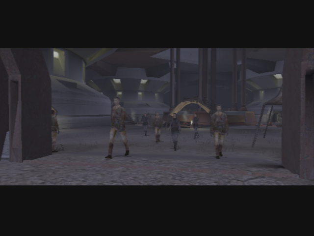

The Search for Bastila - Penetrating the Vulkar base 
====================================================

[< Previous Page](./021_Taris.md) | [Back to the Index](./000_Index.md) | [Next Page >](./023_Taris.md)

## Back in Upper Taris

### Igear's deal

- Go back to the camp
- **Don't speak now to Rukil!!** -> finish the quest "Infected Outcasts" first!
- Igear's will ask you to give him the journals while you cross the camp
    - Why are you telling me this?
    - That's horrible! How can you be so self-centered?
    - Forget it! I won't betray Rukil and the village for you.
    - I'll be going now.

### Lower Apartements 1

**SAVE**    

- Go to apartments on the right while going back towards the upper city
- Meet Calo again
- Go on the left first
- First Apartment:
    - 2 guys -> kill them
    - solo mode -> hide Zaalbar and PC in the left corner
    - Mission invisible -> put two mines in the corridor
    - Put Mission at the back of the room
    - Release camouflage
    - Wait for the 3 guys walking
    - Kill the rest of them
    - Get the mine on the closet and loot
    - Equip combat suit on Mission

- Continue the corridor on the left
- Kill the 2 Vulkars
- Open the next door's room
- 2 Vulkars -> Level Up ! (6)
- Loot, go near the next door
- Before entering, kill the 2 guys in the corridor
- Enter the room
- Puzzle! Password to open the chest
    - First get the mine
    - Hyperspace, Uncle, Alderane
    - 110 XP + Good armor
- Save before the next door
- Selven's apartment
    - Who are you?
    - I was just exploring. I didn't know anyone was in here.  
- Enters anyway -> kill her

- Equip neural band (the belt will be useful for Carth)
- Kill the last Vulkar in the next room
- Leave

- Go to the Cantina
- **SAVE**
- Talk to Zax -> **level 6 needed for persuade**
- Transit back to the safe house

### Back to the apartments

- Talk w/ Mission
	- I want to talk to you about your brother.
	- **Embarassing? Why?**
	- You were stowaways?
	- He's family. You have to stick by your family.
	- Pretty handy skills to have, Mission.
	- Why did he leave?
	- Who's Lena?
- **Talk to Carth (3/12)**
    - I just want to talk with you.
    - I just want to know why you distrust me so much.
    - But we have to work together, Carth, so it has plenty to do with me.
    - I suppose you can't. That must have been hard to take.
    - You say that with such… hatred.
- Improve scope for mission + armor

- Go out with Carth and Mission
- Level up Carth
- Go to the ring and kill Ice +300c
- kill the old man (at begin of combat, pause and use all injections) +400c

- Talk to him after (he leaves)
- kill twitch (he is weaker with a sword) +500c -> LEVEL 6 ??
- see bendak
    - You're On Bendak
- then go to kebla yurt store and buy Echani Ritual Brand (non improvable)
- kill bendak (hard, injections + meds)

**SAVE**

- get credits + ask for more ->900c + bendac blaster 
- Equip carth and improve it at the safe house
- Take Mission and Zaalbar
- Banther Zaalbar and Mission before arriving at the clinic
    - Zaalbar looks fine to me.
- Give the Serum
    - I have the serum to cure the Rakghoul disease.
    - Here you go. **+4 LSP**
    - Keep your reward, Zelka. You need it more than I do. **+2 LSP**
- Rebuy the serum

- Save Ithorian -> NOT NOW
- Talk to racist guy
- **4 Spikes + 27 Parts** will be used after
- _buy maximum of repair parts ??_ -> Only 4 on XBox at this point? -> (8+8+11 = 27) or at least 24 (8 instead of 11)
- _I could buy 16 parts with all my money (no selling)_ -> 1 more needed... -> sell to have at least 21 ?
- Go to the lower city candina -> SAVE
- See Zax for Bendak -> PERSUADE
- Go back to the undercity

### Back to the Camp

- Save the sick Outcasts -> kill the newly transformed ones
    - Don't worry – I'm here to help you.
    - I have brought you a serum to cure the rakghoul disease.
    - Here, take this rakghoul serum. I have enough for both of you. **+2 LSP**
- +210XP
- Talk to Gendar -> congratulates
- Talk to Rukil
    - I have all three journals. Here – take them. **+6 LSP**
    - **Maybe I should come with you. I could help you on the journey.**
- Go back to the Sewers (go on the right -> few ratgouls to kill)

## The Upper Sewers

- Few ratgoules have respawn in the Sewers -> kill them
- Go to the computer -> Mission opens the field
- Enter the "upper" sewers

- Kill the gamorreans fast ? -> otherwise no XP ?
- Go on the right -> loot around ladder
- kill in the corridor
- Level up Zaalbar and Mission (6)
- Next room -> Droid + Mine (Be Carefull!!)

- Door on the left -> 3 gamorreans
- Next door -> grab the mine
- Armed -> Journal -> Here is the Rancor
    - Hide Mission 
    - Go to the pile of bones
    - Loot
    - Switch to give -> put the frag grenade first -> then odor

- Nothing to loot
- Kill the two Vulkars at the entrance of the base

**SAVE**

## Entering the Vulkar base

- kill the droid on the right (first corridor)
- First, take the door in front of the one you just took to kill the droid
- Kill another droid in the corridor
- Kill everybody in the main area
- Loot the armory -> a lot of good stuff
- Go to the console -> see all cameras
- kill vulkars with spikes -> still you get the XP of the killed guys -> LEVEL UP ? -> COOL FOR REPAIR
- **1 spike to login + 3 spikes to kill**
- Level Up! (7)

- Talk to black Vulkar in the control room
    - What are you talking about? You're a Vulkar, aren't you?
    - If you hate Brejik so much, why don’t you leave the gang?
    - You better give me some information if you want to live.
    - Where can I find the prototype swoop engine accelerator?
    - Where can I get a pass card?
    - Is there some way to disable the security cannons?
    - I want to ask you something else.
    - I'm looking for a prisoner. A woman named Bastila.
    - I'm going to let you live. Go on, get out of here!
- kill the last vulkar in the bedroom, take the pass card
- Go in the pool in solo mode
    - DONT use repair parts on the droid on the pool
    - no XP (bug : even if you don't have enough repair parts -> success)
    - Take Zaalbar instead to go in the pool
- Go back near the entrance (back door)
- First door on the left (next to the back door one)
- Sentry droid to repair **(8 parts - @ level 7 - 12 repair skill)** -> 16 left on XBox
- Open the door in front of the one you took
- Kill everybody with the help of the droid
- Next door -> wait for the droid to come

- Talk to the Waitress in the bar
    - How did you end up here in the Vulkar base?
    - Don't worry, I just want to ask you a few questions.
    - Where can I find the prototype swoop engine accelerator?
    - I'm looking for a prisoner. A woman named Bastila.
    - If I let you go can you find your way out of here?
    - Hurry, then – get out of here. **+2 LSP**
- Open the last door -> Get the mine with mission -> Loot
- Go to the computer at the end of the corridor
    - Insert Pass Card
    
**SAVE**
    

## Enter the Garage

- Take the Elevator
- Solo Mode On
    - Take Zaalbar and Mission to kill the droid near the big garage door
    - Take PC to repair the most far droid (**8 parts**) -> not too quickly -> need the right timing
    - Kill the guys on the right corridor with PC and the droid
    - Kill the 2 other guys in the other corridor with Z and mission
    - Send Z near PC if needed
    - **QUICKLY** Mission -> take the mines before the repaired droid arrives
    - Careful -> Vulkars on the left -> wait for the crew to gather

- End solo mode
- Kill the Vulkars on the left door (already opened)
- Try to open the other door -> Locked!
- On the other side: repair bikes rooms -> Kill
- Improve items at the workbench

- Go back to other corridor
- First door -> 2 Vulkars -> 1 footlocker
- Next room -> loot everywhere
- At the console **(1 spike to login)**
    - Blow the bikes **(2 spikes + 140XP)**
    - Open door **(1 spike + 105XP)**
- Go back to the previously locked door
- Meet the leader
    - Enough yapping! Hand over that accelerator.
    - You've got my attention. What's your offer?
    - You were about to tell me your offer, Kandon.
    - I thought she was being offered up as the prize in the swoop race.
    - Just give me the girl now or we have no deal.
    - Forget it. I want Bastila up front or no deal!
    

    
- kill them all -> loot -> equip new stuff
- Go back to the entrance of the garage -> droid to repair - TEMPSAVE
    - Got 10 parts left
    - Improve all you can, and put it in patrol mode **8 parts** (+455XP)
    - If you want to make some more XP, program it to blow up the doo (+595XP)
        - But kind of useless, you will reach the lvl 9 just before leaving Taris
        - After that, you will be granted with a "free" level
- Kill the guard droid with the help of the droid you repaired

- Loot the locked chest 
    - 2000c + 4parts or 4spikes
- Go out to lower city and go to your apartment

## Preparing for the Race

- Improve Carth Blasters
- **Talk with Carth (4/12)**
    - I want to continue our discussion from before.
    - Don't you think you'd feel better if you discussed it?
    - That name sounds familiar.
    - **How could you have not seen through that?**
    - Do you really believe that?
    - **I'd do the same thing in your shoes.**
- Go back to the lower city with Carth and Mission
- Level Up Carth (7)
- **Buy enough repair parts (8 needed)**
- Go to the last lower city apartments -> in front of the elevator door
    - Start on the left
    - Repair the droid
    - Open the door -> kill one Vulkar
    - Loot, next door -> kill 4 Vulkars
    - Loot, next -> again
    - Mission levels up (7)
    - Next door -> Musicians -> Twisted Rancor
        - Activate Elinda first.
    	- Activate Ujaa second.
    	- Activate Ujii third.
    	- Activate Loopa fourth.
    	- Activate Fodo fifth.
    	- Activate Ashana sixth.
    - Equip Carth with the Echani armor
    - Next door (be careful to 3 Vulkar walking in the corridor)
    - Bounty Quest : Permacrete Detonator
        - What are you doing in here? This place looks abandoned!
        - [Persuade] Are you in some sort of trouble? Do you want to talk about it? (Easy)
        - Maybe there's some way I could help you out if this mess.
        - Maybe you could fake your own death?
        - Tell me your plan and I might help you out.
        - I could get you a permacrete detonator.
        

        
- Go to the Swoop race -> Hidden Bek base
    - I have the accelerator right here.
    - Okay, I lived up to my end of the deal. Now you better come through!
    - Zaerdra's right, Gadon. One of your own riders should get that swoop bike.
    - Sounds like you've got all your bases covered.
    - Suddenly I'm not so sure about this.
    - Okay, I'm ready for the race.

## Swoop Platform

- Talk to everyone
- See bastilla

- Do the race two times

- Brejik will interfere
    - You better not be trying to cheat me, Brejik!
- Kill all Vulkars and then Brejik
- Level up (8)
- Loot Brejik -> Light Saber and belt, gloves
- Talk w/ Bastilla
	- **It's a long story.**
	- I've got somewhere safe to go. I was planning to take you there after I saved you from Brejik.
	- **I think you've got things confused. You were a helpless prisoner until I came along.**
	- **Hey, who said you were in charge here?**
	- Carth and I are already working on a plan to get off Taris. (or other... -> but this one is logic with next)
- You have this strange dream again...

[< Previous Page](./021_Taris.md) | [Back to the Index](./000_Index.md) | [Next Page >](./023_Taris.md)

