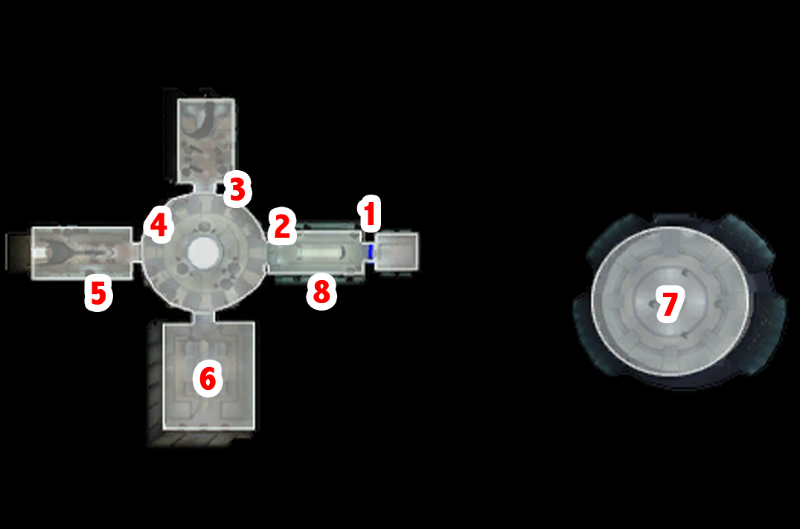
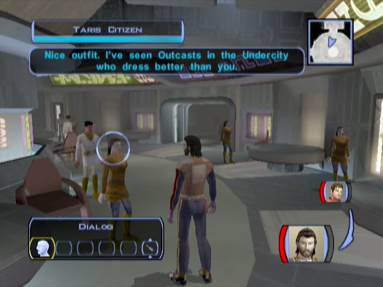
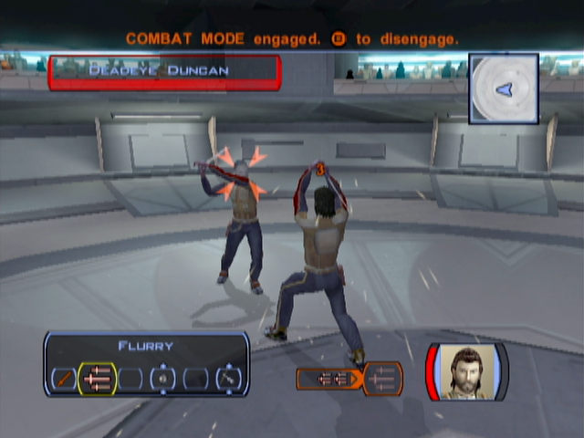

Taris - Embracing the Local Culture
====================================================

[< Previous Page](./021_Taris.md) | [Back to the Index](./000_Index.md) | [Next Page >](./023_Taris.md)

## The Upper City Cantina

### Have a look around

> This area is full of NPCs: a very impressive feature for a 2003 XBox game!

#### (2) Talk to the old man (Garouk)

- Buy him his Pazaak deck (and make the tutorial if you wish)
  - Who are you?
  - You're giving up gambling? Why?
  - I can't afford that.
  - Sure, I'll buy your deck.
  - (I'd like a Pazaak lesson.)

> Pazaak is a gambling game. It is a simplified version of the Black-jack. This mini-game
> will be useful if we want to make a bit more money during our walkthrough. However
> the amount of money to can get by playing this game is quite small. In this walkthrough
> the Pazaak games are done to unlock dialogs (mostly when your opponnent is outraged of
> your constant winning...) or get extra equipment.

#### (3) A peaceful chat with a Sith on leave

- If you are a man, you can talk with a woman (Sarna) in the central room
- If you're a woman, you can talk to a guy in the other room (Yun Genda)
  
> Here we have the possibility to seduce her (or him) in order to get invited to a
> Sith party. In this guide we won't use this strategy since need to maximize the
> collection of XP at the beginning of the game. So we won't try to persuade her(him).

- Conversation with the Sith (TODO: check this dialog)
  - You're from the military base? You don't look like one of the Sith.
  - Nice to meet you, Sarna/Yun. I'm Name.
  - //So why do you do it?
  - You can't really blame people... you did conquer the planet.
  - You seem pretty touchy about this. Maybe you feel a little guilty about what you do.

#### (4) Talk to people around

> It is interesting to note that people attending this cantina are mostly from the 
> Tarisian high _bourgeoisie_ (meaning people who are behaving like rich people, in
> other words they consider themselves as the _elite_ of the society). 
> 
> This is getting obvious as they are making comments on the way you are dressed, the
> way they express their contempt for people living in the slums, or how they tend to
> accept the new authority in charge (in which they hope will serve their interest).
> 
> Note that some voice actors have a british accent ;). Not being a native american,
> it's interesting to see how they describe an elite social class!

#### (5) Enter the bar room

- Bump into a young _bourgeoise_: Gana Lavin
  - Sorry, I'm not your waiter.
  - **I don't even work here!**

> Here we choose to be rude since it will allow us to get more XP.

#### (6) Enter the dueling room

- As you enter, a cinematic is triggering: you watch the fight
- Let's talk to the fighters
- **Deadeye Duncan** (the dumb one) - Fighter #1
  - Who are you?
  - You're the number five ranked duelist? Out of how many?
  - Dueling chambers?
  - Goodbye.
- **Gerlon Two-Fingers** (the war veteran) - Fighter #2
  - I want to ask you some questions.
- **Ice** (the young bold woman) - Fighter #3
  - Wow – that was cold!
- **Marl** (the wise man) - Fighter #4
  - Do I know you?
  - Tell me more about these duels.
  - I want to ask you about the duelists here.
    - Tell me about Duncan.
    - Tell me about Gerlon.
    - Tell me about Ice.
    - Tell me about yourself.
    - Tell me about Twitch.
    - Tell me about Bendak Starkiller.
  - I want to ask you some questions.
  - I just want some general information on Taris.
  - Do you know anything about the crashed Republic escape pods?
- **Twitch** (the crazy Rodian) - Fighter #5

**SAVE**

- Talk to Ajuur - Do the fist match against Deadeye Duncan (easy)
  - What are you talking about?
  - That's a terrible name!
  - I'm ready for a duel.
  - Let's do it.

- Talk to Ajuur - Do the second match against Gerlon Two-Fingers (easy)
- We gonna challenge the other fighters a bit later (level up will be welcome...)

#### (8) Play Pazaak with Niklos

> Before playing any match of Pazaak, remember to save in case you loose ;)...

- Talk to him - Win 5 matches in a row
  - Who are you?
  - Let's play.
- Talk to the woman near the entrance (Christya)
  - 20 credits? That seems expensive for a couple of drinks.
  - Sorry, not interested.

#### (1) Meet Bendak Starkiller

- Talk with a yellow armored mandalorian on the left of the entrance door
  - Autoprints? What are you talking about?
  - How come you don't hang around with the other duelists?
  - I want to ask you some questions.
  - I'll be going now.
- It's time to leave the Cantina

[< Previous Page](./021_Taris.md) | [Back to the Index](./000_Index.md) | [Next Page >](./023_Taris.md)

