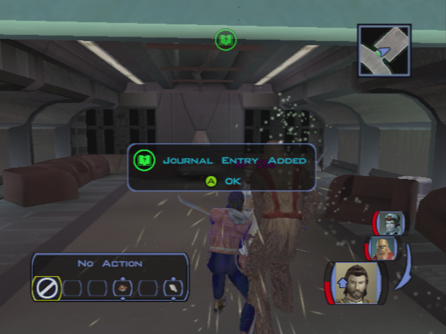
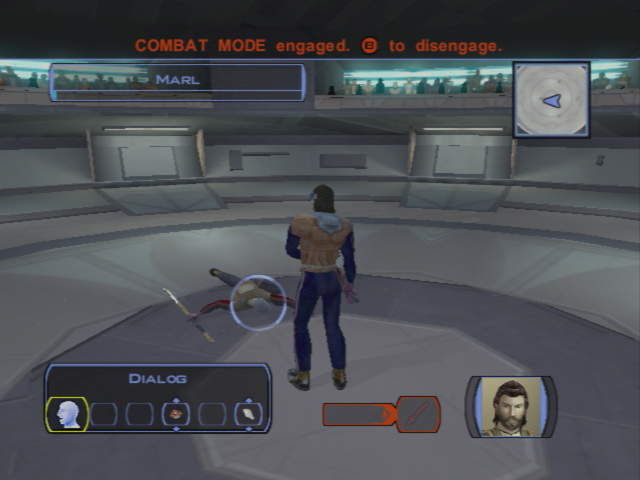
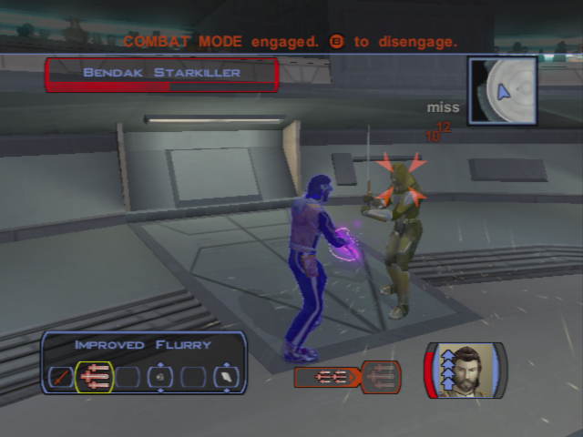

The Search for Bastila - Penetrating the Vulkar base 
====================================================

## Back in Upper Taris

### Igear's deal

- Go back to the camp
- **Don't speak now to Rukil!!** -> finish the quest "Infected Outcasts" first!
- Igear's will ask you to give him the journals while you cross the camp
    - Why are you telling me this?
    - That's horrible! How can you be so self-centered?
    - Forget it! I won't betray Rukil and the village for you.
    - I'll be going now.

### Lower Apartements 1

**SAVE**    

- Go to apartments on the right while going back towards the upper city
- Meet Calo again
- Go on the left first
- First Apartment:
    - 2 guys -> kill them
    - solo mode -> hide Zaalbar and PC in the left corner
    - Mission invisible -> put two mines in the corridor
    - Put Mission at the back of the room
    - Release camouflage
    - Wait for the 3 guys walking
    - Kill the rest of them
    - Get the mine on the closet and loot
    - Equip combat suit on Mission

- Continue the corridor on the left
- Kill the 2 Vulkars
- Open the next door's room
- 2 Vulkars -> Level Up ! (6)
- Loot, go near the next door
- Before entering, kill the 2 guys in the corridor
- Enter the room
- Puzzle! Password to open the chest
    - First get the mine
    - Hyperspace, Uncle, Alderane
    - 110 PX + Good armor
- Save before the next door
- Selven's apartment
    - Who are you?
    - I was just exploring. I didn't know anyone was in here.  
- Enters anyway -> kill her

- Equip neural band (the belt will be useful for Carth)
- Kill the last Vulkar in the next room
- Leave

- Go to the Cantina
- **SAVE**
- Talk to Zax -> **level 6 needed for persuade**
- Transit back to the safe house

### Back to the apartments

- Talk w/ Mission
	- I want to talk to you about your brother.
	- **Embarassing? Why?**
	- You were stowaways?
	- He's family. You have to stick by your family.
	- Pretty handy skills to have, Mission.
	- Why did he leave?
	- Who's Lena?
- **Talk to Carth (3/12)**
    - I just want to talk with you.
    - I just want to know why you distrust me so much.
    - But we have to work together, Carth, so it has plenty to do with me.
    - I suppose you can't. That must have been hard to take.
    - You say that with such… hatred.
- Improve scope for mission + armor

- Go out with Carth and Mission
- Level up Carth
- Go to the ring and kill Ice +300c
- kill the old man (at begin of combat, pause and use all injections) +400c

- Talk to him after (he leaves)
- kill twitch (he is weaker with a sword) +500c -> LEVEL 6 ??
- see bendak
    - You're On Bendak
- then go to kebla yurt store and buy Echani Ritual Brand (non improvable)
- kill bendak (hard, injections + meds)

**SAVE**

- get credits + ask for more ->900c + bendac blaster 
- Equip carth and improve it at the safe house
- Take Mission and Zaalbar
- Banther Zaalbar and Mission before arriving at the clinic
    - Zaalbar looks fine to me.
- Give the Serum
    - I have the serum to cure the Rakghoul disease.
    - Here you go. **+4 LSP**
    - Keep your reward, Zelka. You need it more than I do. **+2 LSP**
- Rebuy the serum

- Save Ithorian -> NOT NOW
- Talk to racist guy
- _buy maximum of repair parts ??_ -> Only 4 on XBox at this point? -> More than 20 will be needed -> (8+8+11 = 27)
- _I could buy 16 parts with all my money (no selling)_
- Go to the lower city candina -> SAVE
- See Zax for Bendak -> PERSUADE
- Go back to the undercity

### Back to the Camp

- Save the sick Outcasts -> kill the newly transformed ones
    - Don't worry – I'm here to help you.
    - I have brought you a serum to cure the rakghoul disease.
    - Here, take this rakghoul serum. I have enough for both of you. **+2 LSP**
- +210PX
- Talk to Gendar -> congratulates
- Talk to Rukil
    - I have all three journals. Here – take them. **+6 LSP**
    - **Maybe I should come with you. I could help you on the journey.**
- Go back to the Sewers (go on the right -> few ratgouls to kill)

## Entering the Vulkar Base

- Few ratgoules have respawn in the Sewers -> kill them
- Go to the computer -> Mission opens the field
- Enter the "upper" sewers

- Kill the gamorreans fast ? -> otherwise no XP ?
- Go on the right -> loot around ladder
- kill in the corridor
- Level up Zaalbar and Mission (6)
- Next room -> Droid + Mine (Be Carefull!!)
- meet the rancor
- stealth -> go to corpses -> put grenade ->odor
- kill the droid on the right (first corridor)
- Aller en face de l'entrer (faire le tour du bar)
- Tuer les ennemis -> looter armurerie
- Go to the console -> see all cameras
- kill vulkars with spikes -> still you get the XP of the killed guys -> LEVEL UP ? -> COOL FOR REPAIR
- talk to black vulkar in the control room
- kill the last vulkar in the bedroom, take the pass card
- Go in the pool in solo mode -> DONT use repair parts on the droid on the pool, no XP (bug : even if you don't have enough repair parts -> success)
- go repair the droid and kill everybody in the bar (**8 PIECES** avec le bon level (1 +1+1+2+3))
- Ouvrir la piece en face avant que le droide tourne
- Revenir devant le droid et ouvrir la seconde piece du couloir**
**
- Talk to ada in the bar to tell her she can go

## Enter the Garage

- Go to the garage, use pass card
- Solo mode -> go near the droid -> place zalbar and mission to kill droid near the big door of the garage
- Repair the most far droid (**8 PIECES** avec le bon level (1 +1+1+2+3))
- Kill the guys on the right corridor (w/ player)
- Kill the 2 in the other corridor with Z and mission
- Send Z near player if needed
- Mission in Fufu -> Mines (QUICK the droid will pass on it)
- Mission -> Grenade on the left guys
- End solo mode
- Kill every body
- improve items
- Go the final door -> need key
- Go other corridor
- to console -> blow bikes -> open door
- meet the vulkar leader -> let him tel his proposition
- kill them all -> equip new stuff
- 8 per droid
- 11? + 3 parts for droid sidedoor (**+595PX** or 455)
- 2000 c + 4parts 
- Go out to lower city and go to appartment

## Preparing for the Race

- Talk to Mission ?
- Improve Carth Blasters
- **Talk with Carth (4/12)**
    - I want to continue our discussion from before.
    - Don't you think you'd feel better if you discussed it?
    - That name sounds familiar.
    - **How could you have not seen through that?**
    - Do you really believe that?
    - **I'd do the same thing in your shoes.**
- Go back to the lower city with Carth and Mission -> BANTER ?
- Buy enough repair parts (8needed)
- Go t lower city appartment
- repair
- automatic talk
- twisted rancor

		Activate Elinda first.
		Activate Ujaa second.
		Activate Ujii third.
		Activate Loopa fourth.
		Activate Fodo fifth.
		Activate Ashana sixth.
- Bounty Quest : Permacrete Detonator
- Go the swoop race

## Swoop Race

- Talk to everyone
- See bastilla
- begin the race x2!
- Talk w/ Bastilla
	- **It's a long story.**
	- I've got somewhere safe to go. I was planning to take you there after I saved you from Brejik.
	- **I think you've got things confused. You were a helpless prisoner until I came along.**
	- **Hey, who said you were in charge here?**
	- Carth and I are already working on a plan to get off Taris. (or other... -> but this one is logic with next)
