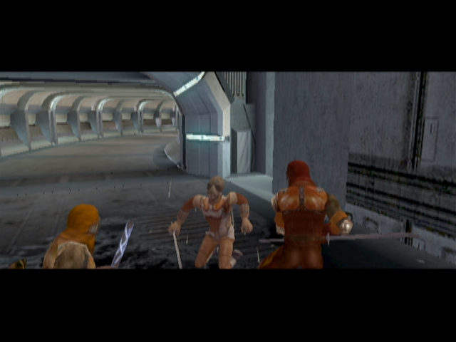
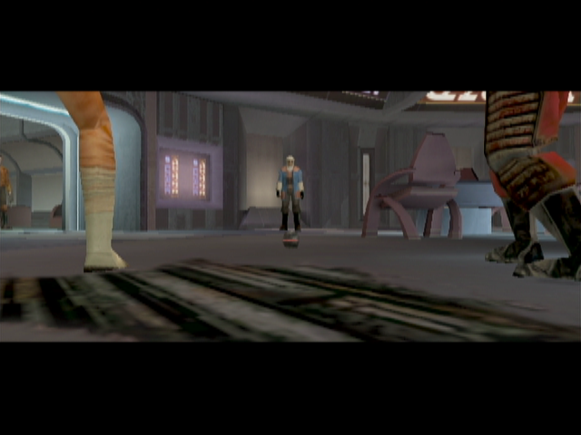
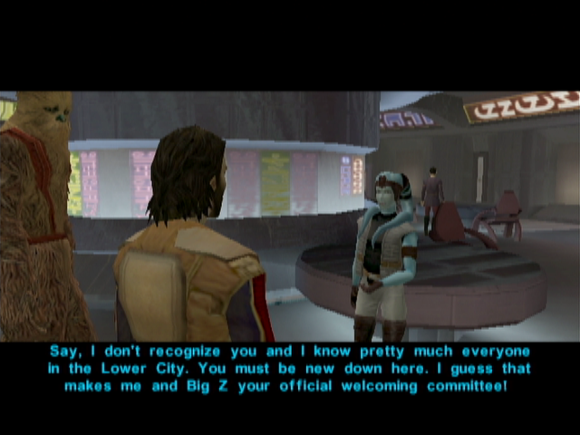

# Taris - The Lower City Area

[< Previous Page](./022_Taris.md) | [Back to the Index](./000_Index.md) | [Next Page >](./024_Taris.md)

## Lower Taris

- Gangs are fighting in the streets

- _Take back your melee weapon! (your PC sucks with guns!!)_
- Kill guys on the left (Use PC to tank, and Carth to shoot)
- Kill the other on the right near the Vulkar base door (WARNING : they are though -> launch grenade + all fire poser on one)
- Go first at the Cantina -> Get rejected with the uniform
  - I'm not on duty right now.
- Go to the hidden beck base (next door) -> Get rejected with the uniform
- Continue and kill the Vulkars
- Level Up! (4)
- Loot and **remove your Sith uniform**
- Continue your path until you meet Canderous

- Go back to the Cantina
  
## Lower City Cantina

- _don't buy pazaak ? 200 c +/-1 ? +/-6 cheaper ->50 ? -> save 6 to check_ -> NO, expansive
- Gelrood -> Infinite pazaak -> not a lot of money each time
  - Why were you banned?
  - I want to ask you some questions.
  - I'll be going now.
- Meet Calo Nord

- Talk to him before he leaves
  - I saw how you mopped those Black Vulkars. Nice work.
  - I'm not looking for a fight. I just want to talk.
  - Okay, I see your point. I'll be off then.
- Go see Holdan in the music room -> wait for force persuade with Bastila to pull off Dia's bounty (+4PCL 125XP instead of 50+105?)
  - Who are you?
  - You work for Davik?
  - You're pretty open about what you do.
  - Do you think Davik could get me off Taris?
  - I'll be going now.
- Discover Mission and Zaalbar -> talk to her -> +60 XP!
  - That's weird: a Twi'lek who speaks galactic Basic!
  - How do a Wookiee and a Twi'lek street urchin end up as best friends?
  - I want to ask you some questions.
  - Tell me about Davik.
  - Tell me about the Lower City gangs.
  - Why did Brejik leave the Hidden Beks?
  - Tell me about Calo Nord.
  - I'll be going now.

- Go to the Bounty office

**_TEMPSAVE_**

- Dancing woman (Starlight Entertainers) -> Don't FALL or reload save
  - What are you talking about?
  - Why don't you have a partner?
  - Maybe I could be your partner.
  - **[Persuade] I'm good enough to get you through your audition.** or **[Persuade] What other choice do you have?** (EASY 75%)
  - [Join Lyn by dancing beside her.]
  - [Join Lyn by dancing close beside her.]
  - [Join Lyn by dancing very close and face to face.] -> HARD -> not necessary, can use easier
- +250PX
- Talk to Zax -> don't pay for infos
  - You work for Davik?
  - Davik posts bounties in a government office? Is that even legal?
  - Tell me about the bounties.
  - How do I collect the credits for these contracts?
  - I want more details on the bounties you're offering.
  - Tell me about this girl Dia.
  - Tell me about Bendak Starkiller.
  - Tell me about the merchant Largo.
  - Tell me about the assassin Selven.
    - Did they ever found out...
  - Tell me about Matrik.
    - Didn't the ...
  - Something else...
  - I need some information.
  - I'm not going to pay just to ask you some questions.
- Talk to the other clients
- Leave the Cantina
- Go to the Hidden Bek base
  

## Hidden Bek Base

  - I need Gadon's help...
  - May be I could be an ally...
- Talk to Gadon Thek
  - You have problems with the Sith?
  - I need information on those Republic escape pods that crashed in the Undercity.
  - Don't worry… I'm not working for the Sith.
  - Bastila's a slave? What will happen to her now?
  - Swoop race? What does that have to do with it?
  - But I don't even have a swoop bike.
  - How do I know I can trust you?
  - How am I supposed to get inside the Vulkar base?
  - Where can I find Mission?
  - I got past the Upper City guard no problem.
  - What do you want with the Sith uniforms?
  - Okay - I'll trade the uniforms for the papers.
  - I'll be back when I get the prototype accelerator.

- Visit the area / Loot

**SAVE**

[< Previous Page](./022_Taris.md) | [Back to the Index](./000_Index.md) | [Next Page >](./024_Taris.md)

