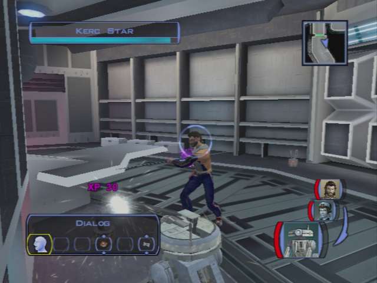
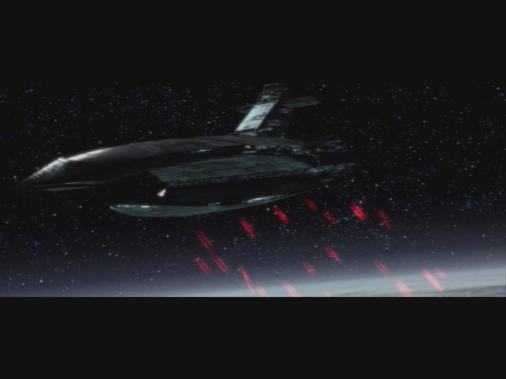
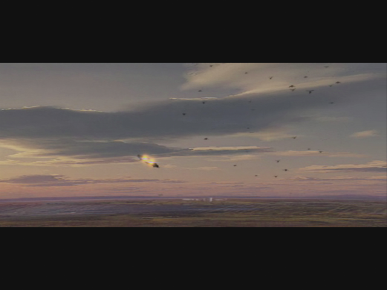

# Bastilla Joins

- Bastilla
	- We were trying to find you, remember?
	- **Both of you settle down! This isn't helping.**
	- Okay, so what now?
- ... transition only you with her
	- Something weird happened when we first met. Like a vision.
	- Of you. Fighting a dark Jedi. Revan, I guess.
	- Force sensitivity? What do you mean?
	- This isn't the first time I had a vision.

**SAVE**

- Go out with Bastilla and Carth
- Twilek
	- **You must have me confused with someone else.**
	- **Canderous? Isn't he that Mandalorian that works for Davik?**
	- **Okay. I got the message. You can go now.**
- Level up Bastilla and equip
- Go the Kebla Yurt store
- Suggestion for speaking to Bastila
    - You wanted...
	- **We were looking for you. (lass speach but better)**
	- **I had a lot of help: Carth, Mission, Zaalbar.**
	- **I think you're underestimating us non-Jedi.**
	- What are you trying to say?
- Buy the detonator -> new speech :)
- Go towards the upper apartments
- Banter w/ Carth
	- Maybe losing lightsabers is a side-effect of her Battle Meditation.

- Save the Ithorian near the apartments elevator
    - Hey – you kids! Leave the Ithorian alone!
    - **Just because he's different doesn't give you the right to attack him!** (+2 LSP)
    - **You look hurt. Here, I've got a medpac. Let me help you.** (+4 LSP)
- Save Largo
    - Maybe I could help...
	- Here – I've got 200 credits you can have. 
	- _Carth intervention? -> not on Xbox ?_

### Back in the Lower City

- Go to lower apt 
    - Give Matrik the Detonator
- _go see gadon -> not here -> body guard discution + Carth int_
- Meet Canderous (+carth intervention + bastilla)
    - **Goodbye.**
    - Why are you telling me this?
    - What's in this for me?
    - How are you going to manage that?
    - How am I supposed to get inside the military base?
    - Won't Davik get mad if I take his droid?
    - Okay, Canderous – you've got a deal.
    

    
- Meet Holdan -> fail persuade -> Bastilla force persuade
    - You're the guy who put the bounty on Dia's head, right?
	- Why would she do that?
	- Sounds like maybe you got what you deserved.
	- I want the bounty on Dia's head removed.
	- [Persuade] If you hire someone to kill Dia it will look like you weren't man enough to do it yourself. -> FAIL -> Bastilla saves
    - **+4 LSP**
- Collect Matrik -> persuade for 400 credits (25% chance at this level)
- Go back to the upper city by foot
- Transit back
- Go see Dia
    - I spoke with Holdan. I convinced him to remove the bounty on your head.
    - Thank you, Dia. This reward will be fine. -> no LSP but sword improvement
- Return to the hideout
- Upgrade for sword
- Talk w/ Bast (2/8) ? -> Not yet
- Go out w: Mission only
- Transit back
- Go buy Parts -> **6 Minimum / 18 spikes** -> both 4 parts and 1 spike in XBox walkthrough
- Go "buy" T3 
    - Persuade one time -> 1500c -> NO
    - MORE! FREE -> DS points but who care -> Supposed to be a member the exchange!

- T3 is level 7
- Equip T3 with Ion blaster (droids to kill)
- **Goto base**

# Sith Base

- Receptionist
    - [Persuade] I'm here for a meeting. Don't worry – I know where I have to go. -> Impossible
    - Touch that alarm and you're dead!
    - Okay – get out of here and I'll let you live!
- _Go to the console ? NOT NOW -> and with T3_
- Kill people on the left
- Take the door behind the receptionist
- First door on the left: Infirmary
    - Kill droids
    - Loot
    - Equip the shield and Computer improvement for T3
- Next door on the right 
    - 2 droids 
    - careful with the mine (Mission gets the mine)

- Next door at the end of the corridor
    - 2 Droids
    - Save Ducros
        - all should be red -> center one first -> then the 2 on the side
        - (BUG/EXPLOIT : after saving him, go to the entrance, talk -> new XP !) -> XBox only
- Door in front of the previous corridor: equipment
- The next door on the left
- Solo Mode
    - Put T3 near the droid to repair
    - Go with PC and Mission to the other door on the left -> kill one droid
    - First door on the right -> PC standing besides (should be hidden by the wall)
    - Take Mission camouflage to open the door and take the mine -> this can be tricky
    - **SAVE**
        - Open the door -> Immidiatly hide Mission behind the wall
        - After few secs, take the 2 mines
        - Hide again
        - T3 repairs the droid **6 parts**
        - Ambush! Shield PC + Grenade with PC -> attack
        - Quit solo mode
        

- Open terminal **1 sp** with T3
	- Hack sentry droids target filtering **6sp** + 160XP
	- open elevator **80 4sp** -> open door with pass = no xp
	- Disable shield **160XP 6sp**
		- **or use power canal to disable shield -> no xp ? -> NOT WORKIN !**
		- A datapad you get off a sith technician's corpse talks about the conduit "fixing the shield outage problem on the droid" IIRC
		- _https://gamefaqs.gamespot.com/boards/556553-star-wars-knights-of-the-old-republic/45958193_
	- Kill guards **160** 1sp
- Let droids kill everybody
- Take the door of the last corridor (in front of the control room)
    - Kill the officer on the right first!! -> has grenades
- Next door: Armory -> Solo mode
    - Mission in camouflage
    - Open with security
    - Buffer-Hide
    - Disable mine
    - Disable solo mode
    - Kill turrets
    

    
- Equip flamme thrower for T3 -> Needed later
- Go back to the intersection (with the field caches)
- Kill one sentry droid
- Door on the right -> everyone already killed with the console
- Next door -> TEMPSAME
- Kill the two turrets first -> then kill the big one
- Take the elevator

**TEMPSAVE**

- Open the door
- Sith Governor
    - You Sith must be brought to judgement for all the blood you have spilled.
- Kill the Sith -> careful to who is focused

- Loot, equip the gloves
- return to hideout

## Last Minutes of Taris
_(HOW MANY SPIKES ? 1+1)_ 

- Improve the Mission's bowcaster + 2nd blade of Zaalbar
- Go outside with T3 and Bastila -> will talk with Canderous
- Go by some spikes if you don't have any ? 3 spikes needed -> loot on site (1+)
- Go back to the lower city cantina to see Canderous
- Check that all side quests are done

**SAVE** : This is the last time you can roam on Taris

- Talk to Canderous
    - Okay, let's join up...
- Take T3!

## Davik's Estate

- Cinematic with EVIL Malak

- Meet Davik
	- I didn't know you were a swoop fan.
	- Your offer intrigues me, Davik.
    - _"She" is the targeted starship: Ebon Hawk_
    - I'm looking forward to working with you, Davik.

- Level Up Canderous
- Don't bother your neighbors at the moment
- Get massage + persuade -> prisoner
	- I'd love a massage right now.
	- It was everything I ever dreamed. You are truly an expert in your craft.
	- I need some information.
	- [Persuade] Tell me what I want to know and I'll tell Davik how pleased I was with your performance.
	- **What else can you tell me?**
- Go back
- First door on the left (nobody -> Calo's room)
- Door in front -> Don't kill him -> Loot in solo mode with T3
- Next door on the left
    - You can't tell the guards if you're dead!
- Kill him and 2 extra guards

- Go to the door opposite side of room with throne (the door you see on the screenshot behind the throne)
- Kill the bounty hunter in the corridor and get the computer card
- Go to the door on the very right: torture room -> warning tough medicine droids
- Release the torture cage
	- **I couldn't sit by and just let you suffer.**
	- I want to ask you some questions.
	- Okay, you're free to go now.
- Next door on the right -> Noble guy -> TEMPSAVE
    - [Persuade/Lie] Uh… Davik just wanted me to make sure you didn't need anything.
    - Thank you sir
- Solo mode -> Loot with T3
- Go back to throne room
- SOLO -> with T3 -> run in the room on the left to the console **2 spikes**
    - Login with the access card
    - Cameras
        - Barracks - Throne -> Gas
        - Barracks - Storage -> Gas
    - Leave console
- Remove Solo mode
- Level up T3 and Canderous (8)
- Open the backdoor and take the mine with PC -> loot -> 2 spikes
- Go back to the console
    - Gas the other room **1 spike**
    - Gas last -> Hangar **1 spike**
- Level up PC! (9)
    - If not yet
    - Disable door security 135XP ? **1 spike** + open hangar door ? -> NO -> last room (justify the loot)
- Go back to the last corridor
- Loot the gased room
- Next room on the left kill everybody
- Open the door at the back of the room
- Cross the corridor and arrive at a crossroad
- Take the right door -> locked
- Take the door upfront
- Open it with the console
    - Disable Hangar Security

**SAVE**

- Open the door

- Focus on Calo -> 3 grenades + flamme thrower T3 -> EZ
- Davik dies in an explosion
- 5-6 cinematics ship and kill taris and ebon

> You escaped!!

- Prepare to shoot with the turret
    - Tip: spam the shoot button at the beginning -> kills a lot of ships
- After
	- **I think Carth has a point. We should keep moving.**
- Land on the jedi academy of Dantoine

