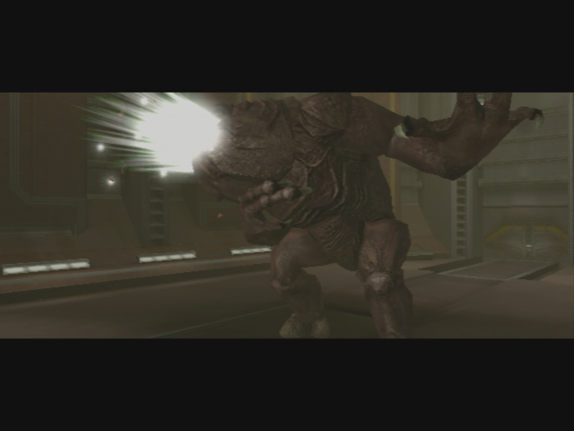
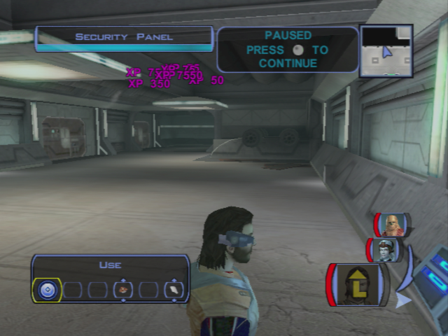
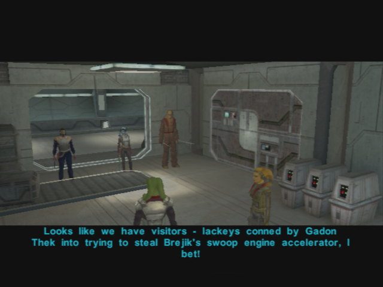
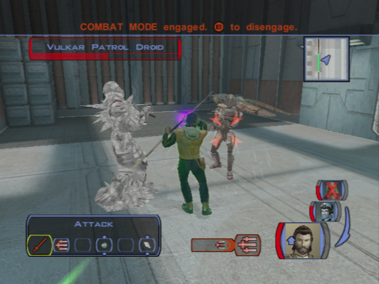

# Taris - The Vulkar Base

[< Previous Page](./024_Taris.md) 
| [Back to the Index](./000_Index.md) 
| [Next Page >](./026_Taris.md)

## The Upper Sewers

- Few ratgoules have respawn in the Sewers -> kill them
- Go to the computer -> Mission opens the field
- Enter the "upper" sewers

- Kill the gamorreans fast ? -> otherwise no XP ?
- Go on the right -> loot around ladder
- kill in the corridor
- Level up Zaalbar and Mission (6) (XBox only? -> after the droid on switch?)
- Next room -> Droid + Mine (Be Carefull!!)

- Door on the left -> 3 gamorreans
- Next door -> grab the mine
- Armed -> Journal -> Here is the Rancor
  - Hide Mission
  - Go to the pile of bones
  - Loot
  - Switch to give -> put the frag grenade first -> then odor

- Nothing to loot
- Kill the two Vulkars at the entrance of the base

**SAVE**

## Entering the Vulkar base

- kill the droid on the right (first corridor)
- First, take the door in front of the one you just took
- Kill another droid in the corridor
- Kill everybody in the main area
- Loot the armory -> a lot of good stuff
- Go to the console -> see all cameras
- kill vulkars with spikes -> still you get the XP of the killed guys -> LEVEL UP ? -> COOL FOR REPAIR
- **1 spike to login + 3 spikes to kill**
- Level Up! (7)

- Talk to black Vulkar in the control room
  - What are you talking about? You're a Vulkar, aren't you?
  - If you hate Brejik so much, why don’t you leave the gang?
  - You better give me some information if you want to live.
  - Where can I find the prototype swoop engine accelerator?
  - Where can I get a pass card?
  - Is there some way to disable the security cannons?
  - I want to ask you something else.
  - I'm looking for a prisoner. A woman named Bastila.
  - I'm going to let you live. Go on, get out of here!
- kill the last vulkar in the bedroom, take the pass card
- Go in the pool in solo mode
  - DONT use repair parts on the droid on the pool
  - no XP (bug : even if you don't have enough repair parts -> success)
  - Take Zaalbar instead to go in the pool
- Go back near the entrance (back door)
- First door on the left (next to the back door one)
- Sentry droid to repair **(8 parts - @ level 7 - 12 repair skill)** -> 16 left on XBox
- Open the door in front of the one you took
- Kill everybody with the help of the droid
- Next door -> wait for the droid to come

- Talk to the Waitress in the bar
  - How did you end up here in the Vulkar base?
  - Don't worry, I just want to ask you a few questions.
  - Where can I find the prototype swoop engine accelerator?
  - I'm looking for a prisoner. A woman named Bastila.
  - If I let you go can you find your way out of here?
  - Hurry, then – get out of here. **+2 LSP**
- Open the last door -> Get the mine with mission -> Loot
- Go to the computer at the end of the corridor
  - Insert Pass Card

**SAVE**

## Enter the Garage

- Take the Elevator
- Solo Mode On
  - Take Zaalbar and Mission to kill the droid near the big garage door
  - Take PC to repair the most far droid (**8 parts**) -> not too quickly -> need the right timing
  - Kill the guys on the right corridor with PC and the droid
  - Kill the 2 other guys in the other corridor with Z and mission
  - Send Z near PC if needed
  - **QUICKLY** Mission -> take the mines before the repaired droid arrives
  - Careful -> Vulkars on the left -> wait for the crew to gather

- End solo mode
- Kill the Vulkars on the left door (already opened)
- Try to open the other door -> Locked!
- On the other side: repair bikes rooms -> Kill
- Improve items at the workbench

- Go back to other corridor
- First door -> 2 Vulkars -> 1 footlocker
- Next room -> loot everywhere
- At the console **(1 spike to login)**
  - Blow the bikes **(2 spikes + 140XP)**
  - Open door **(1 spike + 105XP)**
- Go back to the previously locked door
- Meet the leader
  - Enough yapping! Hand over that accelerator.
  - You've got my attention. What's your offer?
  - You were about to tell me your offer, Kandon.
  - I thought she was being offered up as the prize in the swoop race.
  - Just give me the girl now or we have no deal.
  - Forget it. I want Bastila up front or no deal!

- kill them all -> loot -> equip new stuff
- Go back to the entrance of the garage -> droid to repair - TEMPSAVE
  - Got 10 parts left
  - Improve all you can, and put it in patrol mode **8 parts** (+455XP)
  - If you want to make some more XP, program it to blow up the doo (+595XP)
    - But kind of useless, you will reach the lvl 9 just before leaving Taris
    - After that, you will be granted with a "free" level
- Kill the guard droid with the help of the droid you repaired

- Loot the locked chest
  - 2000c + 4parts or 4spikes
- Go out to lower city and go to your apartment

[< Previous Page](./024_Taris.md)
| [Back to the Index](./000_Index.md)
| [Next Page >](./026_Taris.md)
