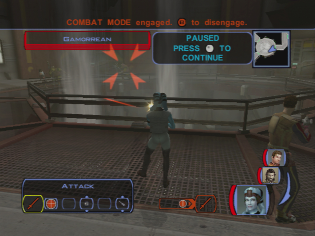
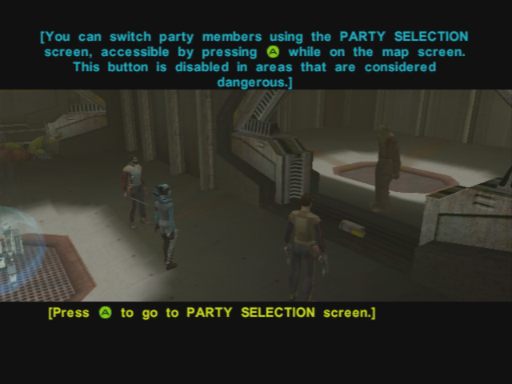
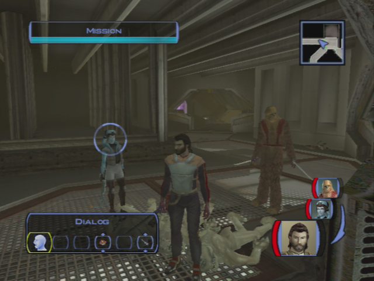
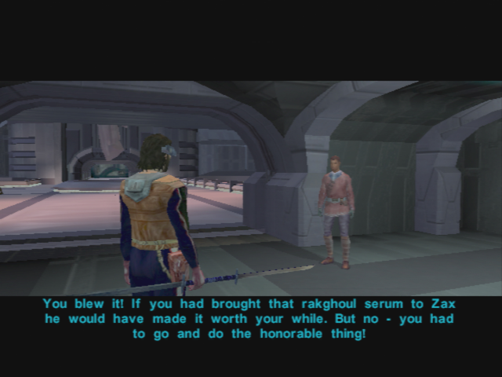

# Taris - Entering the Sewers

[< Previous Page](./024_Taris.md) 
| [Back to the Index](./000_Index.md) 
| [Next Page >](./026_Taris.md)

## Sewers

- Go to the sewers: 4-5 respawned ratgoules in the way

**SAVE BEFORE ENTERING**

- Kill the 3 gamorreans, loot
- Follow the corridor
- On the left kill the ratgoules and find the 2nd journal for Rukil
- Next, roundabout: kill the 4 gamorreans

- Go to the door on the right first -> 2 mines -> field door -> Vulkar base entrance
- Computer
    - Leave the computer. (don't spend a spike)
    - _That energy shield leads to another section of the sewers. The entrance to the Vulkar base is somewhere past there. I've got the codes to lower the shield, but we have to rescue Zaalbar from those Gamorrean slavers. Don't worry – we can come back after we find Big Z._
- Go back to the fountains room
- Go to the door on the right (Careful; 1 gamorrean)
- Next Ratgoules room
- Start by the doors on the left
- 2nd left door -> mine
- Roundabout -> kill the ratgoules
- Still explore doors on the left first
- 2nd door -> corridor -> right -> see Zaalbar
- Next room, kill ratgoules, take the mine and go two rooms backwards (spinning wheel)
- Take the other door (left)
- Kill the gamorrean in the corridor
- Door on the right -> last journal for Rukil
- Repair the droid (12 repair parts)
  Missions levels up (5) or a bit later
- Let the droid do the job

- Loot the belt
- Save Zaalbar
    - Good to meet you Zaalbar. I'm Name.
    - It's some kind of loyalty vow, isn't it?
    - I'm honoured to accept your vow.
    - I'm glad to have you on board, Mission.
    - Whoa – nobody said anything about a rancor monster!
    - That's not really an option. Let's go.
- Zaalbar joins

- Take Mission and Zaalbar with you
- Level up Zaalbar (5) -> Equip 2 swords -> Previously upgraded Mission vibroblade
- Take Zaalbar belongings in the locked chest in the next room
- Equip Mission with the bowcaster
- Unlock the back door
- **Banther Mission with Zaalbar (1/2)**
- Follow the previous corridor
- Open the door on the right ? -> Yes -> but go back to the other door
- Take the mine
- Trigger -> 4 ratgoules will spawn
- Take the ladder

14380 XP on the XBox version (620XP needed for level 6)

## Preparation for the Vulkar Base Infiltration: Back in Upper Taris

### Igear's deal

- Go back to the camp
- **Don't speak now to Rukil!!** -> finish the quest "Infected Outcasts" first!
- Igear's will ask you to give him the journals while you cross the camp
  - Why are you telling me this?
  - That's horrible! How can you be so self-centered?
  - Forget it! I won't betray Rukil and the village for you.
  - I'll be going now.

### Lower Apartements 1

**SAVE**

- Go to apartments on the right while going back towards the upper city
- Meet Calo again
- Go on the left first
- First Apartment:
  - 2 guys -> kill them
  - solo mode -> hide Zaalbar and PC in the left corner
  - Mission invisible -> put two mines in the corridor
  - Put Mission at the back of the room
  - Release camouflage
  - Wait for the 3 guys walking
  - Kill the rest of them
  - Get the mine on the closet and loot
  - Equip combat suit on Mission

- Continue the corridor on the left
- Kill the 2 Vulkars
- Open the next door's room
- 2 Vulkars -> Level Up ! (6) -> a bit later actually (Seleven)
- Loot, go near the next door
- Before entering, kill the 2 guys in the corridor
- Enter the room
- Puzzle! Password to open the chest
  - First get the mine
  - Hyperspace, Uncle, Alderane
  - 110 XP + Good armor
- Save before the next door
- Selven's apartment
  - Who are you?
  - I was just exploring. I didn't know anyone was in here.
- Enters anyway -> kill her

- Equip neural band (the belt will be useful for Carth)
- Kill the last Vulkar in the next room
- Leave

- Go to the Cantina
- **SAVE**
- Talk to Zax -> **level 6 needed for persuade**
- Transit back to the safe house

### Back to the apartments

- Talk w/ Mission
  - I want to talk to you about your brother.
  - **Embarassing? Why?**
  - You were stowaways?
  - He's family. You have to stick by your family.
  - Pretty handy skills to have, Mission.
  - Why did he leave?
  - Who's Lena?
- **Talk to Carth (3/12)**
  - I just want to talk with you.
  - I just want to know why you distrust me so much.
  - But we have to work together, Carth, so it has plenty to do with me.
  - I suppose you can't. That must have been hard to take.
  - You say that with such… hatred.
- Improve scope for mission + armor

- Go out with Carth and Mission
- Level up Carth
- Go to the ring and kill Ice +300c
- kill the old man (at begin of combat, pause and use all injections) +400c

- Talk to him after (he leaves)
- kill twitch (he is weaker with a sword) +500c -> LEVEL 6 ??
- see bendak
  - You're On Bendak
- then go to kebla yurt store and buy Echani Ritual Brand (non improvable)
- kill bendak (hard, injections + meds)

**SAVE**

- get credits + ask for more ->900c + bendac blaster
- Equip carth and improve it at the safe house
- Take Mission and Zaalbar
- Banther Zaalbar and Mission before arriving at the clinic
  - Zaalbar looks fine to me.
- Give the Serum
  - I have the serum to cure the Rakghoul disease.
  - Here you go. **+4 LSP**
  - Keep your reward, Zelka. You need it more than I do. **+2 LSP**
- Rebuy the serum

- Save Ithorian -> NOT NOW
- Talk to racist guy
- **4 Spikes + 27 Parts** will be used after
- _buy maximum of repair parts ??_ -> Only 4 on XBox at this point? -> (8+8+11 = 27) or at least 24 (8 instead of 11)
- _I could buy 16 parts with all my money (no selling)_ -> 1 more needed... -> sell to have at least 21 ?
- Go to the lower city candina -> SAVE
- See Zax for Bendak -> PERSUADE
- Go back to the undercity

### Back to the Camp

- Save the sick Outcasts -> kill the newly transformed ones
  - Don't worry – I'm here to help you.
  - I have brought you a serum to cure the rakghoul disease.
  - Here, take this rakghoul serum. I have enough for both of you. **+2 LSP**
- +210XP
- Talk to Gendar -> congratulates
- Talk to Rukil
  - I have all three journals. Here – take them. **+6 LSP**
  - **Maybe I should come with you. I could help you on the journey.**
- Go back to the Sewers (go on the right -> few ratgouls to kill)

[< Previous Page](./024_Taris.md)
| [Back to the Index](./000_Index.md)
| [Next Page >](./026_Taris.md)
