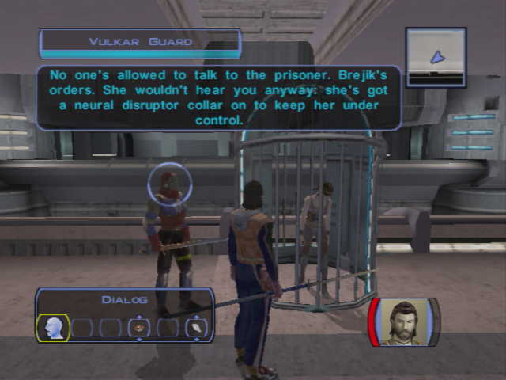
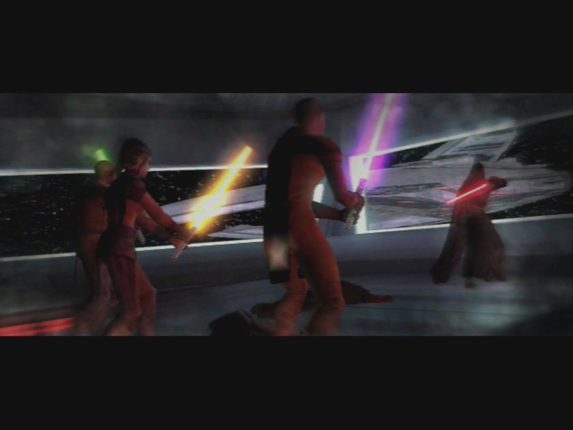
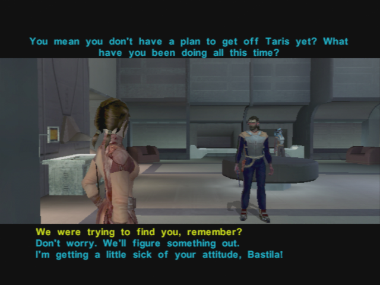

# Taris - Preparation for the Vulkar Base Infiltration

[< Previous Page](./026_Taris.md)
| [Back to the Index](./000_Index.md)
| [Next Page >](./028_Taris.md)

## Preparing for the Race

- Improve Carth Blasters
- **Talk with Carth (4/12)**
    - I want to continue our discussion from before.
    - Don't you think you'd feel better if you discussed it?
    - That name sounds familiar.
    - **How could you have not seen through that?**
    - Do you really believe that?
    - **I'd do the same thing in your shoes.**
- Go back to the lower city with Carth and Mission
- Level Up Carth (7)
- **Buy enough repair parts (8 needed)**
- Go to the last lower city apartments -> in front of the elevator door
    - Start on the left
    - Repair the droid
    - Open the door -> kill one Vulkar
    - Loot, next door -> kill 4 Vulkars
    - Loot, next -> again
    - Mission levels up (7)
    - Next door -> Musicians -> Twisted Rancor
        - Activate Elinda first.
        - Activate Ujaa second.
        - Activate Ujii third.
        - Activate Loopa fourth.
        - Activate Fodo fifth.
        - Activate Ashana sixth.
    - Equip Carth with the Echani armor
    - Next door (be careful to 3 Vulkar walking in the corridor)
    - Bounty Quest : Permacrete Detonator
        - What are you doing in here? This place looks abandoned!
        - [Persuade] Are you in some sort of trouble? Do you want to talk about it? (Easy)
        - Maybe there's some way I could help you out if this mess.
        - Maybe you could fake your own death?
        - Tell me your plan and I might help you out.
        - I could get you a permacrete detonator.

- Go to the Swoop race -> Hidden Bek base
    - I have the accelerator right here.
    - Okay, I lived up to my end of the deal. Now you better come through!
    - Zaerdra's right, Gadon. One of your own riders should get that swoop bike.
    - Sounds like you've got all your bases covered.
    - Suddenly I'm not so sure about this.
    - Okay, I'm ready for the race.

## Swoop Platform

- Talk to everyone
- See bastilla

- Do the race two times

- Brejik will interfere
    - You better not be trying to cheat me, Brejik!
- Kill all Vulkars and then Brejik
- Level up (8)
- Loot Brejik -> Light Saber and belt, gloves
- Talk w/ Bastilla
    - **It's a long story.**
    - I've got somewhere safe to go. I was planning to take you there after I saved you from Brejik.
    - **I think you've got things confused. You were a helpless prisoner until I came along.**
    - **Hey, who said you were in charge here?**
    - Carth and I are already working on a plan to get off Taris. (or other... -> but this one is logic with next)
- You have this strange dream again...

- Bastilla
	- We were trying to find you, remember?
	- **Both of you settle down! This isn't helping.**
	- Okay, so what now?
- ... transition only you with her
	- Something weird happened when we first met. Like a vision.
	- Of you. Fighting a dark Jedi. Revan, I guess.
	- Force sensitivity? What do you mean?
	- This isn't the first time I had a vision.

**SAVE**

- Go out with Bastilla and Carth
- Twilek
	- **You must have me confused with someone else.**
	- **Canderous? Isn't he that Mandalorian that works for Davik?**
	- **Okay. I got the message. You can go now.**
- Level up Bastilla and equip
- Go the Kebla Yurt store
- Suggestion for speaking to Bastila
    - You wanted...
	- **We were looking for you. (lass speach but better)**
	- **I had a lot of help: Carth, Mission, Zaalbar.**
	- **I think you're underestimating us non-Jedi.**
	- What are you trying to say?
- Buy the detonator -> new speech :)
- Go towards the upper apartments
- Banter w/ Carth
	- Maybe losing lightsabers is a side-effect of her Battle Meditation.

- Save the Ithorian near the apartments elevator
    - Hey – you kids! Leave the Ithorian alone!
    - **Just because he's different doesn't give you the right to attack him!** (+2 LSP)
    - **You look hurt. Here, I've got a medpac. Let me help you.** (+4 LSP)
- Save Largo
    - Maybe I could help...
	- Here – I've got 200 credits you can have. 
	- _Carth intervention? -> not on Xbox ?_

### Back in the Lower City

- Go to lower apt 
    - Give Matrik the Detonator
- _go see gadon -> not here -> body guard discution + Carth int_
- Meet Canderous (+carth intervention + bastilla)
    - **Goodbye.**
    - Why are you telling me this?
    - What's in this for me?
    - How are you going to manage that?
    - How am I supposed to get inside the military base?
    - Won't Davik get mad if I take his droid?
    - Okay, Canderous – you've got a deal.
    

    
- Meet Holdan -> fail persuade -> Bastilla force persuade
    - You're the guy who put the bounty on Dia's head, right?
	- Why would she do that?
	- Sounds like maybe you got what you deserved.
	- I want the bounty on Dia's head removed.
	- [Persuade] If you hire someone to kill Dia it will look like you weren't man enough to do it yourself. -> FAIL -> Bastilla saves
    - **+4 LSP**
- Collect Matrik -> persuade for 400 credits (25% chance at this level)
- Go back to the upper city by foot
- Transit back
- Go see Dia
    - I spoke with Holdan. I convinced him to remove the bounty on your head.
    - Thank you, Dia. This reward will be fine. -> no LSP but sword improvement
- Return to the hideout
- Upgrade for sword
- Talk w/ Bast (2/8) ? -> Not yet

[< Previous Page](./026_Taris.md)
| [Back to the Index](./000_Index.md)
| [Next Page >](./028_Taris.md)
