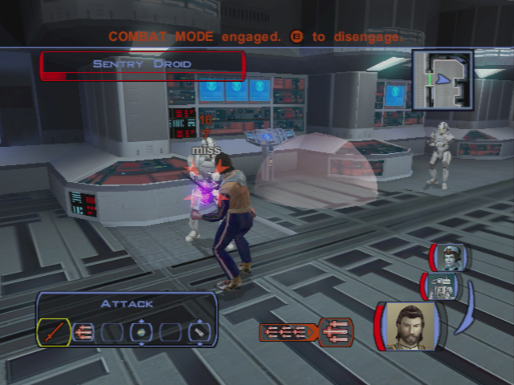
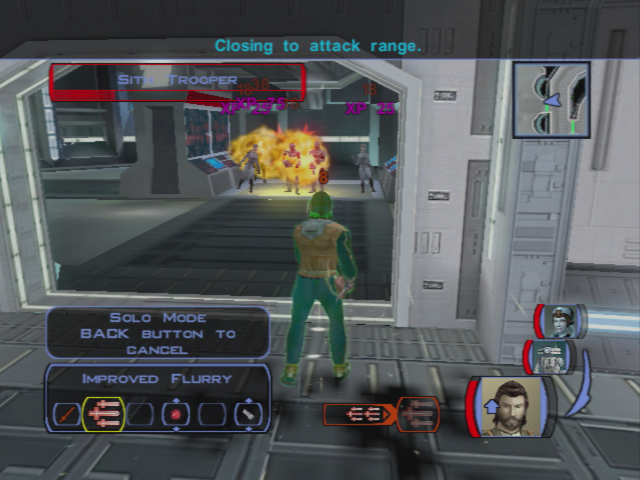
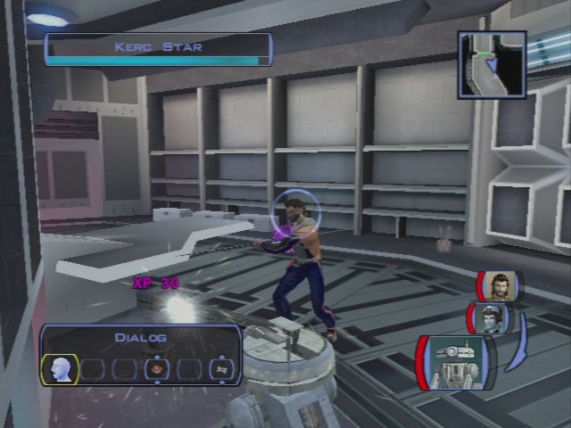
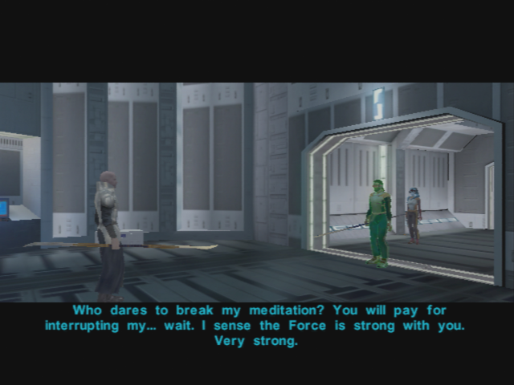

# Taris - Preparation for the Vulkar Base Infiltration

[< Previous Page](./027_Taris.md) 
| [Back to the Index](./000_Index.md) 
| [Next Page >](./029_Taris.md)

# Sith Base

- Receptionist
    - [Persuade] I'm here for a meeting. Don't worry – I know where I have to go. -> Impossible
    - Touch that alarm and you're dead!
    - Okay – get out of here and I'll let you live!
- _Go to the console ? NOT NOW -> and with T3_
- Kill people on the left
- Take the door behind the receptionist
- First door on the left: Infirmary
    - Kill droids
    - Loot
    - Equip the shield and Computer improvement for T3
- Next door on the right
    - 2 droids
    - careful with the mine (Mission gets the mine)

- Next door at the end of the corridor
    - 2 Droids
    - Save Ducros
        - all should be red -> center one first -> then the 2 on the side
        - (BUG/EXPLOIT : after saving him, go to the entrance, talk -> new XP !) -> XBox only
- Door in front of the previous corridor: equipment
- The next door on the left
- Solo Mode
    - Put T3 near the droid to repair
    - Go with PC and Mission to the other door on the left -> kill one droid
    - First door on the right -> PC standing besides (should be hidden by the wall)
    - Take Mission camouflage to open the door and take the mine -> this can be tricky
    - **SAVE**
        - Open the door -> Immidiatly hide Mission behind the wall
        - After few secs, take the 2 mines
        - Hide again
        - T3 repairs the droid **6 parts**
        - Ambush! Shield PC + Grenade with PC -> attack
        - Quit solo mode

- Open terminal **1 sp** with T3
    - Hack sentry droids target filtering **6sp** + 160XP
    - open elevator **80 4sp** -> open door with pass = no xp
    - Disable shield **160XP 6sp**
        - **or use power canal to disable shield -> no xp ? -> NOT WORKIN !**
        - A datapad you get off a sith technician's corpse talks about the conduit "fixing the shield outage problem on the droid" IIRC
        - _https://gamefaqs.gamespot.com/boards/556553-star-wars-knights-of-the-old-republic/45958193_
    - Kill guards **160** 1sp
- Let droids kill everybody
- Take the door of the last corridor (in front of the control room)
    - Kill the officer on the right first!! -> has grenades
- Next door: Armory -> Solo mode
    - Mission in camouflage
    - Open with security
    - Buffer-Hide
    - Disable mine
    - Disable solo mode
    - Kill turrets

- Equip flamme thrower for T3 -> Needed later
- Go back to the intersection (with the field caches)
- Kill one sentry droid
- Door on the right -> everyone already killed with the console
- Next door -> TEMPSAME
- Kill the two turrets first -> then kill the big one
- Take the elevator

**TEMPSAVE**

- Open the door
- Sith Governor
    - You Sith must be brought to judgement for all the blood you have spilled.
- Kill the Sith -> careful to who is focused
- Flame thower with T3

- Loot, equip the gloves
- return to hideout

## Last Minutes of Taris
_(HOW MANY SPIKES ? 1+1)_

- Improve the Mission's bowcaster + 2nd blade of Zaalbar
- Go outside with T3 and Bastila -> will talk with Canderous
- Go by some spikes if you don't have any ? 3 spikes needed -> loot on site (1+)
- Go back to the lower city cantina to see Canderous
- Check that all side quests are done

**SAVE** : This is the last time you can roam on Taris

- Talk to Canderous
    - Okay, let's join up...
- Take T3!

[< Previous Page](./027_Taris.md)
| [Back to the Index](./000_Index.md)
| [Next Page >](./029_Taris.md)
