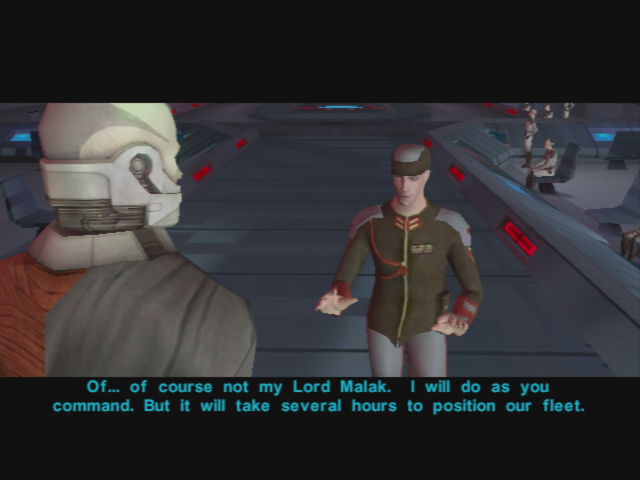
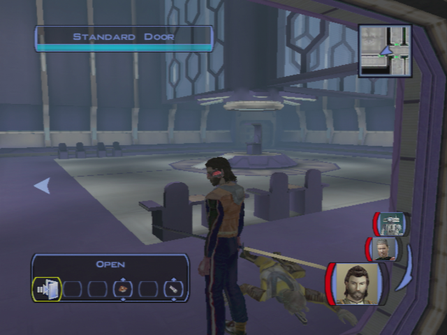
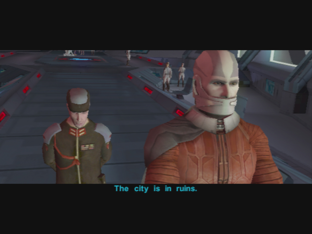
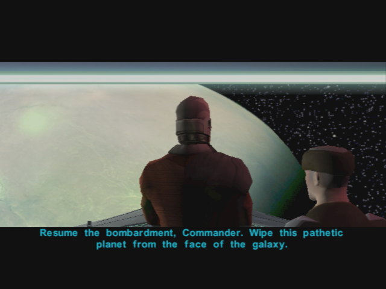
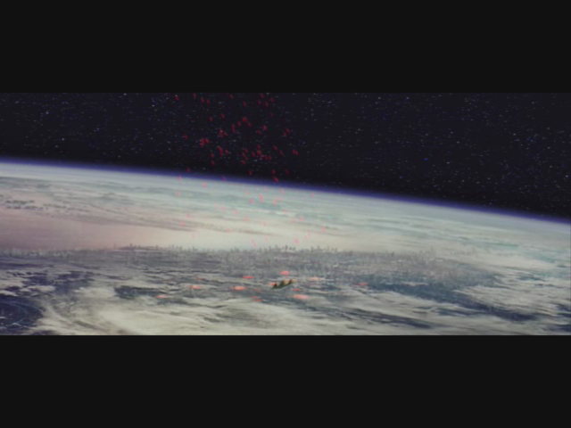
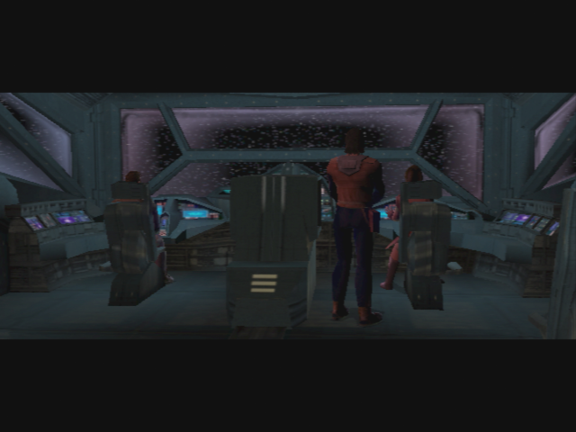

# Taris - Preparation for the Vulkar Base Infiltration

[< Previous Page](./028_Taris.md) 
| [Back to the Index](./000_Index.md) 
| [Next Page >](./030_Dantooine.md)

## Davik's Estate

- Cinematic with EVIL Malak

- Meet Davik
	- I didn't know you were a swoop fan.
	- Your offer intrigues me, Davik.
    - _"She" is the targeted starship: Ebon Hawk_
    - I'm looking forward to working with you, Davik.

- Level Up Canderous
- Don't bother your neighbors at the moment
- Get massage + persuade -> prisoner
	- I'd love a massage right now.
	- It was everything I ever dreamed. You are truly an expert in your craft.
	- I need some information.
	- [Persuade] Tell me what I want to know and I'll tell Davik how pleased I was with your performance.
	- **What else can you tell me?**
- Go back
- First door on the left (nobody -> Calo's room)
- Door in front -> Don't kill him -> Loot in solo mode with T3
- Next door on the left
    - You can't tell the guards if you're dead!
- Kill him and 2 extra guards

- Go to the door opposite side of room with throne (the door you see on the screenshot behind the throne)
- Kill the bounty hunter in the corridor and get the computer card
- Go to the door on the very right: torture room -> warning tough medicine droids
- Release the torture cage
	- **I couldn't sit by and just let you suffer.**
	- I want to ask you some questions.
	- Okay, you're free to go now.
- Next door on the right -> Noble guy -> TEMPSAVE
    - [Persuade/Lie] Uh… Davik just wanted me to make sure you didn't need anything.
    - Thank you sir
- Solo mode -> Loot with T3
- Go back to throne room
- SOLO -> with T3 -> run in the room on the left to the console **2 spikes**
    - Login with the access card
    - Cameras
        - Barracks - Throne -> Gas
        - Barracks - Storage -> Gas
    - Leave console
- Remove Solo mode
- Level up T3 and Canderous (8)
- Open the backdoor and take the mine with PC -> loot -> 2 spikes
- Go back to the console
    - Gas the other room **1 spike**
    - Gas last -> Hangar **1 spike**
- Level up PC! (9)
    - If not yet
    - Disable door security 135XP ? **1 spike** + open hangar door ? -> NO -> last room (justify the loot)
- Go back to the last corridor
- Loot the gased room
- Next room on the left kill everybody
- Open the door at the back of the room
- Cross the corridor and arrive at a crossroad
- Take the right door -> locked
- Take the door upfront
- Open it with the console
    - Disable Hangar Security

**SAVE**

- Open the door

- Focus on Calo -> 3 grenades + flamme thrower T3 -> EZ
- Davik dies in an explosion
- 5-6 cinematics ship and kill taris and ebon

> You escaped!!

- Prepare to shoot with the turret
    - Tip: spam the shoot button at the beginning -> kills a lot of ships
- After
	- **I think Carth has a point. We should keep moving.**
- Land on the jedi academy of Dantoine

[< Previous Page](./028_Taris.md)
| [Back to the Index](./000_Index.md)
| [Next Page >](./030_Dantooine.md)
