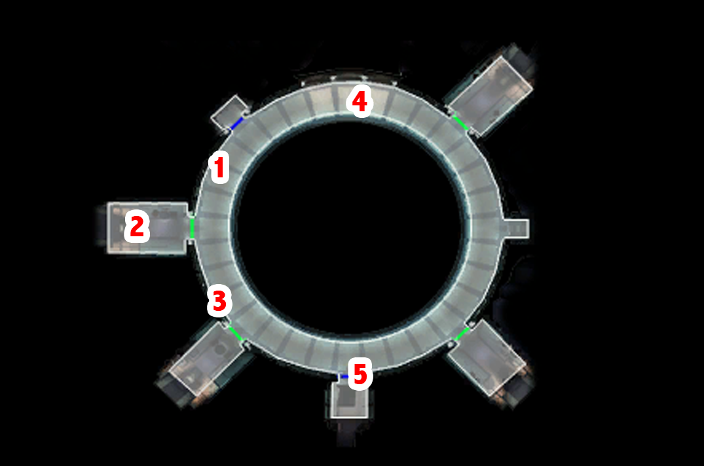

Taris - The Hideout Building
=========================================================

[< Previous Page](./011_EndarSpire.md) 
| [Back to the Index](../index.md) 
| [Next Page >](021_Taris.md)

## Upper Taris - Safe Room

- Carth talks to you
    - **I had a strange dream. Like a vision or something.**
    - **I guess I owe you my life. Thanks.**
    - Bastila? She's the one from the Endar Spire, right?
    - How do you even know Bastila's still alive?
    - If Bastila's a Jedi, she can probably look after herself.
    - Battle Meditation? What's that?
    - //So what do you suggest we do next?
    - Any idea where we should start looking for Bastila?
    - I want to ask you some questions.
    - What can you tell me about this planet we're on?
    - What do you know about Malak and the Sith?
    - A Jedi? What do you mean?
    - I would like to ask you something else.
    - I'd like to know some more about you, Carth.
    - The sooner we start looking for Bastila the sooner we find her. Let's go.
- Loot the crate near the workbench 
- Improve your sword with ????
- Leave the room with Carth

## Upper Taris - South Apartments

#### (1) Sith Ambush

- Kill the Sith and 2 droids -> You gonna meet the victim again later (XBox -> different voices ??)
  - Won't someone come searching for this patrol?
- Level Up! (3)

#### (2) A woman hiding

- First door on the right -> Loot -> **SAVE** -> Talk to the woman
  - I'm sorry. I was just investigating the area.
  - Holdan? Who's that?
  - What do you mean?
  - I want to ask you some questions.
  - I'll be going now.

> Here the game gives you the possibility to persuade her to tell you why she is oppressed
> by this guy named Holdan: "[Persuade] You can trust me. Maybe I can help.". It's a Easy
> persuade (at level 3 you have 50% of succeeding). In this guide we chose to ignore this
> option since no XP is obtained after doing so, and this does not make much sense
> while meeting Holdan in person later. Remember we are hiding away from the Sith, and
> at this moment helping her is clearly not the priority.

#### (3) Larrim - The itinerant merchant

- Talk to the Twi'lek Larrim
  - Pleased to meet you, Larrim. My name is Name.
  - What's so great about these energy shields?
  - Where did this technology...
  - ... Else?
  - Why do you have a kiosk set up here?
  - You mentioned something about illegal aliens living here.
  - Aren't you worried about getting caught?
  - I want to ask you some questions.
  - Let me see what you've got for sale.

> He has nothing really useful (or too expensive!). We won't need his services for the
> rest of the adventure

- Loot all the apartments but don't leave the area (i.e. don't take the elevator in 5) 

#### (4) Meet the janitor

- Talk to the old man sweeping the flour
    - Sorry, I didn't mean any disrespect.
    - I want to ask you some questions.
    - Where can I get some equipment?
    - I want to ask you something else.
    - Tell me about Taris.
    - Where is the cantina?
    - What do you think of the Sith and this quarantine?
    - I'll be going now.

> Now you know about the cantina and the weapons store. We have our next destination!

- Go to the elevator in (5)

[< Previous Page](./011_EndarSpire.md) 
| [Back to the Index](../index.md) 
| [Next Page >](021_Taris.md)

