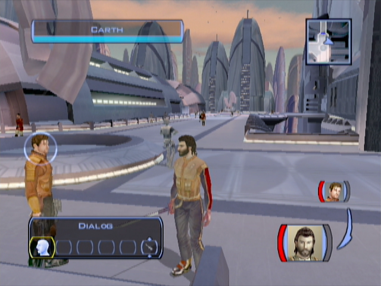
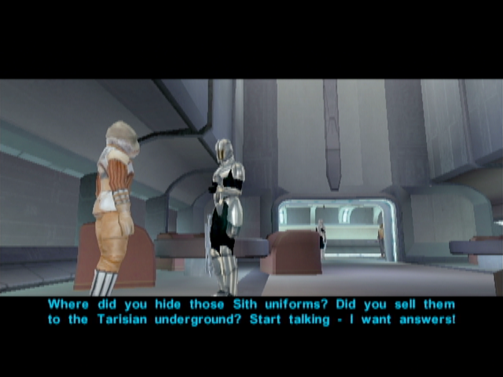
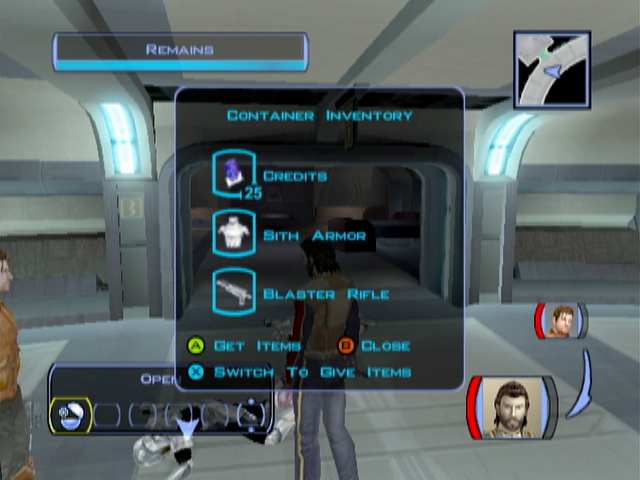

Taris - The Upper City Area
====================================================

[< Previous Page](021_Taris.md) 
| [Back to the Index](../index.md) 
| [Next Page >](023_Taris.md)

## Exploring Upper Taris

- Go towards your apartment -> you will meet Gana Lavin (the angry rich woman in the cantina) with two body guards. Kill the body guards and loot the swords.
- Follow the street
- Go to the clinic on the right
- Talk to Gurney -> He does not want to talk now

**_TEMPSAVE_** : Easy Persuade (Level 3 -> 50%)

- Talk to the doctor (Zelka Forn)
    - Medical facility? Is this some kind of hospital?
    - I just want some general information about Taris.
      - Tell me about Upper Taris.
      - Tell me about the Lower City.
        - What do you know about Davik?
      - Tell me about the Undercity.
        - Outcasts?
        - Ratgoules disease?
        - Is there no cure?
        - **[LS]**
          - Maybe I could find a way to get my hands on that serum for you.
          - Don't worry, Zelka – I'll get that serum for you!
        - **[DS]**
          - I might be able to help you out... for a price.
    - I want to ask you some questions.
      - How do you feel about the Sith?
    - I want to ask you something else.
      - **Do you know anything about the Republic escape pods that crashed in the Undercity?**
      - You seem awfully defensive about this.
      - **[Persuade] Don't worry, I'm not with the Sith. I won't betray your secret if you tell me.** (EASY - 50%)
      - **[LS]**
        - **Is there anything I can do to help?** (LSP +2)
      - **[DS]** no need to be mean at this point
        - Don't worry. Your secret is safe with me.
- Leave the medical facility: Gurney intervenes
    - An offer? What are you talking about?
    - Davik Kang? Who's that?
    - You mean Davik's a crime lord?
    - Why does Davik want the cure so badly?
    - Where can I find Davik if I want to give him the cure?
    - Why do you care who gets the cure?
    - What if I tell Zelka you're helping Davik get the cure?
    - I'll keep your offer in mind.
- Go near the entrance of the North street
- Bounty Hunters racketeering a Merchant
    - **Leave this man alone or you'll have to deal with me!** (LSP +2)
- Kill
    - Maybe I can help you.
    - **Here's 100 credits. Take them.** (LSP +2)
- Loop (50c on each corpse)

## Upper City North

- Cross the street and go to the North Apartments

- Begin on the left (it's a circle)
- Loot everywhere
- 3 Sith are arresting a guy
    - What's going on in there?
    - **Stop the interrogation right now!**
    - **I won't let you kill a defenceless prisoner!** (LSP +2)

- Kill them and talk to the Alien Prisoner
    - The Hidden Beks? Who are they?
    - What are the Hidden Beks planning?
    - Can you take me to Gadon?
    - Can I get one of those uniforms from you?
    - I should be going now.
- Loot the Sith corpse -> take the uniforms

- Go to Largo's Apartment
    - Don't worry – I'm not going to hurt you.
    - I'm just looking around.
    - -> come back later for the bounty -> 200c again -> need the money at the moment

- Continue the north street **TEMPSAVE**
- 3 guys -> agress them ? NO -> PCO but 150 XP instead of 60 (+90XP, is it necessary ?) and loot
    - **[Persuade] Hey, guys, we can all be friends here. Let me buy you a drink.** (LSP +2)
- Talk to the racist man (Gorton Colu)
    - Vermin and scum? What are you talking about?
    - I see... well, good luck in your crusade.
- On the left: the Droid store
- Talk to Janice
    - What do they have against Twi'leks?
    - Utility droids? What do they do?
    - Let me see your droids.
    - **Tell me about that top-of-the-line T3-M4 droid.**
    - ...
    - I'll take the T3-H8 unit. Here's 50 credits.
- Leave the shop
- The droid blow up

- Go back in the shop
    - It blew up. I came to get my money back.
    - No hard feelings.
    - Let me see what you've got for sale.
    - Let me see your inventory.
- _She has parts and spikes, we gonna need some latter_
- Go to the elevator
- Sith talks with you
    - Can I ask you some questions? (other choices does not make sense)

- (Visit the military base door)
- Go back home
- **Talk to Carth (1/12)**
    - Is this a good time to ask you some more questions?
    - I just would like to know you better.
    - This isn't an interrogation. I never said that.
    - Like you said when we first met: Bastila didn't have time to use her powers.
    - I'm a scout. I was recruited into the fleet for my skills, if you must know.
    - **You'd rather I wasn't?**
    - Are you implying *I* had something to do with the crash?
    - Why would Bastila request my transfer?
    - I'm telling you, Carth, I had nothing to do with the crash.
    - Are you always this suspicious?
    - I consider this important.
- Equip you (not carth, conversation with the sith will not make sense) with the Sith armor

- Go back to the elevator with the uniform (by foot ! -> funny talks)
- _(Don't talk to everybody since Carth is with you... -> Does not make much sense)_
- Talk to a Sith
- North street near the swoop bikes: meet the drunk men again!

- Talk to the racist guy!
  **_SAVE_**
- Take the Elevator

[< Previous Page](021_Taris.md) | [Back to the Index](../index.md) | [Next Page >](023_Taris.md)

