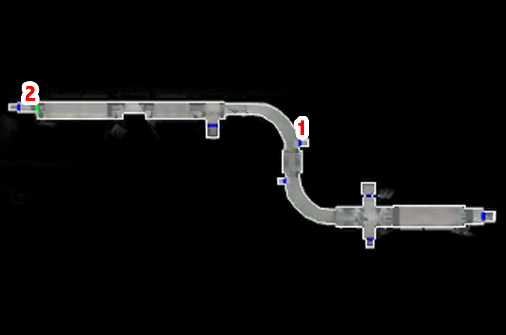

# Taris - The Undercity

[< Previous Page](023_Taris.md)
| [Back to the Index](../index.md)
| [Next Page >](025_Taris.md)

- Take the elevator with the Sith papers towards the Undercity

## Undercity

- Challengend by two Outcast Beggars
  - Who are you? What are you doing here in the Undercity?
  - **You poor wretches. Here's 20 credits to buy some food and clothing.** (LSP +2)
- Shaleena arrives
  - My name's Name. Who are you?
  - The surface is a beautiful place.
  - Rukil? Who's that?
  - The Promised Land? What's that?
  -  I want to ask you some questions.
  - Tell me about this village.
  - Do you know anything about the escape pods that crashed into the Undercity?
  - Have any other up-worlders come through here recently?
  - Where can I find Gendar?
- Talk with the doctor
  - Who are you?
  - What are you talking about?
  - There must be something someone can do!
  - Goodbye.
- Gendar
  - Who are you people? Why do you live here in the Undercity?
  - What a horrible way to live!
  - Rukil?
  - Tell me about the rakghouls that live down here.
  - I want to ask you some questions.
  - I'm looking for a Twi'lek named Mission Vao.
  - How can I get to the sewers?
  - ...
  - You said something about other up-worlders who came by here recently?
  - I think I'll be going now.

- Rukil -> learn about Malya her apprentice
  - Uh... okay, then. Could I ask you some questions?
  - I'm Name. What do you want from me, Rukil?
  - **The true path? What does that mean?**
  - Prove myself? How can I do that?
  - I will help you with this, Rukil.
  - I'll be back if I find anything out.
- Meet Igear -> merchant -> good seller but not rebuyer
  - How do you manage to run a store here in the Undercity?
  - I want to ask you some questions.
  - Why doesn't Gendar like you?
  - That's why Gendar's mad at you? There has to be more to it than that!
  - I'll be going now.
- Go to the gate -> save the guy -> go back to talk
  - Open the gate... I will kill the rakghouls.
- Talk again to the people
- Go away from the camp
- Mission runs towards you
  - Whoaa...
  - Calm down, Mission. Take a deep breath and tell me what happened.
  - Do you know where they took him?
  - Why don't you ask Gadon and the Beks to help you?
  - If I help you get Zaalbar back you have to get me inside the Vulkar base.
  - **[MISSION has joined your party.]**

- //Level up Mission (and Carth (5) ? -> XBox)
- Equip her with the Sith Rifle
- //Pick up the mines with Mission -> after exploring left
- //first go see the republic soldier

- go left from the camp, meet canderous
  - **Are you threatening me?**
- kill the ratgoules -> grenade !
  - What do you mean by that?
  - What can you tell me about Davik?
  - What do you know about the Lower City gangs?
  - I better get going now.
- find the apprentice journal

- go right -> talk with sith
  - Look... I have got all the proper security papers.
  - You said you lost one patrol already?
  - I should be going now.
- kill ratgoules until sewers
  - Get the serum
  - Get the gun improvement
  - Get the armor (equip)
- **Banter** comming back (save-load?) Carth / Mission
  - Settle down! Both of you

- Go back to igear -> buy him improvement for weapons
  - Scope
  - Vibration Cell
- go back to rukil
  - Your apprentice is dead. I have her journal.
  - Guide you? But I don't even know where the Promised Land is!
  - Very well – tell me the history of your people.
  - Is that how you came to be down here?
  - How can I lead you this Promised Land when I don't even know what it is?
  - **And you want me to find these missing journals?**
  - **Don't worry, Rukil. I'll find those journals.**
    +175 XP (level 5)
- Go back home (by foot)
- Talk to Mission -> Proposition in the lower city (near the Undercity elevator)
  
  - I want to know a little more about you, Mission.
  - How did you and Zaalbar hook up?
  - Who'd want to pick a fight with a Wookiee?
  - You're lucky he didn't fry you with a blaster.
  -  Did Zaalbar kill them?
  - How did Zaalbar end up on Taris?
  -  How did you survive before you met Zaalbar?
  - We should get back to the task at hand.
  - I didn't know you had a brother.
- **Kill the respawned Vulkar in Lower City near the Upper City elevator**
- Go back to your apartment in the Upper City (fast travel)
- **Talk to Carth (2/12)**
  - I want to discuss something with you.
  - We didn't finish our conversation last time.
  - Why are you so hostile? What did I do to deserve this?
  - Of course it won't happen again if you never trust anyone!
  - **Right. And how am I supposed to know that *you* won't betray us?**
  - Why not you? Accusing other people is a good cover for a traitor.
  - Ahhh… so you don't trust yourself, is that it?
  - You sure you don't want to talk about it?
- Go back to the Lower City by foot -> new speach with the Sith at the entrance

**12 parts needed -> got 10, 2 found in the sewers**

## Sewers

- Head toward the sewer entrance (where you killed a bunch of ratgoules)
- _Switch version: along the way:_
  - Igear's will ask you to give him the journals while you cross the camp
    - Why are you telling me this?
    - That's horrible! How can you be so self-centered?
    - Forget it! I won't betray Rukil and the village for you.
    - I'll be going now.
- Go to the sewers: 4-5 respawned ratgoules in the way

**SAVE BEFORE ENTERING**

- Kill the 3 gamorreans, loot
- Follow the corridor
- On the left kill the ratgoules and find the 2nd journal for Rukil
- Next, roundabout: kill the 4 gamorreans

- Go to the door on the right first -> 2 mines -> field door -> Vulkar base entrance
- Computer
  - Leave the computer. (don't spend a spike)
  - _That energy shield leads to another section of the sewers. The entrance to the Vulkar base is somewhere past there. I've got the codes to lower the shield, but we have to rescue Zaalbar from those Gamorrean slavers. Don't worry – we can come back after we find Big Z._
- Go back to the fountains room
- Go to the door on the right (Careful; 1 gamorrean)
- Next Ratgoules room
- Start by the doors on the left
- 2nd left door -> mine
- Roundabout -> kill the ratgoules
- Still explore doors on the left first
- 2nd door -> corridor -> right -> see Zaalbar
- Next room, kill ratgoules, take the mine and go two rooms backwards (spinning wheel)
- Take the other door (left)
- Kill the gamorrean in the corridor
- Door on the right -> last journal for Rukil
- Repair the droid (12 repair parts)
  Missions levels up (5) or a bit later
- Let the droid do the job

- Loot the belt
- Save Zaalbar
  - Good to meet you Zaalbar. I'm Name.
  - It's some kind of loyalty vow, isn't it?
  - I'm honoured to accept your vow.
  - I'm glad to have you on board, Mission.
  - Good...
  - Whoa – nobody said anything about a rancor monster!
  - That's not really an option. Let's go.
- Zaalbar joins

- Take Mission and Zaalbar with you
- Level up Zaalbar (5) -> Equip 2 swords -> Previously upgraded Mission vibroblade
- Take Zaalbar belongings in the locked chest in the next room
- Equip Mission with the bowcaster
- Unlock the back door
- **Banther Mission with Zaalbar (1/2)** while going toward the door
- Follow the previous corridor until the next closed door
- Open the next door on the right -> console -> come back later
- Take the other closed door
- Take the mine
- Trigger -> 4 ratgoules will spawn
- Take the ladder

14380 XP on the XBox version (620XP needed for level 6)

## Preparation for the Vulkar Base Infiltration: Back in Upper Taris

### Igear's deal

- Go back to the camp
- **Don't speak now to Rukil!!** -> finish the quest "Infected Outcasts" first!
- Igear's will ask you to give him the journals while you cross the camp
  - Why are you telling me this?
  - That's horrible! How can you be so self-centered?
  - Forget it! I won't betray Rukil and the village for you.
  - I'll be going now.

### Lower Apartements 1

**SAVE**

- Go to apartments on the right while going back towards the upper city
- Meet Calo again
- Go on the left first
- First Apartment:
  - 2 guys -> kill them
  - solo mode -> hide Zaalbar and PC in the right corner
  - Mission invisible -> put 2/3 mines in the corridor
  - Put Mission at the back of the room
  - Release camouflage
  - Wait for the 3 guys walking
  - Kill the rest of them (if some are not dead)
  - Get the mine on the closet and loot
  - Equip combat suit on Mission

- Continue the corridor on the left
- Kill the 2 Vulkars
- Open the next door's room
- 2 Vulkars -> Level Up ! (6) -> a bit later actually (Seleven)
- Loot, go near the next door
- Before entering, kill the 2 guys in the corridor
- Enter the room
- Puzzle! Password to open the chest
  - First get the mine
  - Hyperspace, Uncle, Alderane
  - 110 XP + Good armor
- Save before the next door
- Selven's apartment
  - Who are you?
  - I was just exploring. I didn't know anyone was in here.
- Enters anyway (+shield+implants if needed) -> kill her

- Equip neural band (the belt will be useful for Carth)
- Kill the last Vulkar in the next room
- Leave

- Go to the Cantina
- **SAVE**
- Talk to Zax -> **level 6 needed for persuade**
  - Bounty
  - Seleven
  - Persuade
- Transit back to the safe house

### Back to the apartments

- Talk w/ Mission
  - I want to talk to you about your brother.
  - **Embarassing? Why?**
  - You were stowaways?
  - He's family. You have to stick by your family.
  - Pretty handy skills to have, Mission.
  - Why did he leave?
  - Who's Lena?
- **Talk to Carth (3/12)**
  - I just want to talk with you.
  - I just want to know why you distrust me so much.
  - But we have to work together, Carth, so it has plenty to do with me.
  - I suppose you can't. That must have been hard to take.
  - You say that with such… hatred.
- Improve scope for mission + armor

- Go out with Carth and Mission
- Level up Carth
- Go to the ring and kill Ice +300c
- kill the old man (at begin of combat, pause and use all injections) +400c

- Talk to him after (he leaves)
- kill twitch (he is weaker with a sword + use medpacs -> already a lot in stock) +500c
- see bendak
  - You're On Bendak
- then go to kebla yurt store and buy Echani Ritual Brand (non improvable)
- kill bendak (hard, injections + meds + frag grenades)

**SAVE**

- get credits + ask for more ->900c + bendac blaster
- Equip carth and improve it at the safe house
- Take Mission and Zaalbar
- Banther Zaalbar and Mission before arriving at the clinic (xbox)
  - Zaalbar looks fine to me.
- Give the Serum
  - I have the serum to cure the Rakghoul disease.
  - Here you go. **+4 LSP**
  - Keep your reward, Zelka. You need it more than I do. **+2 LSP**
- Rebuy the serum

- Save Ithorian -> NOT NOW
- Talk to racist guy
- **4 Spikes + 27 Parts** will be used after
  - _buy maximum of repair parts ??_ -> Only 4 on XBox at this point? -> (8+8+11 = 27) or at least 24 (8 instead of 11)
  - _I could buy 16 parts with all my money (no selling)_ -> 1 more needed... -> sell to have at least 21 ?
  - On switch: only have 5 left before the last droid -> 3 more needed or 6
- Go to the lower city candina -> SAVE
- See Zax for Bendak -> PERSUADE
- Go back to the undercity

### Back to the Camp

- Save the sick Outcasts (SAVE) -> kill the newly transformed ones
- Talk to doctor
  - I'm going through those...
    - Don't worry – I'm here to help you.
    - I have brought you a serum to cure the rakghoul disease.
    - Here, take this rakghoul serum. I have enough for both of you. **+2 LSP**
    - Sell some minor mines + all gas mines
- Talk again to the doctor -> free healing
- +210XP
- Talk to Gendar -> congratulates
- Talk to Rukil
  - I have all three journals. Here – take them. **+6 LSP**
  - **Maybe I should come with you. I could help you on the journey.**
- Go back to the Sewers (go on the right -> few ratgouls to kill)

[< Previous Page](023_Taris.md) 
| [Back to the Index](../index.md) 
| [Next Page >](025_Taris.md)

