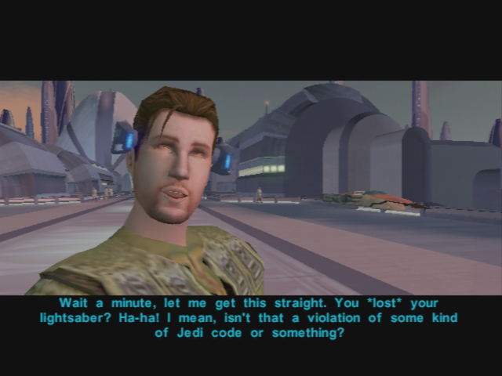
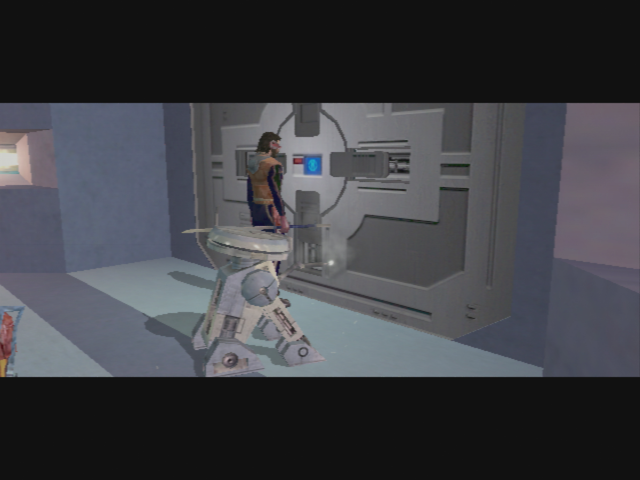

# Taris - Preparation for the Vulkar Base Infiltration

[< Previous Page](026_Taris.md)
| [Back to the Index](../index.md)
| [Next Page >](028_Taris.md)

- Go out with Bastila and Carth
- Twilek
	- **You must have me confused with someone else.**
	- **Canderous? Isn't he that Mandalorian that works for Davik?**
	- **Okay. I got the message. You can go now.**
- Level up Bastila and equip
- Go the Kebla Yurt store
- Suggestion for speaking to Bastila
    - You wanted...
	- **We were looking for you. (lass speach but better)**
	- **I had a lot of help: Carth, Mission, Zaalbar.**
	- **I think you're underestimating us non-Jedi.**
	- What are you trying to say?
- Buy the detonator -> new speech :)
- Go towards the upper apartments
- Banter w/ Carth
	- Maybe losing lightsabers is a side-effect of her Battle Meditation.

- Save the Ithorian near the apartments elevator
    - Hey – you kids! Leave the Ithorian alone!
    - **Just because he's different doesn't give you the right to attack him!** (+2 LSP)
    - **You look hurt. Here, I've got a medpac. Let me help you.** (+4 LSP)
- Save Largo
    - Maybe I could help...
	- Here – I've got 200 credits you can have. 
	- _Carth intervention? -> not on Xbox ?_

### Back in the Lower City

- Go to lower apt 
    - Give Matrik the Detonator
- _go see gadon -> not here -> body guard discution + Carth int_
- Meet Canderous (+carth intervention + Bastila)
    - **Goodbye.**
    - Why are you telling me this?
    - What's in this for me?
    - How are you going to manage that?
    - How am I supposed to get inside the military base?
    - Won't Davik get mad if I take his droid?
    - Okay, Canderous – you've got a deal.
    

    
- Meet Holdan -> fail persuade -> Bastila force persuade
    - You're the guy who put the bounty on Dia's head, right?
	- Why would she do that?
	- Sounds like maybe you got what you deserved.
	- I want the bounty on Dia's head removed.
	- [Persuade] If you hire someone to kill Dia it will look like you weren't man enough to do it yourself. -> FAIL -> Bastila saves
    - **+4 LSP**
- Collect Matrik -> persuade for 400 credits (25% chance at this level)
- Go back to the upper city by foot
- Transit back
- Go see Dia
    - I spoke with Holdan. I convinced him to remove the bounty on your head.
    - Thank you, Dia. This reward will be fine. -> no LSP but sword improvement
- Return to the hideout
- Upgrade for sword
- Talk w/ Bast (2/8) ? -> Not yet

- Go out w: Mission only
- Transit back
- Go buy Parts -> **6 Minimum / 18 spikes** -> both 4 parts and 1 spike in XBox walkthrough
- Go "buy" T3
    - Persuade one time -> 1500c -> NO
    - MORE! FREE -> DS points but who care -> Supposed to be a member the exchange!

- T3 is level 7
- Equip T3 with Ion blaster (droids to kill)
- **Goto base**

[< Previous Page](026_Taris.md)
| [Back to the Index](../index.md)
| [Next Page >](028_Taris.md)
