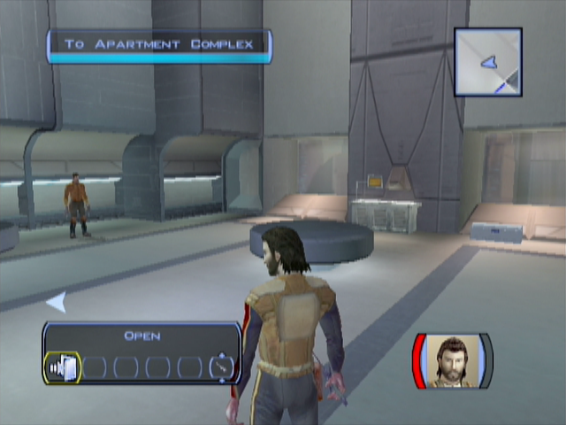
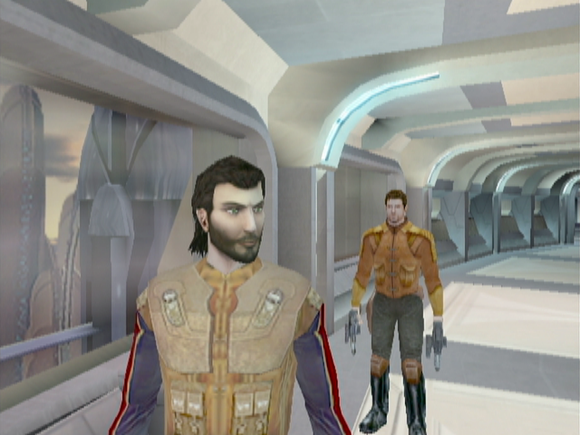
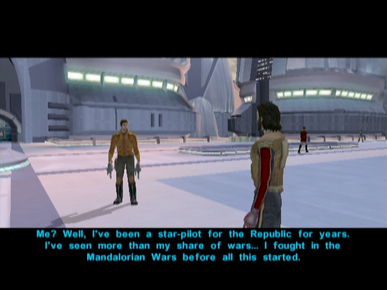
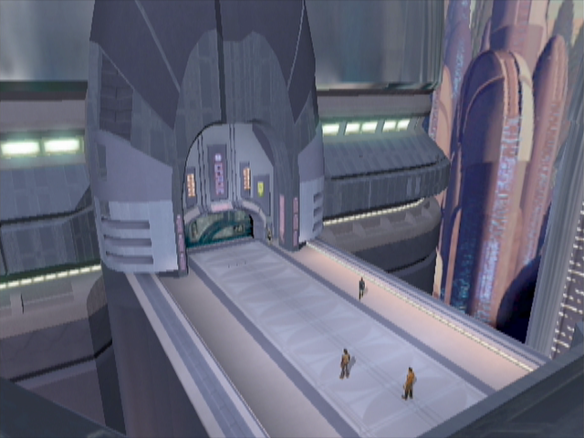

The Search for Bastila
======================

## Upper Taris - Safe Room

- Carth talks to you
    - **I had a strange dream. Like a vision or something.**
    - **I guess I owe you my life. Thanks.**
    - Bastila? She's the one from the Endar Spire, right?
    - How do you even know Bastila's still alive?
    - If Bastila's a Jedi, she can probably look after herself.
    - Battle Meditation? What's that?
    - //So what do you suggest we do next?
    - Any idea where we should start looking for Bastila?
    - I want to ask you some questions.
    - What can you tell me about this planet we're on?
    - What do you know about Malak and the Sith?
    - A Jedi? What do you mean?
    - I would like to ask you something else.
    - I'd like to know some more about you, Carth.
    - The sooner we start looking for Bastila the sooner we find her. Let's go.
- Loot and improve your sword
- Leave the room

## Upper Taris - South Apartments

- Kill the Sith and 2 droids -> You gonna meet the victim again later (XBox -> different voices ??)
  - Won't someone come searching for this patrol?
- Level Up! (3)
- First door on the right -> Loot -> **SAVE** -> Talk to the woman
  - I'm sorry. I was just investigating the area.
  - Holdan? Who's that?
  - What do you mean?
  - //**[Persuade] You can trust me. Maybe I can help.** -> Easy -> Level 3 = 50% (Keep it ? Not necessary -> no XP and not much sense while seeing Holdan later)
  - I want to ask you some questions.
  - I'll be going now.
- Talk to the Twi'lek Larrim
  - Pleased to meet you, Larrim. My name is Name.
  - What's so great about these energy shields?
  - Where did this technology...
  - ... Else?
  - Why do you have a kiosk set up here?
  - You mentioned something about illegal aliens living here.
  - Aren't you worried about getting caught?
  - I want to ask you some questions.
  - Let me see what you've got for sale.
- He has nothing interesting (or too expensive!)
- Loot around and talk to the old man -> tells you about the Cantina and Weapons
    - Sorry, I didn't mean any disrespect.
    - I want to ask you some questions.
    - Where can I get some equipment?
    - I want to ask you something else.
    - Tell me about Taris.
    - Where is the cantina?
    - What do you think of the Sith and this quarantine?
    - I'll be going now.

## Upper City South

- Take-off your weapons (let's be RP!)
- Talk to a Sith / People
- Talk to s Droid
  - What can you tell me about the Sith?
  - Is there some way I can get a shuttle off this planet?
  - Do you know anything about the gangs in the Lower City?
  - How come there are hardly any aliens around?
  - Who do you work for?
  - I don't need anything right now.
- Cross the street, in direction of the Equipment Emporium / Cantina
- **Proposition to talk with Carth (0/12)**
  - I'd like to know some more about you, Carth.
  - You're talking like it's your fault. Like you failed somehow.
  - Them? Do you mean the people of your home world?
  

  
- Go to the Equipment Emporium and talk to Kebla Yurt
  - I want to ask you some questions.
  - I was wondering how you feel about the Sith?
  - I need some general information on Taris.
  - Swoop gangs? What can you tell me about them?
  - What do you know about Davik?
  - Is Davik working with the Sith?
  - Do you know anything about those escape pods that crashed here on Taris?
  - I'll be going now.
- We will discover her inventory later -> she has rather good weapons we gonna need later

## Upper City Cantina

- Go to the cantina talk to the old man (Garouk) an buy the paazaak deck (and make the tutorial)
  - Who are you?
  - You're giving up gambling? Why?
  - I can't afford that.
  - Sure, I'll buy your deck.
  - (I'd like a Pazaak lesson.)
- Talk to the girl (Sarna) on the right (Sith on permission) in the next room on the right.
- If you're a woman, you can talk to a guy in the other room (Yun Genda)
- _DONT try to persuade her. -> new quest -> **Sith party (BUT LESS XP)**_
  - You're from the military base? You don't look like one of the Sith.
  - Nice to meet you...
  - //So why do you do it?
  - You can't really blame people... you did conquer the planet.
  - You seem pretty touchy about this. Maybe you feel a little guilty about what you do.
  - //Sorry – I'm not trying to judge you.
  - //I'm not actually from Taris. I'm just stuck here until the quarantine ends.
  - //Being stuck on Taris isn't so bad... but the locals aren't much fun.
- Talk to other people around

- Go to the bar room
- Gana Lavin : Be rude -> more XP -> guy to kills after the cantina
  - Sorry, I'm not your waiter.
  - **I don't even work here!**
- Go to the Dueling Ring room
- Watch the match, talk to everybody
- Deadeye Duncan
    - Who are you?
    - You're the number five ranked duelist? Out of how many?
    - Dueling chambers?
    - Goodbye.
- Gerlon Two-Fingers
    - I want to ask you some questions.
- Ice
    - Wow – that was cold!
- Marl
    - Do I know you?
    - Tell me more about these duels.
    - I want to ask you about the duelists here.
        - Tell me about Duncan.
        - Tell me about Gerlon.
        - Tell me about Ice.
        - Tell me about yourself.
        - Tell me about Twitch.
        - Tell me about Bendak Starkiller.
    - I want to ask you some questions.
    - I just want some general information on Taris.
    - Do you know anything about the crashed Republic escape pods?
- Do the first match (Talk to Ajuur)
    - What are you talking about?
    - That's a terrible name!
    - I'm ready for a duel.
    - Let's do it.
    - //I just want to ask you some questions.
- Do the 2 firsts matches

    
- Go pazaak with Niklos near the entrance
    - Who are you?
    - Let's play.
- Talk to the girl near the entrance (Christya)
    - 20 credits? That seems expensive for a couple of drinks.
    - Sorry, not interested.
- Talk with Bendak Starkiller
    - Autoprints? What are you talking about?
    - How come you don't hang around with the other duelists?
    - I want to ask you some questions.
    - I'll be going now.
- Leave the Cantina
    

## Exploring Upper Taris

- Go towards your apartment -> you will meet Gana Lavin (the angry rich woman in the cantina) with two body guards. Kill the body guards and loot the swords.
- Follow the street
- Go to the clinic on the right

**_TEMPSAVE_** : Easy Persuade (Level 3 -> 50%)

- Talk to the doctor (Zelka Forn)
    - Medical facility? Is this some kind of hospital?
    - I want to ask you some questions.
    - How do you feel about the Sith?
    - Ask something else
    - I just want some general information about Taris.
    - Tell me about Upper Taris.
    - Tell me about the Lower City.
    - What do you know about Davik?
    - Tell me about the Undercity.
    - Outcasts?
    - Ratgoules disease?
    - Is there no cure?
    - Maybe I could find a way to get my hands on that serum for you.
    - Don't worry, Zelka – I'll get that serum for you!
    - **Do you know anything about the Republic escape pods that crashed in the Undercity?**
    - You seem awfully defensive about this.
    - **[Persuade] Don't worry, I'm not with the Sith. I won't betray your secret if you tell me.** (EASY - 50%)
    - **Is there anything I can do to help?** (LSP +2)
- Leave the medical facility: Gurney intervenes
    - An offer? What are you talking about?
    - Davik Kang? Who's that?
    - You mean Davik's a crime lord?
    - Why does Davik want the cure so badly?
    - Where can I find Davik if I want to give him the cure?
    - Why do you care who gets the cure?
    - What if I tell Zelka you're helping Davik get the cure?
    - I'll keep your offer in mind.
- Go near the entrance of the North street
- Bounty Hunters racketeering a Merchant
    - **Leave this man alone or you'll have to deal with me!** (LSP +2)
- Kill
    - Maybe I can help you.
    - **Here's 100 credits. Take them.** (LSP +2)
- Loop (50c on each corpse)

## Upper City North
 
- Cross the street and go to the North Apartments
- Begin on the left (it's a circle)
- Loot everywhere
- 3 Sith are arresting a guy
    - What's going on in there?
    - **Stop the interrogation right now!**
    - **I won't let you kill a defenceless prisoner!** (LSP +2)
- Kill them and talk to the Alien Prisoner
    - The Hidden Beks? Who are they?
    - What are the Hidden Beks planning?
    - Can you take me to Gadon?
    - Can I get one of those uniforms from you?
    - I should be going now.
- Loot the Sith corpse -> take the uniforms
- Go to Largo's Apartment
    - Don't worry – I'm not going to hurt you.
    - I'm just looking around. 
    - -> come back later for the bounty -> 200c again -> need the money at the moment
- Continue the north street
- **TEMPSAVE** 3 guys -> agress them ? NO -> PCO but 150 PX instead of 60 (+90PX, is it necessary ?) and loot
    - **[Persuade] Hey, guys, we can all be friends here. Let me buy you a drink.** (LSP +2)
- Talk to the racist man (Gorton Colu)
    - Vermin and scum? What are you talking about?
    - I see... well, good luck in your crusade.
- On the left: the Droid store
- Talk to Janice
    - What do they have against Twi'leks?
    - Utility droids? What do they do?
    - Let me see your droids.
    - **Tell me about that top-of-the-line T3-M4 droid.**
    - I'll take the T3-H8 unit. Here's 50 credits.
- Go out -> the droid explode -> go back
    - It blew up. I came to get my money back.
    - No hard feelings.
    - Let me see what you've got for sale.
    - Let me see your inventory.
- ***Buy 7 parts in her shop (sell if needed)*** ???
- Go to the elevator
- Sith talks with you
- (Visit the military base door)
- Go back home
- **Talk to Carth (1/12)**
    - Is this a good time to ask you some more questions?
    - I just would like to know you better.
    - This isn't an interrogation. I never said that.
    - Like you said when we first met: Bastila didn't have time to use her powers.
    - I'm a scout. I was recruited into the fleet for my skills, if you must know.
    - **You'd rather I wasn't?**
    - Are you implying *I* had something to do with the crash?
    - Why would Bastila request my transfer?
    - I'm telling you, Carth, I had nothing to do with the crash.
    - Are you always this suspicious?
    - I consider this important.
- Equip you (not carth, conversation with the sith will not make sense) with the Sith armor
- Go back to the elevator with the uniform (by foot ! -> funny talks)
- North street near the swoop bikes: meet the drunk men again!
- Talk to the racist guy!
**_SAVE_**
- Take the Elevator

## Lower Taris

- Kill guys on the left (Use PC to tank, and Carth to shoot)
- Kill the other on the right near the Vulkar base door (WARNING : they are though -> launch grenade + all fire poser on one)
- Go first at the Cantina -> Get rejected with the uniform
    - I'm not on duty right now.
- Go to the hidden beck base (next door) -> Get rejected with the uniform
- Continue and kill the Vulkars
- Level Up! (4)
- Loot and remove your Sith uniform
- Continue your path until you meet Canderous
- Go back to the Cantina
- _don't buy pazaak ? 200 c +/-1 ? +/-6 cheaper ->50 ? -> save 6 to check_ -> NO, expansive
- Gelrood -> Infinite pazaak -> not a lot of money each time
    - Why were you banned?
    - I want to ask you some questions.
    - I'll be going now.
- Meet Calo Nord
- Talk to him before he leaves
    - I saw how you mopped those Black Vulkars. Nice work.
    - I'm not looking for a fight. I just want to talk.
    - Okay, I see your point. I'll be off then.
- Go see Holdan in the music room -> wait for force persuade with Bastila to pull off Dia's bounty (+4PCL 125PX instead of 50+105?)
    - Who are you?
    - I want to ask you some questions.
    - You work for Davik?
    - You're pretty open about what you do.
    - Do you think Davik could get me off Taris?
    - I'll be going now.
- Discover Mission and Zaalbar -> talk to her -> +60 PX!
    - That's weird: a Twi'lek who speaks galactic Basic!
    - How do a Wookiee and a Twi'lek street urchin end up as best friends?
    - I want to ask you some questions.
    - Tell me about Davik.
    - Tell me about the Lower City gangs.
    - Why did Brejik leave the Hidden Beks?
    - Tell me about Calo Nord.
    - I'll be going now.
- Go to the Bounty office

**_TEMPSAVE_**

- Dancing Girl (Starlight Entertainers) -> Don't FALL or reload save
    - What are you talking about?
    - Why don't you have a partner?
    - Maybe I could be your partner.	
    - **[Persuade] I'm good enough to get you through your audition.** or **[Persuade] What other choice do you have?** (EASY 75%)
    - [Join Lyn by dancing very close and face to face.]
    - [Join Lyn by dancing close beside her.]
    - [Join Lyn by dancing very close and face to face.]
- Talk to Zax -> don't pay for infos
    - You work for Davik?
    - Davik posts bounties in a government office? Is that even legal?
    - Tell me about the bounties.
    - There's two government contracts. One's an assassin named Selven, the other is Bendak Starkiller. He's a famous death-match duelist. Between them they've killed hundreds of people.
    - How do I collect the credits for these contracts?
    - Tell me about this girl Dia.
    - Tell me about Bendak Starkiller.
    - Tell me about the merchant Largo.
    - Tell me about the assassin Selven.
    - Tell me about Matrik.
    - I need some information.
    - I'm not going to pay just to ask you some questions.
- Talk to the other clients
- Leave the Cantina
- Go to the Hidden Bek base
- Talk to Gadon Thek
    - You have problems with the Sith?
    - I need information on those Republic escape pods that crashed in the Undercity.
    - Don't worry… I'm not working for the Sith.
    - Bastila's a slave? What will happen to her now?
    - Swoop race? What does that have to do with it?
    - But I don't even have a swoop bike.
    - How do I know I can trust you?
    - How do I know you'll live up to your end of the bargain?
    - How am I supposed to get inside the Vulkar base?
    - Where can I find Mission?
    - I got past the Upper City guard no problem.
    - What do you want with the Sith uniforms?
    - Okay - I'll trade the uniforms for the papers.
    - I'll be back when I get the prototype accelerator.
- Visit the area / Loot
- Kill the respawned Vulkar in Lower City near the Upper City elevator
- Go back to your apartment in the Upper City (fast travel)
- **Talk to Carth (2/12)**
    - I want to discuss something with you.
    - We didn't finish our conversation last time.
    - Why are you so hostile? What did I do to deserve this?
    - Of course it won't happen again if you never trust anyone!
    - **Right. And how am I supposed to know that *you* won't betray us?**
    - Why not you? Accusing other people is a good cover for a traitor.
- Go back to the Lower City by foot -> new speach with the Sith

## Undercity

- Take the elevator with the Sith papers towards the Undercity
- Challengend by two Outcast Beggars
	- Who are you? What are you doing here in the Undercity?
	- **You poor wretches. Here's 20 credits to buy some food and clothing.** (LSP +2)
- Shaleena arrives
	- My name's Name. Who are you?
	- The surface is a beautiful place.
	- Rukil? Who's that?
	- The Promised Land? What's that?
	-  I want to ask you some questions.
	- Tell me about this village.
	- Do you know anything about the escape pods that crashed into the Undercity?
	- Have any other up-worlders come through here recently?
	- Where can I find Gendar?
- Talk with the doctor
	- Who are you?
	- Danger and suffering? What are you talking about?
	- There must be something someone can do!
	- Goodbye.
- Gendar
	- Who are you people? Why do you live here in the Undercity?
- Rukil -> learn about Malya her apprentice
    - Uh... okay, then. Could I ask you some questions?
    - I'm Name. What do you want from me, Rukil?
    - **The true path? What does that mean?**
    - Prove myself? How can I do that?
    - I will help you with this, Rukil.
    - I'll be back if I find anything out.
- Meet Igear -> merchant -> good seller but not rebuyer
    - How do you manage to run a store here in the Undercity?
    - I want to ask you some questions.
    - Why doesn't Gendar like you?
    - That's why Gendar's mad at you? There has to be more to it than that!
    - I'll be going now.
- Go to the gate -> save the guy -> go back to talk
    - Open the gate... I will kill the rakghouls.
- Talk again to the people
- Go away from the camp
- Mission runs towards you
    - You're Mission Vao, right? Gadon Thek said you could help me.
    - Calm down, Mission. Take a deep breath and tell me what happened.
    - Do you know where they took him?
    - Why don't you ask Gadon and the Beks to help you?
    - If I help you get Zaalbar back you have to get me inside the Vulkar base.
    - **[MISSION has joined your party.]**
- Level up Mission
- first go see the republic soldier
- go left from the camp, meet canderous
- kill the ratgoules -> grenade !
- find the apprentice journal
- go right -> talk with sith -> kill ratgoules until sewers -> get the serum

- **Banter** comming back (save-load?) Carth / Mission
- go back to rukil / go back to igear -> buy him improvement for weapons
- Improve stuff back home
- Talk to Mission
	- I want to know a little more about you, Mission.
	- How did you and Zaalbar hook up?
	- Who'd want to pick a fight with a Wookiee?
	- You're lucky he didn't fry you with a blaster.
	-  Did Zaalbar kill them?
	- How did Zaalbar end up on Taris?
	-  How did you survive before you met Zaalbar?
	- We should get back to the task at hand.
	- I didn't know you had a brother.
- Transit Back
- Kill respawn mobs

- Si continue vers les sewers -> 50 /100 px ? sinon après moins ?

## Sewers

- **12 parts needed -> got 10, some inside ?**
- save Zalbar
- GO OUT (don't go to the vulkar entrance -> not much sence) take the ladder

## Back in Upper Taris

- Go to appartements, meet calo
	- first appartement : 2 guys, kill them, solo mode, then hide in the corner -> Mission in FUFU -> 2 MINES -> wait for the 3 guys walking arround to enter the room
	- get the mine with mission, explore each room
	- LEVEL 6 ?
	- enigme : Hyperspace, Uncle, Alderane
	- Kill Seleven
- **Go see Zax for the bounties if persuade is OK**

## Back in Upper Taris

- Talk w/ Mission
	- I want to talk to you about your brother.
	- **Embarassing? Why?** You don't have to tell me anything if you don't want to.
	- You were stowaways?
	- He's family. You have to stick by your family.
	- Pretty handy skills to have, Mission.
	- Why did he leave?
	- Who's Lena?
- **Talk to Carth (3/12)**
    - I just want to talk with you.
    - I just want to know why you distrust me so much.
    - But we have to work together, Carth, so it has plenty to do with me.
    - I suppose you can't. That must have been hard to take.
    - You say that with such… hatred.
- Improve scope for mission + armor
- Go sell the serum (+200px)
- go to the ring and kill Ice +300c
- kill the old man (at begin of combat, pause and use all injections) +400c
- Talk to him after (he leaves)
- kill twitch (he is weaker with a sword) +500c -> LEVEL 6 ??
- see bendak
- then go to kebla yurt store and buy Echani Ritual Brand (non improvable)
- kill bendak (hard, injections + meds)
- get credits + ask for more ->900c + bendac blaster 
- equip carth and improve it

- BANTER Zalb / Mission ?
- give the Serum
- rebuy the serum

- Save Ithorian
- BANTER AGAIN
- talk to racist ? wait for zalbar ?
- buy maximum of repair parts
- talk to the racist guy
- See Zax for Bendak -> PERSUADE
- Go back to undercity and save the sick outcasts

## Back to the Camp

- Save guys
- Talk to the chef
- Go back to the camp gives the promised lands
- back to vulkar base (kill ratgoules)

## Sewers 2

- Go on the right -> loot around ladder
- kill -> levelup
- meet the rancor
- stealth -> go to corpses -> put grenade ->odor

## Enter the Vulkar Base

- kill the droid on the right (first corridor)
- Aller en face de l'entrer (faire le tour du bar)
- Tuer les ennemis -> looter armurerie
- Go to the console -> see all cameras
- kill vulkars with spikes -> still you get the XP of the killed guys -> LEVEL UP ? -> COOL FOR REPAIR
- talk to black vulkar in the control room
- kill the last vulkar in the bedroom, take the pass card
- Go in the pool in solo mode -> DONT use repair parts on the droid on the pool, no XP (bug : even if you don't have enough repair parts -> success)
- go repair the droid and kill everybody in the bar (**8 PIECES** avec le bon level (1 +1+1+2+3))
- Ouvrir la piece en face avant que le droide tourne
- Revenir devant le droid et ouvrir la seconde piece du couloir**
**
- Talk to ada in the bar to tell her she can go

## Enter the Garage

- Go to the garage, use pass card
- Solo mode -> go near the droid -> place zalbar and mission to kill droid near the big door of the garage
- Repair the most far droid (**8 PIECES** avec le bon level (1 +1+1+2+3))
- Kill the guys on the right corridor (w/ player)
- Kill the 2 in the other corridor with Z and mission
- Send Z near player if needed
- Mission in Fufu -> Mines (QUICK the droid will pass on it)
- Mission -> Grenade on the left guys
- End solo mode
- Kill every body
- improve items
- Go the final door -> need key
- Go other corridor
- to console -> blow bikes -> open door
- meet the vulkar leader -> let him tel his proposition
- kill them all -> equip new stuff
- 8 per droid
- 11? + 3 parts for droid sidedoor (**+595PX** or 455)
- 2000 c + 4parts 
- Go out to lower city and go to appartment

## Preparing for the Race

- Talk to Mission ?
- Improve Carth Blasters
- **Talk with Carth (4/12)**
    - I want to continue our discussion from before.
    - Don't you think you'd feel better if you discussed it?
    - That name sounds familiar.
    - **How could you have not seen through that?**
    - Do you really believe that?
    - **I'd do the same thing in your shoes.**
- Go back to the lower city with Carth and Mission -> BANTER ?
- Buy enough repair parts (8needed)
- Go t lower city appartment
- repair
- automatic talk
- twisted rancor

		Activate Elinda first.
		Activate Ujaa second.
		Activate Ujii third.
		Activate Loopa fourth.
		Activate Fodo fifth.
		Activate Ashana sixth.
- Bounty Quest : Permacrete Detonator
- Go the swoop race

## Swoop Race

- Talk to everyone
- See bastilla
- begin the race x2!
- Talk w/ Bastilla
	- **It's a long story.**
	- I've got somewhere safe to go. I was planning to take you there after I saved you from Brejik.
	- **I think you've got things confused. You were a helpless prisoner until I came along.**
	- **Hey, who said you were in charge here?**
	- Carth and I are already working on a plan to get off Taris. (or other... -> but this one is logic with next)
