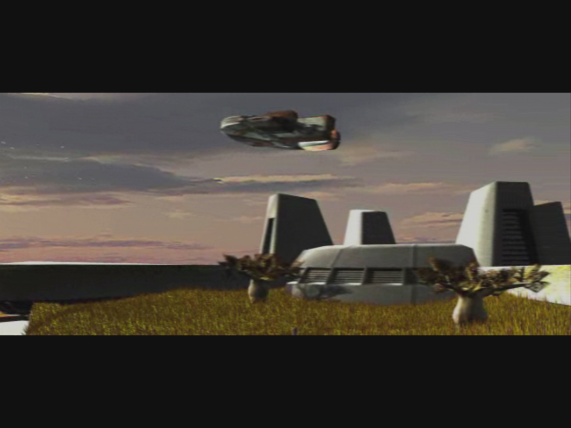
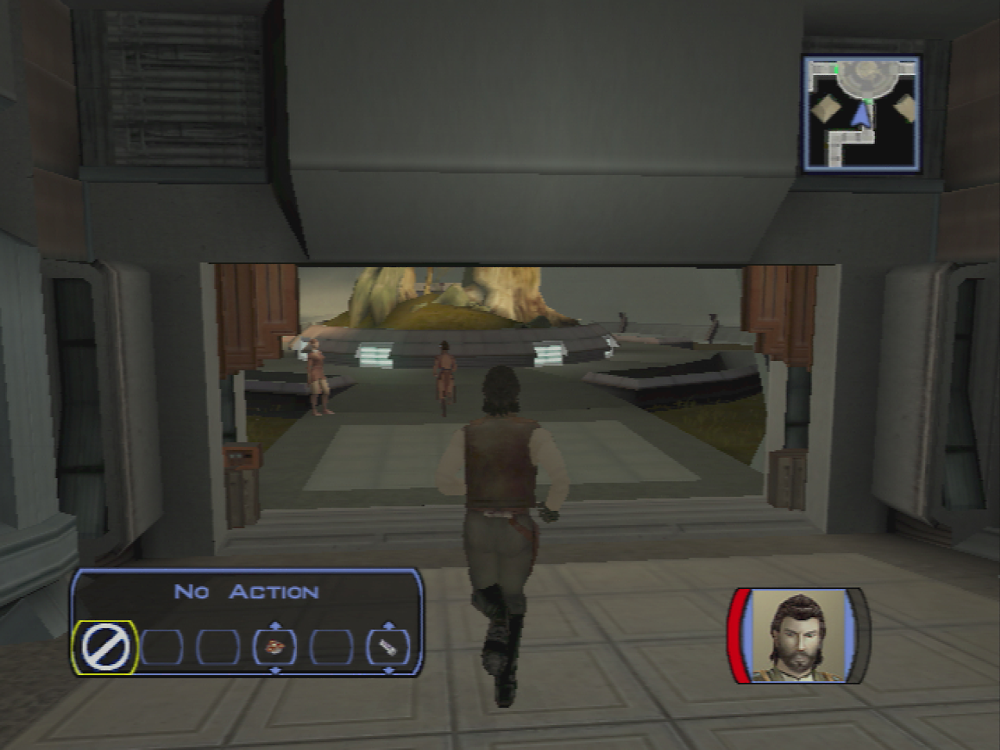

Dantooine - Jedi Training
=========================

## Meeting the Jedi Council

- Immediately pause after the conversation with Bastila
	- Take of you armor/sword/helmet -> take your original closes
- Follow Bastilla (Carth too)

- You are stopped by a Jedi
	- **Are you a Jedi?**
	- I believe you are mistaken. I am not a Padawan. I am Name. I came here with Bastila.
	- **I didn't come here to be scolded by you!**
- Go to the council room (left)
- Speek to Carth
- Join the jedi masters
	- **So you've drawn me into your little trap, Bastila. What now?**
	- **Isn't the Jedi Council on Coruscant?**
	- **I've got some questions for all of you.**
	- **Why did the Sith destroy Taris?**
	- Me? What about me?
	- **I don't know if I'm ready for this.**
	- **I'm willing..**

> The council wants to talk in private. You leave the discution, and go to bed.
> In the meanwhile you have a new vision...

- Carth speaks
	- **I had a rough night...**
	- Did she say anything else?
	- Let's go.
- Take Mission in the group
	- Level Up
- Move forward -> auto suggestion with Mission
	- **Malak will pay for what he did, Mission.**
- Go to the consil -> SAVE -> Start cinematic and discution -> reload -> remove party member (for the en of the cinematic)
	- **What?? How would Bastila know if we shared a dream?**
	- I am having visions now?
	- Are you saying I'm... joined with her?
	- **I will try my best.**
	- **Jedi are turning to the dark side?**
	- **I'm ready now. I accept this mission.** (otherwise DS -> should I ? -> sevral more dialogs -> not much sense -> they talk about visiting the ruins) 
	- As you wish, Master Vandar.
- Jedi Training begins

- Discussion with Zhar
	- **I want to ask some questions, Master Zhar. Questions about Revan and Malak.**
	- What happened?
	- What happened to this noble mission?
	- I will heed the lesson, Master Zhar.
- Remove Carth and Mission in the party -> does not make sense
- Go to the jedi masters -> Bastilla will redirect you to ask the masters
- Dorak
	- **Where are the Academy's archives?**
	- Very well... tell me the history of the Jedi.
	- **What does this have to do with Revan and Malak?**
	- **They should have protected them!**
	- Did the Jedi join in?
	- **How did Revan fall to the dark side?**
	- **Where did they disappear to?**
	- **How did Revan get so many followers?** (other question good also -> new lines)
	- So what happened next?
	- **What can I learn from Revan's history? -> less but more coherent**
- Vandar
	- I'd like to ask you some questions.
	- What can you tell me about Bastila?
	- Carth mentioned something about it.
	- Is there anything you can tell me about Revan and Malak?
	- Are you saying Revan was responsible for Malak's fall?
	- //Master Vrook doesn't seem to like me very much... -> NO LATER -> Can't finish discution coherently when becoming padawan otherwise
	- Quit
- Vrook (quit the conversation at each question... He really does not want to talk!)
	- I would like to ask some questions.
	- What can you tell me about Bastila?
	- Is there anything you can tell me about Revan and Malak? (re-ask)
	- What happened on the Outer Rim to corrupt Revan?
	- You often seem angry with me, Master Vrook. Have I displeased you? (re-ask)
- Go back and see Zhar
	- I am ready to continue my training.
	- What kind of tests are these?
- Makes no sense to ask Vandar and come back
	- **Belaya -> more precision on cave -> plus Jedi code**
	    - I am still learning the Jedi code.
	- **Sol'aa -> pazaak 120 c -> 6 matches -> give cards**
	- **Matale**
- Jedi Code : Vandar (not necessary then)
	- Can be learned by Vrook or other padawans
- Zhar
	- I am ready
		- peace
		- knowledge
		- serenity
		- harmony
		- the force
- Go to terminal, learn about classes
- Dorak
	- **Why do I get set with a single color?**
	- I want to be a Jedi Sentinel!
	- Help them flee.
	- Try to see a weakness in his technique.
	- Try to pick the lock.
	- Try to lure them out into a trap.
	- Sentinel
- **LEVEL 10 -> Free level!!**
	- **After level 10 -> 3 feat points left -> 12 / 15 / 18**
	- **https://strategywiki.org/wiki/Star_Wars:_Knights_of_the_Old_Republic/Classes#Jedi_Sentinel**
	- **10 force power left**
- Zhar
	- **What will these crystals do for me?**
	    - **Not READY ? -> USELESS to wait**
	- I am ready to face the third trial.
	- What's causing this corruption?
	- You know more than you're telling me..
- **Go back to Ebon Hawk**
- Go to the Ebon Hawk "get your equiment"
- Improve Canderous gun (trigger)
- Take Davik's armor -> +8 defense
- Talk to Canderous
	- I was wondering if you had any interesting stories.
	- **Is that why the Mandalorians attacked the Republic?**
	- **You seek death?**
	- **+ stimulants**
	- **+ info on Taris**
- Talk to Mission
	- I want to talk to you about your brother.
	- What did she do to you?
	- **Did Lena dump him?**
	- **Maybe she actually liked Griff.**
	- **Maybe something happened to him.**
- **Talk to Zalbar**
	- **+ grenade**
- **T3**
	- **spikes**

- Go out with **Mission** and **Carth**
- Leena appears (Mission brother's girlfriend)
	- **Mission gets a little worked up when it comes to her brother.**
	- Maybe your brother isn't the man you thought he was.
	- **So where is Griff now?**
- Talk to Mission now
    - I want to talk about your brother.
    - We'll find your brother, Mission.
- Level up Carth and Mission (2 levels since you earn nearly a whole free level while becoming a jedi)
- Equip -> Mission with Davik’s visor -> bonus feat
- Talk to the Twilek -> Lur Arka -> His girl
	- **Only if I get to ask you something in return.**
	- **Do you actually believe she's still alive?**
	- Sorry...
	- Are problems with Mandalorians common on Dantooine?
	- Isn't this something the local authorities should handle?
	- Is there anything of interest on Dantooine that you can tell me about?
	- **I'll keep my eye out for your girl.**
- Talk to the merchant Crattis -> Learn about Czerka -> Inventory -> Equipment
	- **What do you have against the Czerka Corporation?**
	- Do you mean Czerka Corp. are allied with the Sith?
	- I'd like to see what you have for sale.
	
> On XBox you should have the Calrissian's Utility Belt in Carttis inventory if you used the mod. (TODO: put the link!!)
> This item is gonna be necessary latter to trigger more dialog options with HK-47 (a droid you buy on Tatooine).
>
> On the original version of the game on XBox (and XBox One), this item can't be aquired anywhere in the game.
> However, the item in itself is present in the game. 
> It seems like Bioware added this item but forgot to check if it was buyable before the release on PC.

- Karal -> Droid equipment
	- Let me see what you have in stock.
- Deespra downstairs -> learn about crystal
	- I am looking for crystals to alter my lightsaber.
- Leave the enclave

## Dantoine - Trails in the Plains

- Meet Nemo
	- I have been given a task by the Council...
		- What do you know of the tainted grove?
		- No, they have not.
	- I have a question about Dantooine.
		- Where can I find a store?
		- Master Zhar said there are caves on Dantooine with lightsaber crystals. (re-ask)
	- I would like to know about you.
		- Who are you?
		- You are a Jedi?
		- Are you a member of the Council?
		- What do you do here? (re-ask)
		- **What kind of a name is Nemo anyway?** (re-ask)
	- I've heard people mention Mandalorians. (can't now ?)
- **Meet Gar LATTER** -> we gonna need to discuss with him when other party members are in the group...
- Jon
	- **Mandalorians? They were all beaten in the last war.**
	- They killed her?
	- **I am not a Jedi yet.**
- Elise
	- **Who are you?**
	- Your companion?
	- **Does anyone hold a grudge against him?**
	- Did someone break it down?
	- Could it have been opened from the inside?
	- Your missing companion is a droid??
	- You live alone with this... droid?
	- If I happen to see him, I will send him back to you.
- Adum Larp
	- **Purpose?**
	- **You're trying to sell me something, aren't you...**
	- Let me see what you're selling.
- Kill animals in wild while going towards the East

- Go left, see the ruins (not now ? -> cinematic better when we will go latter) 
- Go south (loading)
- First kill all animals on the left and go to matale house
- talk to droid
- Continue and cross the bridge
- Kill mandalorian
- go to Grove (south)
- Kill animals
- Go toward the bridge on the left
- Meet **Bolook**
	- Who are you?
	- What do you want me to do?
	- Is there anything else I should know?
- Murder phase 1
	- Handon Guld -> ask -> injured ? -> il faisait un footing..? 
		- **Should I have?**
		- Did you see the killer?
	- Rickard Lusoff -> chasse -> cloudy not sunny !
		- Tell me what happened.
	- Droid
		- What did you find out about the body?
		- Tell me about these plains.
		- I will have more questions later.
	- Handon
		- What did you see happen?
		- Why were you out here? (reask)
		- Do you often run around the plains?
		- You're holding your side. Are you injured?
		- That's all for now.
	- Rickard
		- What did you see happen?
		- Why were you out here?
		- Not just yet.
		- Bolook said you were limping. Are you hurt?
	- Information Droid -> Weapon near body ? -> Handon did not mentioned it
	- repport
		- Handon is lying.
		- **He didn't mention the weapon found by the body.**
		- I know who is lying now.
		- Rickard is lying.
		- **It was cloudy; there was no sun glare!**
- Murder part 2
	- DONT TALK TO DROID
	- Handon
		- Did you know the victim?
		- I wanted to ask something else.
		- Why would someone want to kill him?
		- No one says you killed him... yet.
	- Rickard
		- Did you know the victim?
		- Why would someone want to kill him?
	- Droid
		- What can you tell me about Calder and Handon?
		- What can you tell me about Calder and Rickard?
	- Handon : Victim ? Reasons ? 
		- You knew Calder better than you admit. You rented a speeder with him!
		- Punch his face in? Why?
	- Rickard
		- You thought Calder was cheating you!
		- You can deny it, but there was bad blood between you!
	- repport 
		- Handon is lying. (or Rickard)
		-  He knew his wife was cheating on him. (or They had a fight over business matters.)
- Murder 3
	- Rickard -> its the blaster of calder
		- What about the weapon found by the body?
	- Handon confirms
		- What do you know about the weapon found by the body?
	- droid -> do not belong to calder ! -> not stolen !
		- Tell me about the weapon found at the scene.
		- Is there a report of Handon's blaster being stolen?
	- repport : The blaster is Handon's. He lied about it being stolen.
		-  _The blaster is Handon's, but he reported it stolen._
		- The blaster is Handon's. He lied about it being stolen.
	- droid -> blood sample -> not calder's !!
		- Tell me about the blood sample.
	- repport Handon
		- It didn't belong to the victim.
		- It's Handon's blood. (both OK but more logical handon)
		- He is clutching his side.
		- No, they are both guilty.
		- Rickard thought Calder was cheating him in business!
	- 1310px Both men found guilty
- Take the bridge (east)
- kill animals
- go full east -> juhani (force push in row)
	- Who are you?
	- **You were a Jedi then?**
	- **You slew Quatra, your Master?**
	- **Why are you doing this?**
	- **I just want to talk.**
	- **I do not hold anger towards you, Juhani. I wish you peace.**
	- The first step on the path of true knowledge is knowing that you are ignorant.
	- [Persuade] It is not your fault, Juhani. -> if fail, the conversation stops, retry until ok
	- Anger? Show them that you have freed yourself of this base passion.
	- Your inner peace and harmony will show them your sincerity.
- https://strategywiki.org/wiki/Star_Wars:_Knights_of_the_Old_Republic/Grove
- 1200 px
- Mandalorians towars south -> tough -> grenade adesive + paralise force on the first mandalorian (the nearest) -> all the firepower on him
- eriadu strengh amplifier (gants) -> loot ? +2 strengh
- Level up Carth! (10)
- Go south

## Sandral Grounds

- Save **C8-42 -> KILL HIM -> the girl with find another guy**
	- That was quite a beating you took.
	- Owner's?
	- Er... ALL the time?
	- Um... probably not...
	- You sought them out?
	- Fine. I'll destroy you and tell her why you did it.
- Kill the other beasts ?

- Go in cave
- Kill all monsters + Hive
- Loot all the crystals (not randomized)
- Red crystal are in the eggs, break them all
- Leave the cave

- Kill new beasts and go West (with Iriaz mod, no respawn... : remove dan_wanderhound1.utc) 
- Banther Mission and Carth (2/2)
    - It's about time you two made up.
- Kill Mandalorians -> Last group has spawned near juani -> kill later
- Kill animals -> ALBINOS -> LVL 14 -> There is no way force will work
    - Focus all fire power on him
- Level up (11)
- Sandral droid
- Go back to the north to see Elise Montagne
	- [Lie] I found your droid... but he had been destroyed by kath hounds.

# Dantoine - Back in the Enclave

- Juhani (+banther Carth and Mission)
	- **Have you spoken to the Council?**
	- **The ways of the Jedi are strange indeed.**
- Zhar -> robe of padawan
- Mission levels up (10)
- Improve Carth armor and your LS
- Equip the Jedi Robe 
- Go to counsil -> talk to Zhar
- Vandar
	- **What happened to the Jedi who went to investigate?**
	- **Why Vrook doesn't like me?**
- Take Carth (with Bastila)
- **Matale enters** Carth -> lines with matale
	- **Is there anything else I should know?**
	- What caused this feud?
	- Which families are involved?
	- Where are they settled?
	- I shall investigate this immediately.
- Level UP Bastila + Equip gauntlets (Strength)
- **Bastila (near tree -> beautiful)**
	- I want to talk about that dream.
	- I still don't understand why we shared this 'vision'.
	- But how did our fates become linked?
	- **Well, thanks a lot.**
	- I have another question.
	- Why did we dream of Malak and Revan?
	- **What do you mean by a 'trace'?**
	- **What do you think Malak and Revan were doing?**
	- **I'm not sure I like the idea of you being in my dreams.**
	- **Pretty certain, yes.**
	- Do you think we will receive more of these visions?
	- That's all I wanted to know.

# Go to Ruins first

- Go in ruins -> kill 2 monsters (in the wild)
- Droid
	- What language is that? What are you trying to say?
	- Bastila, do you have any idea what this droid is saying?
	- Hey! I understood that.
	- Are you some type of guardian?
	- **How long have you been here?**
	- **Who are these Builders you keep talking about?**
	- **The droid speaks Selkath. Maybe they were the Builders.**
	- **Have you seen a Builder recently?**
	- What is the 'Star Forge'?
	- But what is it? What does it so?
	- **Could it have been a factory or weapons plant?**
	- What is your purpose here again? -> not logical otherwise
	- **Did you kill the Jedi over there?**
	- How can I open the sealed doors behind you?
- Loot NEMO
- Equip Echani Double Blade with Bastila and you the prototype blade !!
    - Light saber uneffective. + Davik armor 10% resistance Cold and Hot + Arkanian Shield
- Door near Nemo first
- Kill Droid -> Ion Grenade + Sword
- Don't forget to loot the droid (en face de l'ordi)
- Computer
	- Press a button.
	- Kick the computer.
	- **Talk to the computer.**
	-  Insert your datapad into the receptacle.
	- Talk to the computer.
- **Do same with Ice trial**
- See map
	- What is it?
	- So what is the Forge, exactly?
	- Perhaps those worlds have more clues.
- Go back kill mobs

- Bastila wants to talk just before entering the enclave
	- You look like something's bothering you.
	- **Don't understand**
	- **Our relationship? Is this some kind of clumsy come-on?**
	- **Whoa, guess I touched a nerve there, huh?**
	- Okay, I'll answer a few questions.
	- I was a scout. The fleet recruited me for my skills.
	- Deralia. It's in a remote system. Why?
	- Wasn't all this in my service records?
	- And what did you find out?
- Jedi enclave
	- We found an incomplete Star Map and mention of something called a Star Forge.
	- **Sounds like a suicide mission to me.**
	- Am I to undertake this task alone?
	- There are others I want to join me.
	- When do I leave?
- Speak to Carth (with Bastila)
    - You've been quiet lately...
	- Left out of the loop? I don't understand.
	- **Why should anything the Jedi do seem strange to you?**
	- They thought it was more important that I help find the Star Maps than stay.
	- They said there's a bond between Bastila and myself.
	- Are you saying I'm not needed?
	- **I** am *not* going to betray you! I am *not* Saul!
- Speak to Bastila
	- You have something you want to ask me?
	- Educated guess, from the way you keep staring. -> Otherwise harcellement
	- **No, I doubt it.**
	- What do you think I should do?
	- Why are you getting so upset?
	- It works both ways, doesn't it? You could help me stay strong.
	- **I don't need your help.**

# Matale / Sandral

- Go directly to Matale (Bastila and Carte banther)
	- I come on behalf of the Jedi Council. I wish to speak to Ahlan Matale.
	- **Any information you might have would be helpful.**
	- **What were they doing here?**
	- I shall go and speak to Nurik Sandral.
	- **I understand you are upset, Ahlan Matale. Rest assured I will find Shen.**
- Go east 
- BANTHER ? Carth and Bastila 2/2 -> not on iPhone -> on Xbox confirmed 
	- What did they see, exactly?
- kill beasts -> find journal on corpse
- Go south -> kill animals -> don’t kill Mandalorians now -> Go west instead
- **Go west to Sandral -> DONT kill the last mand**
	- **I come on behalf…**
	- I am not...
- Enter his mention
	- **I want to ask you about the disappearance of Shen Matale.**
	- **Your son Casus is dead. I have seen his body.**
	- **Killed by…**
	- **Here is the diary, Nurik, but you may keep your money. I need no reward for this task. + 2 LSP**
- Rahasia enters the room before you leave
	- Who are you?
	- **Casus was killed by kath hounds. The Matales had nothing to do with it!**
	- Judge him? What has your father done?
	- Please, tell me what has happened.
	- **Why are you telling me all this?**
	- **Why do you care about Shen?**
- **Transit back to the Ebon Hawk to take T3**
- improve saber of Bastila
- Canderous -> First story
	- I was wondering if you had any more war stories.
	- **I would have harnessed that power sooner.**
	- **I didn't think Mandalorians got afraid.**
	- **Who were you fighting anyway?**
	- I want a Basilisk war droid!
	- + stimulants
- Talk w/ Juhani
	- You thought the dark side had consumed you. It is nothing.
	- **Do not worry, Juhani. I forgive you.**
- Go out with T3 and Bastila
- Level up T3 (Equip 2 hands: blasters with bonuses against droids)
- **Fast travel back**
- **Go to side door**
- Equip the Stabilizer Gaunlets (+2 Demolition)

# Sandral Mention (2 spikes + 5 parts)
 

- kill droid on the left
- get mine
- Loot 2 doors in corridor (on right)
- first door (left) -> 3 droids
- camera w T3
	- Overload central and storage rooms (DON'T CORRUPT -> NO XP ANYWAY)
	- sauf repair room -  (2 rooms) - 2 spikes
- Kill droid next door
- open doors
- 2nd door corridor -> Go in
- Loot and make a loop to come back
- Find Daughter
- Loot
- Repair room + Get Key + repair droid 5 parts 715 PX !
- Loot the last room on the left and go back
- Save Shen (take the mine in front of his door)
	- I am here to rescue you, Shen.
	- I'll protect you, Shen. Let's go.
	- What if we take Rahasia with us?
	- **Why do your families hate each other so much?**
- **Go see Daughter**
	- ** I'm trying to rescue Shen, but he won't leave without you, Rahasia.**
**SAVE** -> HARD+EASY persuade incoming
- Go back to Shen auto exit
	- It was no problem.
	- No reward is necessary. **+2 LSP**
	- You two just need to calm down.
	- You should try to sort this out together.
	- **[Persuade] Shen is capable of making decisions on his own.** (25% chance of success)
    - **[Persuade] Children grow up and leave eventually.** -> EASIER (75%) but still!!
    - I knew you two could see reason.
    - **They could stay at the Jedi Enclave.**
You gained 900px !
- Go back to Ebon Hawk (Transit back)
- Bastila proposition while you move forward (will be cited later)
	- You wanted to speak to me?
	- Is it true you killed Darth Revan?
	- That's not what I heard.
	- **What else did you expect from the Sith?**
- Deesra speak intercept -> history
	- **How do you know the Council gave me a mission?**
	- What are you talking about?
	- **Why are you telling me this?**
	- Then why are you worried about them now?
	- The Great Hunt? What's that?
	- **So the Jedi just killed these creatures?**
	- Why? What was so special about those three?
	- Thanks for…
- Talk to Belaya -> new line
- Talk to guy in bed room -> Montagne (droid quest) (Bastila talks)
	- There is no need.
	- Yes, he seems quite nice.
- Talk :
	- Zhar
	- Vrook
	- Vandar -> Congratulate
- Go back to the Ebon Hawk

## Kill Last Mandalorian

- Improve Canderous Blaster (trigger)
- Can't talk to Canderous yet. -> next level
- Take Juhani and Canderous with you
- Levelup and equip
- Suggestion while leaving the enclave: Juhani (0/6)
    - I was wondering if we could talk.
    - How did you come to be a Jedi?
    - Yes. Please continue.
    - **What is the Cathar homeworld like?**
    - **Did you meet a Jedi?**
    - **Enamored?**
- Talk with Gar -> will trigger dialog with Juhani later
    - I am merely an apprentice.
    - I am sorry. I do not know.
    - Who are you?
    - **You mentioned kath hounds?** (Canderous and Juhani interact -> need 1 other interaction of a special line with Juhani )
- Jon
	- What do you know about these raiders?
	- **A lightsaber??**
	- I killed some of them on the plains. (reask)
	- I will come back if I find their leader.
- Go left (east) in the grass field
    - Kill max amount of mobs
- Level up 12 before Mandalorians
- Go South -> kill last Mandalorians (should be relatively easy now)
   - 2 grenades useful… + all firepower on the chief
- Go Ebon -> Go back (shortest route to the bridge, no monster)
- Jon -> kill the mand chief 
    - take reward 1000cr, you gonna need it
    - And there is no point to do some show off since Bastila isn't here!

# Back to Ebon
 

- Canderous -> (2/4)
	- I was wondering if you had any more war stories.
	- **What do you mean?**
	- Did it backfire?
	- **An asteroid?**
	- A ship!
- Last talk with Mission
	- I want to talk to you about your brother.
	- Griff may not be perfect, but he is your brother, Mission.
	- So... -> hide cover
	- When the time comes you'll know what to say, Mission.
- Juhani (1/6) -> level 12->1 13-2 14-3 15-4 16-5 17-6 ?
    - I was wondering if we could talk.
	- Tell me more about your past.
	- Invigorating?
	- Tragic?
	- The Jedi are not gods.
	- **Did they leave?**
	- All species are capable of intolerance.
	- It is alright.
	- …
- Mission -> Security Spikes
- **Zalbaar -> Grenade**
- **T3 -> spike**
- Bastila (2/8)
	- I'd like to know more about you, Bastila.
	- Tell me how you joined the Jedi, then.
	- Discouraged? Why?
	- That sounds idiotic. I would never agree to that.
	- And what's so wrong with that?
	- You need to lighten up.
	- **It just seems wrong not to be allowed to love.**
	- Don't you miss your family at all?
	- You don't sound very convinced.
	- **You and your father were close?**
	- You never tried to get in touch with your father again?
	- You sound very sad when you say that.
**SAVE** in front of the navigation map
- Select the planet Tatooine
- Cinematic with Malak