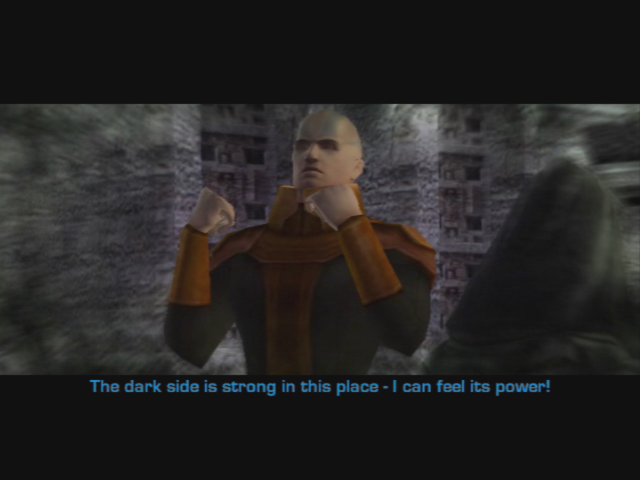
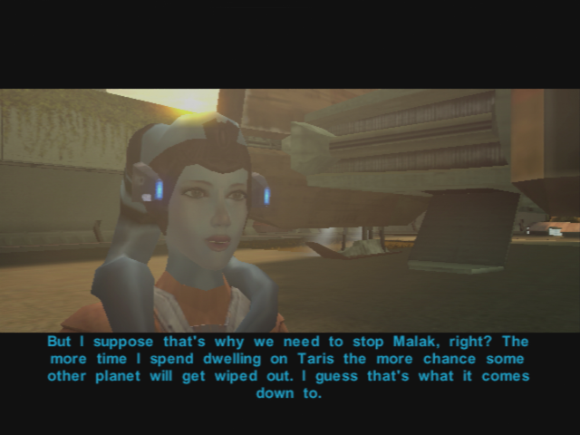
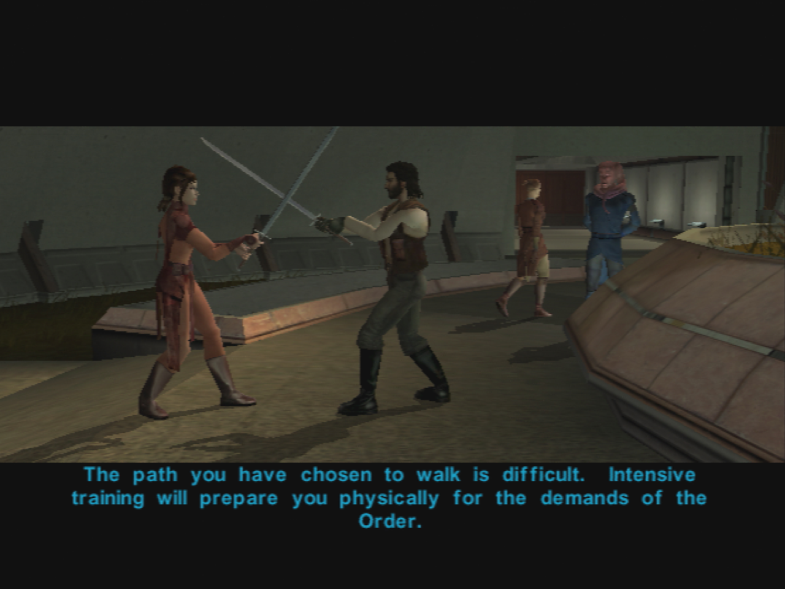
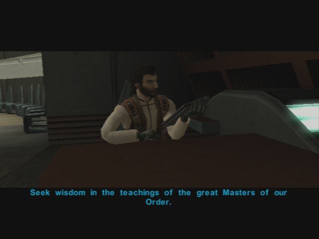
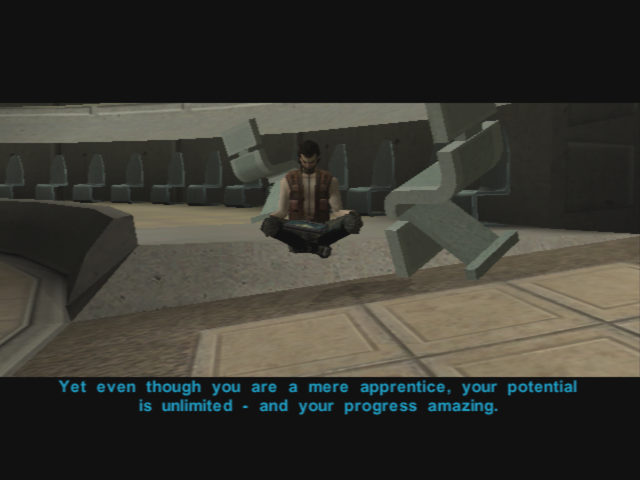
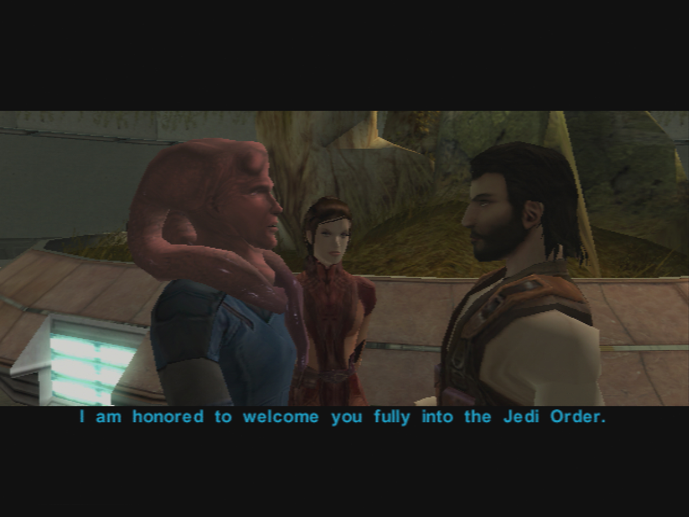

Dantooine - Meeting the Jedi Council
=========================

[< Previous Page](./029_Taris.md)
| [Back to the Index](./000_Index.md)
| [Next Page >](031_Dantooine.md)

- Immediately pause after the conversation with Bastila
	- Take of you armor/sword/helmet -> take your original closes
- Follow Bastilla (Carth too)

- You are stopped by a Jedi
	- **Are you a Jedi?**
	- I believe you are mistaken. I am not a Padawan. I am Name. I came here with Bastila.
	- **I didn't come here to be scolded by you!**
- Go to the council room (left)
- Speek to Carth
- Join the jedi masters
	- **So you've drawn me into your little trap, Bastila. What now?**
	- **Isn't the Jedi Council on Coruscant?**
	- **I've got some questions for all of you.**
	- **Why did the Sith destroy Taris?**
	- Me? What about me?
	- **I don't know if I'm ready for this.**
	- **I'm willing..**

> The council wants to talk in private. You leave the discution, and go to bed.
> In the meanwhile you have a new vision...

- Carth speaks
	- **I had a rough night...**
	- Did she say anything else?
	- Let's go.
- Take Mission in the group
	- Level Up
- Move forward -> auto suggestion with Mission
	- **Malak will pay for what he did, Mission.**

- Go to the consil -> SAVE -> Start cinematic and discution -> reload -> remove party member (for the en of the cinematic)
	- **What?? How would Bastila know if we shared a dream?**
	- I am having visions now?
	- Are you saying I'm... joined with her?
	- **I will try my best.**
	- **Jedi are turning to the dark side?**
	- **I'm ready now. I accept this mission.** (otherwise DS -> should I ? -> sevral more dialogs -> not much sense -> they talk about visiting the ruins) 
	- As you wish, Master Vandar.
- Jedi Training begins

- Discussion with Zhar
	- **I want to ask some questions, Master Zhar. Questions about Revan and Malak.**
	- What happened?
	- What happened to this noble mission?
	- I will heed the lesson, Master Zhar.
- Remove Carth and Mission in the party -> does not make sense

[< Previous Page](./029_Taris.md)
| [Back to the Index](./000_Index.md)
| [Next Page >](031_Dantooine.md)
