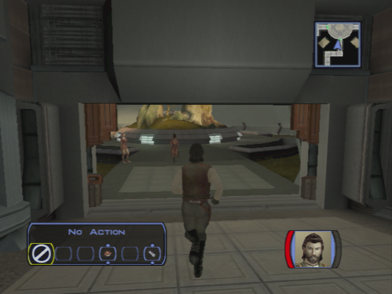
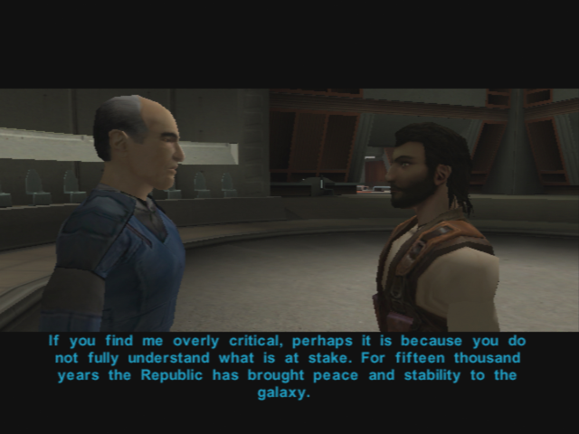
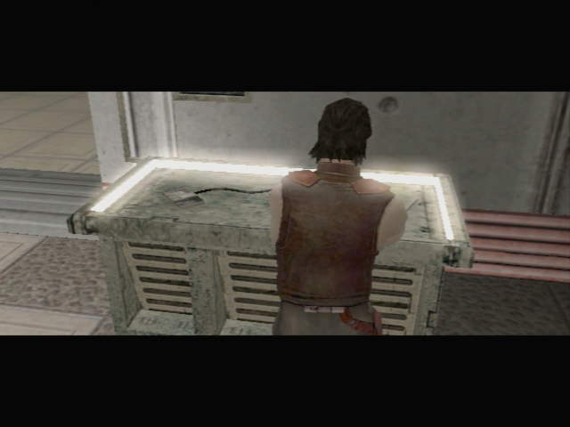
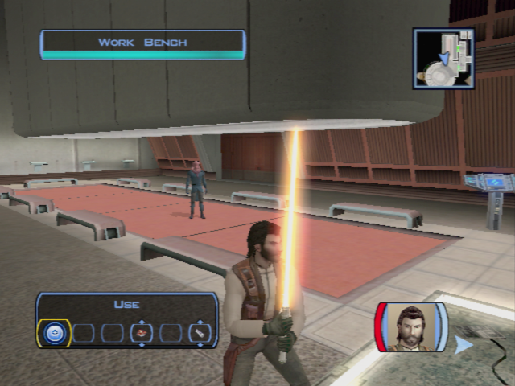
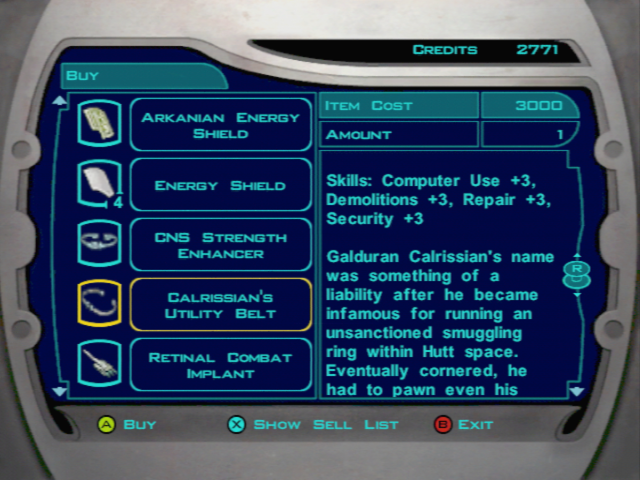

Dantooine - Jedi Training
=========================

## Meeting the Jedi Council

- Immediately pause after the conversation with Bastila
	- Take of you armor/sword/helmet -> take your original closes
- Follow Bastilla (Carth too)

- You are stopped by a Jedi
	- **Are you a Jedi?**
	- I believe you are mistaken. I am not a Padawan. I am Name. I came here with Bastila.
	- **I didn't come here to be scolded by you!**
- Go to the council room (left)
- Speek to Carth
- Join the jedi masters
	- **So you've drawn me into your little trap, Bastila. What now?**
	- **Isn't the Jedi Council on Coruscant?**
	- **I've got some questions for all of you.**
	- **Why did the Sith destroy Taris?**
	- Me? What about me?
	- **I don't know if I'm ready for this.**
	- **I'm willing..**

> The council wants to talk in private. You leave the discution, and go to bed.
> In the meanwhile you have a new vision...

- Carth speaks
	- **I had a rough night...**
	- Did she say anything else?
	- Let's go.
- Take Mission in the group
	- Level Up
- Move forward -> auto suggestion with Mission
	- **Malak will pay for what he did, Mission.**

- Go to the consil -> SAVE -> Start cinematic and discution -> reload -> remove party member (for the en of the cinematic)
	- **What?? How would Bastila know if we shared a dream?**
	- I am having visions now?
	- Are you saying I'm... joined with her?
	- **I will try my best.**
	- **Jedi are turning to the dark side?**
	- **I'm ready now. I accept this mission.** (otherwise DS -> should I ? -> sevral more dialogs -> not much sense -> they talk about visiting the ruins) 
	- As you wish, Master Vandar.
- Jedi Training begins

- Discussion with Zhar
	- **I want to ask some questions, Master Zhar. Questions about Revan and Malak.**
	- What happened?
	- What happened to this noble mission?
	- I will heed the lesson, Master Zhar.
- Remove Carth and Mission in the party -> does not make sense
- Go to the jedi masters -> Bastilla will redirect you to ask the masters
- Dorak
	- **Where are the Academy's archives?**
	- Very well... tell me the history of the Jedi.
	- **What does this have to do with Revan and Malak?**
	- **They should have protected them!**
	- Did the Jedi join in?
	- **How did Revan fall to the dark side?**
	- **Where did they disappear to?**
	- **How did Revan get so many followers?** (other question good also -> new lines)
	- So what happened next?
	- **What can I learn from Revan's history? -> less but more coherent**
- Vandar
	- I'd like to ask you some questions.
	- What can you tell me about Bastila?
	- Carth mentioned something about it.
	- Is there anything you can tell me about Revan and Malak?
	- Are you saying Revan was responsible for Malak's fall?
	- //Master Vrook doesn't seem to like me very much... -> NO LATER -> Can't finish discution coherently when becoming padawan otherwise
	- Quit
- Vrook (quit the conversation at each question... He really does not want to talk!)
	- I would like to ask some questions.
	- What can you tell me about Bastila?
	- Is there anything you can tell me about Revan and Malak? (re-ask)
	- What happened on the Outer Rim to corrupt Revan?
	- You often seem angry with me, Master Vrook. Have I displeased you? (re-ask)

- Go back and see Zhar
	- I am ready to continue my training.
	- What kind of tests are these?
- Makes no sense to ask Vandar and come back
	- **Belaya -> more precision on cave -> plus Jedi code**
	    - I am still learning the Jedi code.
	- **Sol'aa -> pazaak 120 c -> 6 matches -> give cards**
	- **Matale**
- Zhar
	- I am ready
		- peace
		- knowledge
		- serenity
		- harmony
		- the force
- Go to terminal, learn about classes
- Dorak
	- **Why do I get set with a single color?**
	- I want to be a Jedi Sentinel!
	- Help them flee.
	- Try to see a weakness in his technique.
	- Try to pick the lock.
	- Try to lure them out into a trap.
	- Sentinel
- **LEVEL 10 -> Free level!!**
	- **After level 10 -> 3 feat points left -> 12 / 15 / 18**
	- **https://strategywiki.org/wiki/Star_Wars:_Knights_of_the_Old_Republic/Classes#Jedi_Sentinel**
	- **10 force power left**
- Master Zhar
	- **What will these crystals do for me?**
	- I am ready to face the third trial.
	- What's causing this corruption?
	- You know more than you're telling me..
	

	
- **Go back to Ebon Hawk**
- Go to the Ebon Hawk "get your equiment"
- Improve Canderous gun (trigger)
- Take Davik's armor -> +8 defense
- Talk to Canderous (0/6)
	- I was wondering if you had any interesting stories.
	- **Is that why the Mandalorians attacked the Republic?**
	- **You seek death?**
	- **+ stimulants**
	- **+ info on Taris**
- Talk to Mission
	- I want to talk to you about your brother.
	- What did she do to you?
	- **Did Lena dump him?**
	- **Maybe she actually liked Griff.**
	- **Maybe something happened to him.**
- **Talk to Zalbar**
	- **+ grenade**
- **T3**
	- **spikes**

- Go out with **Mission** and **Carth**
- Leena appears (Mission brother's girlfriend)
	- **Mission gets a little worked up when it comes to her brother.**
	- Maybe your brother isn't the man you thought he was.
	- **So where is Griff now?**
- Talk to Mission now
    - I want to talk about your brother.
    - We'll find your brother, Mission.
- Level up Carth and Mission (2 levels since you earn nearly a whole free level while becoming a jedi)
- Equip -> Mission with Davik’s visor -> bonus feat
- Talk to the Twilek -> Lur Arka -> His girl
	- **Only if I get to ask you something in return.**
	- **Do you actually believe she's still alive?**
	- Sorry...
	- Are problems with Mandalorians common on Dantooine?
	- Isn't this something the local authorities should handle?
	- Is there anything of interest on Dantooine that you can tell me about?
	- **I'll keep my eye out for your girl.**
- Talk to the merchant Crattis -> Learn about Czerka -> Inventory -> Equipment
	- **What do you have against the Czerka Corporation?**
	- Do you mean Czerka Corp. are allied with the Sith?
	- I'd like to see what you have for sale.
	
> On XBox you should have the Calrissian's Utility Belt in Carttis inventory if you used the mod. (TODO: put the link!!)
> This item is gonna be necessary latter to trigger more dialog options.
>
> On the original version of the game on XBox (and XBox One), this item can't be aquired anywhere in the game.
> However, the item in itself is present in the game. 
> It seems like Bioware added this item but forgot to check if it was buyable before the release on PC.

- Karal -> Droid equipment
	- Let me see what you have in stock.
- Deespra downstairs -> learn about crystal
	- I am looking for crystals to alter my lightsaber.
- Leave the enclave

