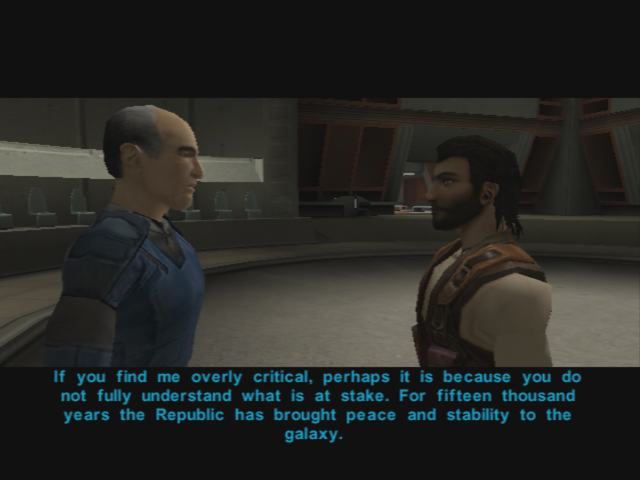
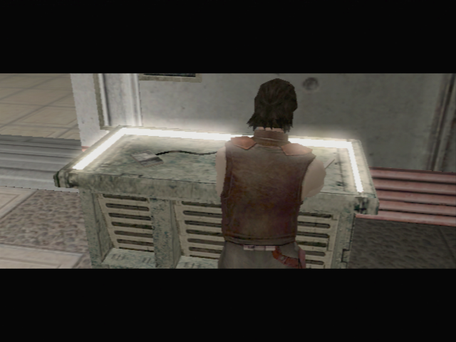

Dantooine - Learn About the Jedi Culture
=========================

[< Previous Page](./030_Dantooine.md)
| [Back to the Index](./000_Index.md)
| [Next Page >](032_Dantooine.md)

- Go to the jedi masters -> Bastila will redirect you to ask the masters
- Dorak
	- **Where are the Academy's archives?**
	- Very well... tell me the history of the Jedi.
	- **What does this have to do with Revan and Malak?**
	- **They should have protected them!**
	- Did the Jedi join in?
	- **How did Revan fall to the dark side?**
	- **Where did they disappear to?**
	- **How did Revan get so many followers?** (other question good also -> new lines)
	- So what happened next?
	- **What can I learn from Revan's history? -> less but more coherent**
- Vandar
	- I'd like to ask you some questions.
	- What can you tell me about Bastila?
	- Carth mentioned something about it.
	- Is there anything you can tell me about Revan and Malak?
	- Are you saying Revan was responsible for Malak's fall?
	- //Master Vrook doesn't seem to like me very much... -> NO LATER -> Can't finish discution coherently when becoming padawan otherwise
	- Quit
- Vrook (quit the conversation at each question... He really does not want to talk!)
	- I would like to ask some questions.
	- What can you tell me about Bastila?
	- Is there anything you can tell me about Revan and Malak? (re-ask)
	- What happened on the Outer Rim to corrupt Revan?
	- You often seem angry with me, Master Vrook. Have I displeased you? (re-ask)

- Go back and see Zhar
	- I am ready to continue my training.
	- What kind of tests are these?
- Makes no sense to ask Vandar and come back
	- **Belaya -> more precision on cave -> plus Jedi code**
	    - I am still learning the Jedi code.
	- **Sol'aa -> pazaak 120 c -> 6 matches -> give cards**
	- **Matale**
- Zhar
	- I am ready
		- peace
		- knowledge
		- serenity
		- harmony
		- the force
- Go to terminal, learn about classes
- Dorak
	- **Why do I get set with a single color?**
	- I want to be a Jedi Sentinel!
	- Help them flee.
	- Try to see a weakness in his technique.
	- Try to pick the lock.
	- Try to lure them out into a trap.
	- Sentinel
- **LEVEL 10 -> Free level!!**
	- **After level 10 -> 3 feat points left -> 12 / 15 / 18**
	- **https://strategywiki.org/wiki/Star_Wars:_Knights_of_the_Old_Republic/Classes#Jedi_Sentinel**
	- **10 force power left**
- Master Zhar
	- **What will these crystals do for me?**
	- I am ready to face the third trial.
	- What's causing this corruption?
	- You know more than you're telling me..
	

[< Previous Page](./030_Dantooine.md)
| [Back to the Index](./000_Index.md)
| [Next Page >](032_Dantooine.md)
