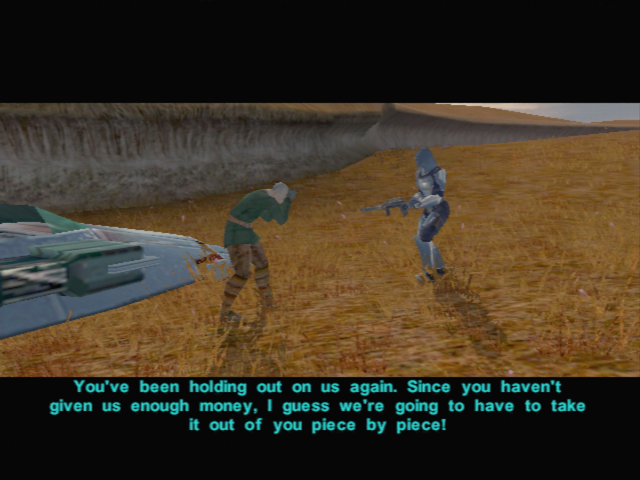
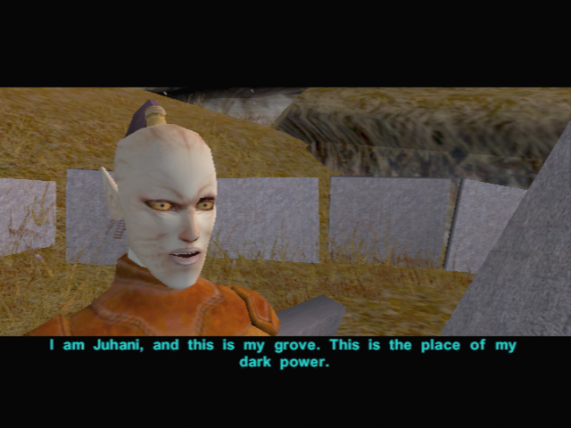
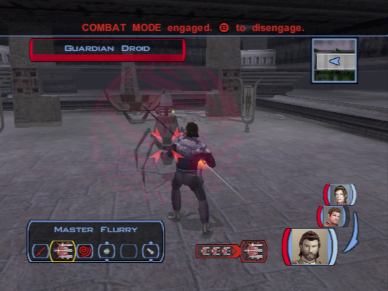
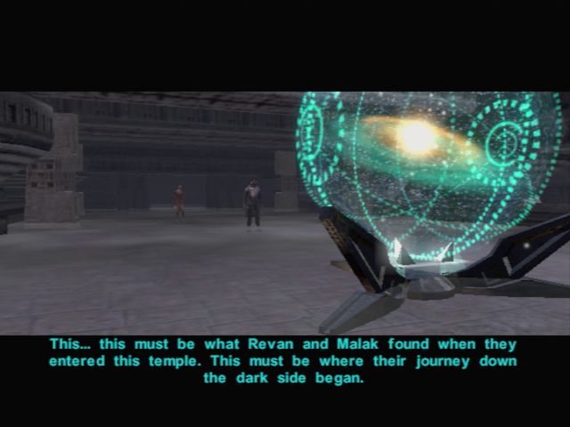

# Dantooine - Trails in the Plains

## Exterior of the Jedi Enclave

- Meet Nemo
	- I have been given a task by the Council...
		- What do you know of the tainted grove?
		- No, they have not.
	- I have a question about Dantooine.
		- Where can I find a store?
		- Master Zhar said there are caves on Dantooine with lightsaber crystals. (re-ask)
	- I would like to know about you.
		- Who are you?
		- You are a Jedi?
		- Are you a member of the Council?
		- What do you do here? (re-ask)
		- **What kind of a name is Nemo anyway?** (re-ask)
	- I've heard people mention Mandalorians. (can't now ?)
- **Meet Gar LATTER** -> we gonna need to discuss with him when other party members are in the group...
- Jon
	- **Mandalorians? They were all beaten in the last war.**
	- They killed her?
	- **I am not a Jedi yet.**
	

	
- Elise
	- **Who are you?**
	- Your companion?
	- **Does anyone hold a grudge against him?**
	- Did someone break it down?
	- Could it have been opened from the inside?
	- Your missing companion is a droid??
	- You live alone with this... droid?
	- If I happen to see him, I will send him back to you.
- Adum Larp
	- **Purpose?**
	- **You're trying to sell me something, aren't you...**
	- Let me see what you're selling.
	
## The Grass Fields of Dantooine
	
- Move toward the south -> cinematic with hostile kinrath
- Kill animals in the wild while going towards the East (path on the left)

- Go left, see the ruins (not now ? -> cinematic better when we will go latter) 
- Go south (loading)
- First kill all animals on the left and go to the Matale's house
- Talk to their droid
- Continue and cross the bridge
- And Mandalorian is killing a farmer

- Kill mandalorian
- go to the Grove (south)
- Kill animals
- Go toward the bridge on the left
- Meet **Bolook**
	- Who are you?
	- What do you want me to do?
	- Is there anything else I should know?
- Murder phase 1
	- Handon Guld -> ask -> injured ? -> il faisait un footing..? 
		- **Should I have?**
		- Did you see the killer?
	- Rickard Lusoff -> chasse -> cloudy not sunny !
		- Tell me what happened.
	- Droid
		- What did you find out about the body?
		- Tell me about these plains.
		- I will have more questions later.
	- Handon
		- What did you see happen?
		- Why were you out here? (reask)
		- Do you often run around the plains?
		- You're holding your side. Are you injured?
		- That's all for now.
	- Rickard
		- What did you see happen?
		- Why were you out here?
		- Not just yet.
		- Bolook said you were limping. Are you hurt?
	- Information Droid -> Weapon near body ? -> Handon did not mentioned it
	- repport
		- Handon is lying.
		- **He didn't mention the weapon found by the body.**
		- I know who is lying now.
		- Rickard is lying.
		- **It was cloudy; there was no sun glare!**
- Murder part 2
	- DONT TALK TO DROID
	- Handon
		- Did you know the victim?
		- I wanted to ask something else.
		- Why would someone want to kill him?
		- No one says you killed him... yet.
	- Rickard
		- Did you know the victim?
		- Why would someone want to kill him?
	- Droid
		- What can you tell me about Calder and Handon?
		- What can you tell me about Calder and Rickard?
	- Handon : Victim ? Reasons ? 
		- You knew Calder better than you admit. You rented a speeder with him!
		- Punch his face in? Why?
	- Rickard
		- You thought Calder was cheating you!
		- You can deny it, but there was bad blood between you!
	- repport 
		- Handon is lying. (or Rickard)
		-  He knew his wife was cheating on him. (or They had a fight over business matters.)
- Murder 3
	- Rickard -> its the blaster of calder
		- What about the weapon found by the body?
	- Handon confirms
		- What do you know about the weapon found by the body?
	- droid -> do not belong to calder ! -> not stolen !
		- Tell me about the weapon found at the scene.
		- Is there a report of Handon's blaster being stolen?
	- repport : The blaster is Handon's. He lied about it being stolen.
		-  _The blaster is Handon's, but he reported it stolen._
		- The blaster is Handon's. He lied about it being stolen.
	- droid -> blood sample -> not calder's !!
		- Tell me about the blood sample.
	- repport Handon
		- It didn't belong to the victim.
		- It's Handon's blood. (both OK but more logical handon)
		- He is clutching his side.
		- No, they are both guilty.
		- Rickard thought Calder was cheating him in business!
	- 1310XP Both men found guilty
	

- Take the bridge (east)
- kill animals
- go full east -> juhani (force push in row)
	- Who are you?
	- **You were a Jedi then?**
	- **You slew Quatra, your Master?**
	- **Why are you doing this?**
	- **I just want to talk.**
	- **I do not hold anger towards you, Juhani. I wish you peace.**
	- The first step on the path of true knowledge is knowing that you are ignorant.
	- [Persuade] It is not your fault, Juhani. -> if fail, the conversation stops, retry until ok
	- Anger? Show them that you have freed yourself of this base passion.
	- Your inner peace and harmony will show them your sincerity.

	

- https://strategywiki.org/wiki/Star_Wars:_Knights_of_the_Old_Republic/Grove
- 1200 XP
- Mandalorians towars south -> tough -> grenade adesive + paralise force on the first mandalorian (the nearest) -> all the firepower on him
- eriadu strengh amplifier (gants) -> loot ? +2 strengh
- Level up Carth! (10)
- Go south

## Sandral Grounds

- Save **C8-42 -> KILL HIM -> the girl with find another guy**
	- That was quite a beating you took.
	- Owner's?
	- Er... ALL the time?
	- Um... probably not...
	- You sought them out?
	- Fine. I'll destroy you and tell her why you did it.
- Kill the other beasts ?

- Go in cave
- Kill all monsters + Hive
- Loot all the crystals (not randomized)
- Red crystal are in the eggs, break them all
- Leave the cave

- Kill new beasts and go West 
> (with Iriaz mod, no respawn... : remove dan_wanderhound1.utc) 
- Banther Mission and Carth (2/2)
    - It's about time you two made up.
- Kill Mandalorians -> Last group has spawned near juani -> kill later
- Kill animals -> ALBINOS -> LVL 14 -> There is no way force will work
    - Focus all fire power on him
- Level up (11)
- Talk to the Sandral's droid

- Go back toward the north to see Elise Montagne near the enclave
	- [Lie] I found your droid... but he had been destroyed by kath hounds.

## Back in the Enclave

- Juhani (+banther Carth and Mission)
	- **Have you spoken to the Council?**
	- **The ways of the Jedi are strange indeed.**
	

	
- Zhar -> robe of padawan
- Mission levels up (10)
- Improve Carth armor and your LS
- Equip the Jedi Robe 
- Go to counsil -> talk to Zhar
- Vandar
	- **What happened to the Jedi who went to investigate?**
	- **Why Vrook doesn't like me?**
- Take Carth (with Bastila)
- **Matale enters** Carth -> lines with matale
	- **Is there anything else I should know?**
	- What caused this feud?
	- Which families are involved?
	- Where are they settled?
	- I shall investigate this immediately.
- Level UP Bastila + Equip gauntlets (Strength)
- Talk with Bastila
	- I want to talk about that dream.
	- I still don't understand why we shared this 'vision'.
	- But how did our fates become linked?
	- **Well, thanks a lot.**
	- I have another question.
	- Why did we dream of Malak and Revan?
	- **What do you mean by a 'trace'?**
	- **What do you think Malak and Revan were doing?**
	- **I'm not sure I like the idea of you being in my dreams.**
	- **Pretty certain, yes.**
	- Do you think we will receive more of these visions?
	- That's all I wanted to know.
	

# Go to Ruins first

- Go in ruins -> kill 2 monsters (in the wild)
- Droid
	- What language is that? What are you trying to say?
	- Bastila, do you have any idea what this droid is saying?
	- Hey! I understood that.
	- Are you some type of guardian?
	- **How long have you been here?**
	- **Who are these Builders you keep talking about?**
	- **The droid speaks Selkath. Maybe they were the Builders.**
	- **Have you seen a Builder recently?**
	- What is the 'Star Forge'?
	- But what is it? What does it so?
	- **Could it have been a factory or weapons plant?**
	- What is your purpose here again? -> not logical otherwise
	- **Did you kill the Jedi over there?**
	- How can I open the sealed doors behind you?
- Loot NEMO
- Equip Echani Double Blade with Bastila and you the prototype blade !!
    - Light saber uneffective. + Davik armor 10% resistance Cold and Hot + Arkanian Shield
- Door near Nemo first
- Kill Droid -> Ion Grenade + Sword
- Don't forget to loot the droid (en face de l'ordi)
- Computer
	- Press a button.
	- Kick the computer.
	- **Talk to the computer.**
	-  Insert your datapad into the receptacle.
	- Talk to the computer.
- **Do same with Ice trial**

- Open the door, and discover the star map
	- What is it?
	- So what is the Forge, exactly?
	- Perhaps those worlds have more clues.
	

	
- Go back, kill the respawn mobs
- Bastila wants to talk just before entering the enclave
	- You look like something's bothering you.
	- **Don't understand**
	- **Our relationship? Is this some kind of clumsy come-on?**
	- **Whoa, guess I touched a nerve there, huh?**
	- Okay, I'll answer a few questions.
	- I was a scout. The fleet recruited me for my skills.
	- Deralia. It's in a remote system. Why?
	- Wasn't all this in my service records?
	- And what did you find out?
- Jedi enclave
	- We found an incomplete Star Map and mention of something called a Star Forge.
	- **Sounds like a suicide mission to me.**
	- Am I to undertake this task alone?
	- There are others I want to join me.
	- When do I leave?
- Speak to Carth (with Bastila)
    - You've been quiet lately...
	- Left out of the loop? I don't understand.
	- **Why should anything the Jedi do seem strange to you?**
	- They thought it was more important that I help find the Star Maps than stay.
	- They said there's a bond between Bastila and myself.
	- Are you saying I'm not needed?
	- **I** am *not* going to betray you! I am *not* Saul!
- Speak to Bastila
	- You have something you want to ask me?
	- Educated guess, from the way you keep staring. -> Otherwise harcellement
	- **No, I doubt it.**
	- What do you think I should do?
	- Why are you getting so upset?
	- It works both ways, doesn't it? You could help me stay strong.
	- **I don't need your help.**
	

