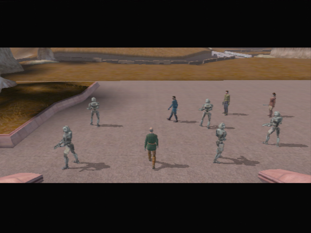
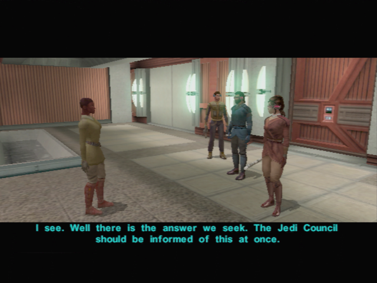
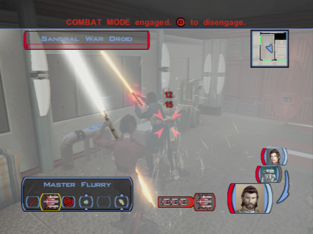
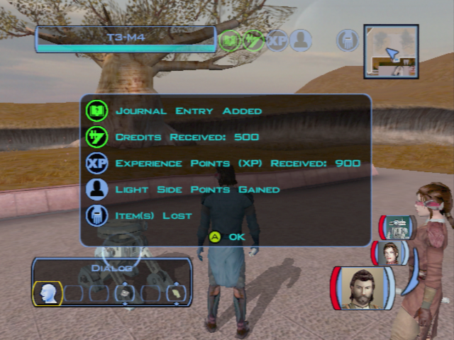
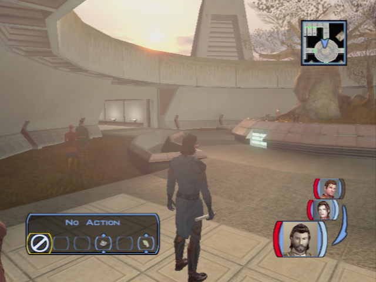

# Dantooine - Family Rivals

[< Previous Page](035_Dantooine.md)
| [Back to the Index](./000_Index.md)
| [Next Page >](./037_Dantooine.md)

## Matale vs Sandral

- Kill 2 beasts on the way
- South
- 2 beast + 3 kath
- kill beasts -> find journal on corpse
- Go toward the mention
- BANTHER ? Carth and Bastila 2/2 -> not on iPhone? -> LATER On Tatooine...
	- What did they see, exactly?
- Go directly to Matale's house (Bastila and Carth will intervene)
	- I come on behalf of the Jedi Council. I wish to speak to Ahlan Matale.
	- **Any information you might have would be helpful.**
	- **What were they doing here?**
	- I shall go and speak to Nurik Sandral.
	- **I understand you are upset, Ahlan Matale. Rest assured I will find Shen.**

- Continue the road to get to the sandral mention
- Go south -> kill animals -> don’t kill Mandalorians now -> Go west instead
- **Go west to Sandral -> DONT kill the last mand**
	- **I come on behalf…**
	- I am not...
- Enter his mention
	- **I want to ask you about the disappearance of Shen Matale.**
	- **Your son Casus is dead. I have seen his body.**
	- **He was killed by…**
	- **Here is the diary, Nurik, but you may keep your money. I need no reward for this task. + 2 LSP**
- Rahasia enters the room before you leave
	- Who are you?
	- **Casus was killed by kath hounds. The Matales had nothing to do with it!**
	- Judge him? What has your father done?
	- Please, tell me what has happened.
	- **Why are you telling me all this?**
	- **Why do you care about Shen?**
	

	
- **Transit back to the Ebon Hawk to take T3**
- improve saber of Bastila
- Canderous -> First story (1/6)
	- I was wondering if you had any more war stories.
	- **I would have harnessed that power sooner.**
	- **I didn't think Mandalorians got afraid.**
	- **Who were you fighting anyway?**
	- I want a Basilisk war droid!
	- + stimulants
- Talk w/ Juhani (personal 1/9)
	- You thought the dark side had consumed you. It is nothing.
	- **Do not worry, Juhani. I forgive you.**
- Go out with T3 and Bastila
- Level up T3 (Equip 2 hands: blasters with bonuses against droids)
- **Fast travel back**
- **Go to side door**
- Equip the Stabilizer Gaunlets (+2 Demolition)

## Infiltrating Sandral's Mention (2 spikes + 5 parts)

- kill droid on the left
- get mine
- Loot 2 doors in corridor (on right)
- first door (left) -> 3 droids
- camera w T3
	- Overload central and storage rooms (DON'T CORRUPT -> NO XP ANYWAY)
	- sauf repair room -  (2 rooms) - 2 spikes
- Kill droid next door
- open doors
- 2nd door corridor -> Go in
- Loot and make a loop to come back
- Find Daughter
- Loot

- Repair room + Get Key + repair droid 5 parts 715 XP !
- Loot the last room on the left and go back
- Save Shen (take the mine in front of his door)
	- I am here to rescue you, Shen.
	- I'll protect you, Shen. Let's go.
	- What if we take Rahasia with us?
	- **Why do your families hate each other so much?**
- **Go see Daughter**
	- ** I'm trying to rescue Shen, but he won't leave without you, Rahasia.**
**SAVE** -> **HARD+EASY persuade incoming**
- Go back to Shen auto exit
	- It was no problem.
	- No reward is necessary. **+2 LSP**
	- You two just need to calm down.
	- You should try to sort this out together.
	- **[Persuade] Shen is capable of making decisions on his own.** (Hard: 25% chance of success)
    - **[Persuade] Children grow up and leave eventually.** -> (Easy: 75%) but still!!
    - I knew you two could see reason.
    - **They could stay at the Jedi Enclave.**
    
You earned 900XP !

- Go back to Ebon Hawk (Transit back)
- Bastila proposition while you move forward (will be cited later)
	- You wanted to speak to me?
	- Is it true you killed Darth Revan?
	- That's not what I heard.
	- **What else did you expect from the Sith?**
- Improve Canderous Blaster (trigger)
- Can't talk to Canderous yet. -> next level
- Deesra speak intercept -> history
	- **How do you know the Council gave me a mission?**
	- What are you talking about?
	- **Why are you telling me this?**
	- Then why are you worried about them now?
	- The Great Hunt? What's that?
	- **So the Jedi just killed these creatures?**
	- Why? What was so special about those three?
	- Thanks for…
- Talk to Belaya -> new line
- Talk to guy in bed room -> Montagne (droid quest) (Bastila talks)
	- There is no need.
	- Yes, he seems quite nice.
	

	
- Talk :
	- Zhar
	- Vrook -> ask about the mandalorians
	- Vandar -> Congratulate

[< Previous Page](035_Dantooine.md)
| [Back to the Index](./000_Index.md)
| [Next Page >](./037_Dantooine.md)
