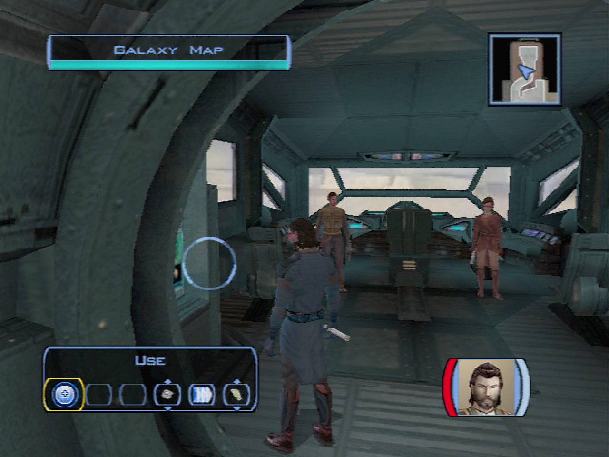
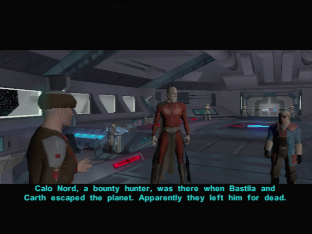

# Dantooine - Preparing your Travel Across the Galaxy

[< Previous Page](037_Dantooine.md) 
| [Back to the Index](./000_Index.md) 
| [Next Page >](./040_Tatooine.md)

## Back to the Ebon Hawk

- Canderous (2/6)
	- I was wondering if you had any more war stories.
	- **What do you mean?**
	- Did it backfire?
	- **An asteroid?**
	- A ship!
- Last talk with Mission
	- I want to talk to you about your brother.
	- Griff may not be perfect, but he is your brother, Mission.
	- So he sacrificed you...
	- When the time comes you'll know what to say, Mission.
- Juhani (1/6) -> level 12->1 13-2 14-3 15-4 16-5 17-6 ?
    - I was wondering if we could talk.
	- Tell me more about your past.
	- Invigorating?
	- Tragic?
	- The Jedi are not gods.
	- **Did they leave?**
	- All species are capable of intolerance.
	- It is alright.
	- …
- Mission -> Security Spikes
- **Zalbaar -> Grenade**
- **T3 -> spike**
- Go toward the cocpit

- Bastila (2/8)
	- I'd like to know more about you, Bastila.
	- Tell me how you joined the Jedi, then.
	- Discouraged? Why?
	- That sounds idiotic. I would never agree to that.
	- And what's so wrong with that?
	- You need to lighten up.
	- **It just seems wrong not to be allowed to love.**
	- Don't you miss your family at all?
	- You don't sound very convinced.
	- **You and your father were close?**
	- You never tried to get in touch with your father again?
	- You sound very sad when you say that.
**SAVE** in front of the navigation map
- Select the planet we will travel next: Tatooine
- Cinematic with Malak

[< Previous Page](037_Dantooine.md) 
| [Back to the Index](./000_Index.md) 
| [Next Page >](./040_Tatooine.md)