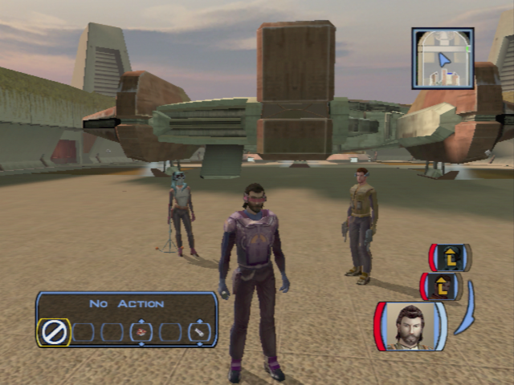
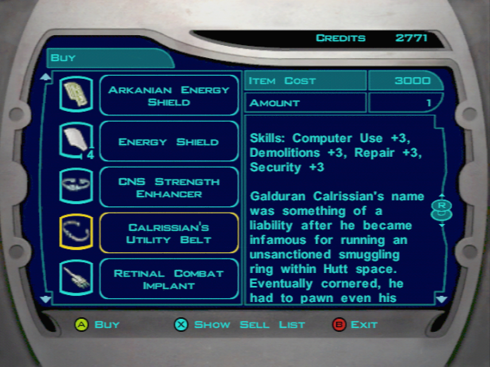

# Dantooine - Preparing for the Trials

[< Previous Page](031_Dantooine.md)
| [Back to the Index](../index.md)
| [Next Page >](033_Dantooine.md)

- **Go back to Ebon Hawk**
- Go to the Ebon Hawk "get your equiment"
- Improve Canderous gun (trigger)
- Take Davik's armor -> +8 defense
- Talk to Canderous (0/6)
	- I was wondering if you had any interesting stories.
	- **Is that why the Mandalorians attacked the Republic?**
	- **You seek death?**
	- **+ stimulants**
	- **+ info on Taris**
- Talk to Mission
	- I want to talk to you about your brother.
	- What did she do to you?
	- **Did Lena dump him?**
	- **Maybe she actually liked Griff.**
	- **Maybe something happened to him.**
- **Talk to Zalbar**
	- **+ grenade**
- **T3**
	- **spikes**

- Go out with **Mission** and **Carth**
- Leena appears (Mission brother's girlfriend)
	- **Mission gets a little worked up when it comes to her brother.**
	- Maybe your brother isn't the man you thought he was.
	- **So where is Griff now?**
- Talk to Mission now
	- I want to talk about your brother.
	- We'll find your brother, Mission.
- Level up Carth and Mission (2 levels since you earn nearly a whole free level while becoming a jedi)
- Equip -> Mission with Davik’s visor -> bonus feat
- Talk to the Twilek -> Lur Arka -> His girl
	- **Only if I get to ask you something in return.**
	- **Do you actually believe she's still alive?**
	- Sorry...
	- Are problems with Mandalorians common on Dantooine?
	- Isn't this something the local authorities should handle?
	- Is there anything of interest on Dantooine that you can tell me about?
	- **I'll keep my eye out for your girl.**
- Talk to the merchant Crattis -> Learn about Czerka -> Inventory -> Equipment
	- **What do you have against the Czerka Corporation?**
	- Do you mean Czerka Corp. are allied with the Sith?
	- I'd like to see what you have for sale.

> On XBox you should have the Calrissian's Utility Belt in Carttis inventory if you used the mod. (TODO: put the link!!)
> This item is gonna be necessary latter to trigger more dialog options.
>
> On the original version of the game on XBox (and XBox One), this item can't be aquired anywhere in the game.
> However, the item in itself is present in the game.
> It seems like Bioware added this item but forgot to check if it was buyable before the release on PC.

- Karal -> Droid equipment
	- Let me see what you have in stock.
- Deespra downstairs -> learn about crystal
	- I am looking for crystals to alter my lightsaber.
- Leave the enclave

## Exterior of the Jedi Enclave

- Meet Nemo
	- I have been given a task by the Council...
		- What do you know of the tainted grove?
		- No, they have not.
	- I have a question about Dantooine.
		- Where can I find a store?
		- Master Zhar said there are caves on Dantooine with lightsaber crystals. (re-ask)
	- I would like to know about you.
		- Who are you?
		- You are a Jedi?
		- Are you a member of the Council?
		- What do you do here? (re-ask)
		- **What kind of a name is Nemo anyway?** (re-ask)
	- I've heard people mention Mandalorians. (can't now ?)
- **Meet Gar LATTER** -> we gonna need to discuss with him when other party members are in the group...
- Jon
	- **Mandalorians? They were all beaten in the last war.**
	- They killed her?
	- **I am not a Jedi yet.**
	

	
- Elise
	- **Who are you?**
	- Your companion?
	- **Does anyone hold a grudge against him?**
	- Did someone break it down?
	- Could it have been opened from the inside?
	- Your missing companion is a droid??
	- You live alone with this... droid?
	- If I happen to see him, I will send him back to you.
- Adum Larp
	- **Purpose?**
	- **You're trying to sell me something, aren't you...**
	- Let me see what you're selling.
	

[< Previous Page](031_Dantooine.md) 
| [Back to the Index](../index.md) 
| [Next Page >](033_Dantooine.md)
