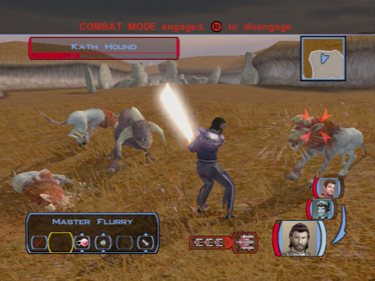
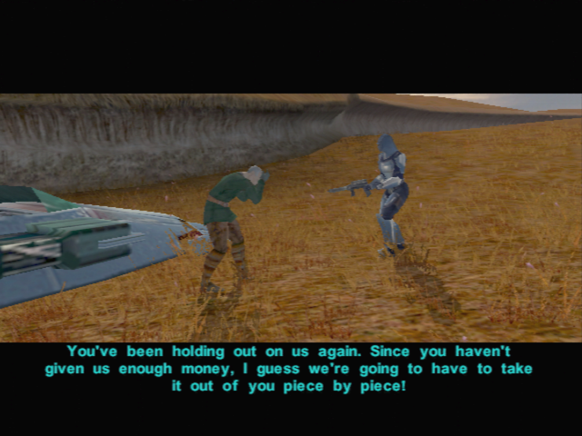

# Dantooine - The Country Side

[< Previous Page](032_Dantooine.md)
| [Back to the Index](../index.md)
| [Next Page >](034_Dantooine.md)


## The Grass Fields of Dantooine

- Move toward the south -> cinematic with hostile kinrath
- Kill animals in the wild while going towards the East (path on the left)



- Go left, see the ruins (make sense to go now)
- Go south (loading)
- First kill all animals on the left and go to the Matale's house
- Talk to their droid
- Continue and cross the bridge
- And Mandalorian is killing a farmer



- Kill mandalorian
- go to the Grove (south loading)
- Kill animals
- go south! (loading again)


- Sandral mention
- Talk to droid too
- Take the bridge
- Kill animal (keep the Albinos aways -> hard -> 750px)
- Second mandalorian group
	- Loot
- Kill animals and save the droid **C8-42 -> KILL HIM -> the woman with find another guy**
	- That was quite a beating you took.
	- Owner's?
	- Er... ALL the time?
	- Um... probably not...
	- You sought them out?
	- Fine. I'll destroy you and tell her why you did it.
- Enter the cave


- Kill all monsters + Hive (level up Carth 10)
- Loot all the crystals (not randomized)
- Red crystal are in the eggs, break them all
- Leave the cave


- Kill 1 respawned beast
- Carth + Mission Banther
	- It's about time you two made up.
- Go to the north (loading)


- 3rd Mandalorian group!
	- eriadu strengh amplifier (gants) -> loot ? +2 strengh
- Kill the animals at the north -> until path (loading)
- Kill animals on the right and follow the path
- Save
- Meet Juhani! -> force push!
	- Who are you?
	- **You were a Jedi then?**
	- **You slew Quatra, your Master?**
	- **Why are you doing this?**
	- **I just want to talk.**
	- **I do not hold anger towards you, Juhani. I wish you peace.**
	- The first step on the path of true knowledge is knowing that you are ignorant.
	- [Persuade] It is not your fault, Juhani. -> if fail, the conversation stops, retry until ok
	- Anger? Show them that you have freed yourself of this base passion.
	- Your inner peace and harmony will show them your sincerity.
- Back at the north path (loading)


- Kill 2 beast 2x100px (level 11) on Matale grounds
- Go to the north (were you came from)
- Again 2 beasts
- See Elise Montagne
	- [Lie] I found your droid... but he had been destroyed by kath hounds.
- Back to the enclave


```
- Go toward the bridge on the left
- Meet **Bolook**
	- Who are you?
	- What do you want me to do?
	- Is there anything else I should know?
- Murder phase 1
	- Handon Guld -> ask -> injured ? -> il faisait un footing..? 
		- **Should I have?**
		- Did you see the killer?
	- Rickard Lusoff -> chasse -> cloudy not sunny !
		- Tell me what happened.
	- Droid
		- What did you find out about the body?
		- Tell me about these plains.
		- I will have more questions later.
	- Handon
		- What did you see happen?
		- Why were you out here? (reask)
		- Do you often run around the plains?
		- You're holding your side. Are you injured?
		- That's all for now.
	- Rickard
		- What did you see happen?
		- Why were you out here?
		- Not just yet.
		- Bolook said you were limping. Are you hurt?
	- Information Droid -> Weapon near body ? -> Handon did not mentioned it
	- repport
		- Handon is lying.
		- **He didn't mention the weapon found by the body.**
		- I know who is lying now.
		- Rickard is lying.
		- **It was cloudy; there was no sun glare!**
- Murder part 2
	- DONT TALK TO DROID
	- Handon
		- Did you know the victim?
		- I wanted to ask something else.
		- Why would someone want to kill him?
		- No one says you killed him... yet.
	- Rickard
		- Did you know the victim?
		- Why would someone want to kill him?
	- Droid
		- What can you tell me about Calder and Handon?
		- What can you tell me about Calder and Rickard?
	- Handon : Victim ? Reasons ? 
		- You knew Calder better than you admit. You rented a speeder with him!
		- Punch his face in? Why?
	- Rickard
		- You thought Calder was cheating you!
		- You can deny it, but there was bad blood between you!
	- repport 
		- Handon is lying. (or Rickard)
		-  He knew his wife was cheating on him. (or They had a fight over business matters.)
- Murder 3
	- Rickard -> its the blaster of calder
		- What about the weapon found by the body?
	- Handon confirms
		- What do you know about the weapon found by the body?
	- droid -> do not belong to calder ! -> not stolen !
		- Tell me about the weapon found at the scene.
		- Is there a report of Handon's blaster being stolen?
	- repport : The blaster is Handon's. He lied about it being stolen.
		-  _The blaster is Handon's, but he reported it stolen._
		- The blaster is Handon's. He lied about it being stolen.
	- droid -> blood sample -> not calder's !!
		- Tell me about the blood sample.
	- repport Handon
		- It didn't belong to the victim.
		- It's Handon's blood. (both OK but more logical handon)
		- He is clutching his side.
		- No, they are both guilty.
		- Rickard thought Calder was cheating him in business!
	- 1310XP Both men found guilty
	


- Take the bridge (east)
- kill animals
- go full east -> juhani (force push in row)
	- Who are you?
	- **You were a Jedi then?**
	- **You slew Quatra, your Master?**
	- **Why are you doing this?**
	- **I just want to talk.**
	- **I do not hold anger towards you, Juhani. I wish you peace.**
	- The first step on the path of true knowledge is knowing that you are ignorant.
	- [Persuade] It is not your fault, Juhani. -> if fail, the conversation stops, retry until ok
	- Anger? Show them that you have freed yourself of this base passion.
	- Your inner peace and harmony will show them your sincerity.

	

- https://strategywiki.org/wiki/Star_Wars:_Knights_of_the_Old_Republic/Grove
- 1200 XP
- Mandalorians towars south -> tough -> grenade adesive + paralise force on the first mandalorian (the nearest) -> all the firepower on him
- eriadu strengh amplifier (gants) -> loot ? +2 strengh
- Level up Carth! (10)
- Go south


## Sandral Grounds

- Save **C8-42 -> KILL HIM -> the woman with find another guy**
	- That was quite a beating you took.
	- Owner's?
	- Er... ALL the time?
	- Um... probably not...
	- You sought them out?
	- Fine. I'll destroy you and tell her why you did it.
- Kill the other beasts ?


- Go in cave
- Kill all monsters + Hive
- Loot all the crystals (not randomized)
- Red crystal are in the eggs, break them all
- Leave the cave


- Kill new beasts and go West 
> (with Iriaz mod, no respawn... : remove dan_wanderhound1.utc) 
- Banther Mission and Carth (2/2)
    - It's about time you two made up.
- Kill Mandalorians -> Last group has spawned near juani -> kill later
- Kill animals -> ALBINOS -> LVL 14 -> There is no way force will work
    - Focus all fire power on him
- Level up (11)
- Talk to the Sandral's droid


- Go back toward the north to see Elise Montagne near the enclave
	- [Lie] I found your droid... but he had been destroyed by kath hounds.
```


[< Previous Page](032_Dantooine.md) 
| [Back to the Index](../index.md) 
| [Next Page >](034_Dantooine.md)