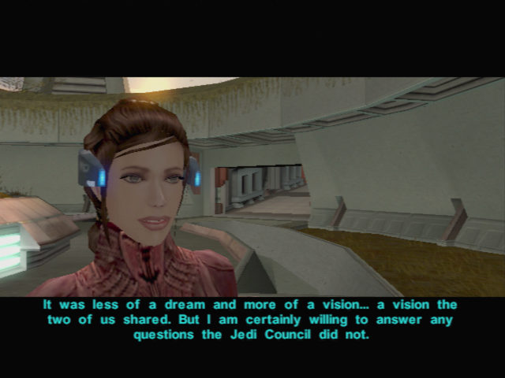

# Dantooine - Becoming an Padawan

[< Previous Page](033_Dantooine.md)
| [Back to the Index](../index.md)
| [Next Page >](035_Dantooine.md)

## Back in the Enclave

- Juhani (+banther Carth and Mission)
	- **Have you spoken to the Council?**
	- **The ways of the Jedi are strange indeed.**

- Zhar -> robe of padawan
- Mission levels up (10)
- Improve Carth armor and your LS
- Equip the Jedi Robe
- Go to counsil -> talk to Zhar
- Vandar
	- **What happened to the Jedi who went to investigate?**
	- **Why Vrook doesn't like me?**
- Take Carth (with Bastila)
- **Matale enters** Carth -> lines with matale
	- **Is there anything else I should know?**
	- What caused this feud?
	- Which families are involved?
	- Where are they settled?
	- I shall investigate this immediately.
- Level UP Bastila (8 to 10) + Equip gauntlets (Strength)
- Talk with Bastila
	- I want to talk about that dream.
	- I still don't understand why we shared this 'vision'.
	- But how did our fates become linked?
	- **Well, thanks a lot.**
	- I have another question.
	- Why did we dream of Malak and Revan?
	- **What do you mean by a 'trace'?**
	- **What do you think Malak and Revan were doing?**
	- **I'm not sure I like the idea of you being in my dreams.**
	- **Pretty certain, yes.**
	- Do you think we will receive more of these visions?
	- That's all I wanted to know.

[< Previous Page](033_Dantooine.md) 
| [Back to the Index](../index.md) 
| [Next Page >](035_Dantooine.md)
