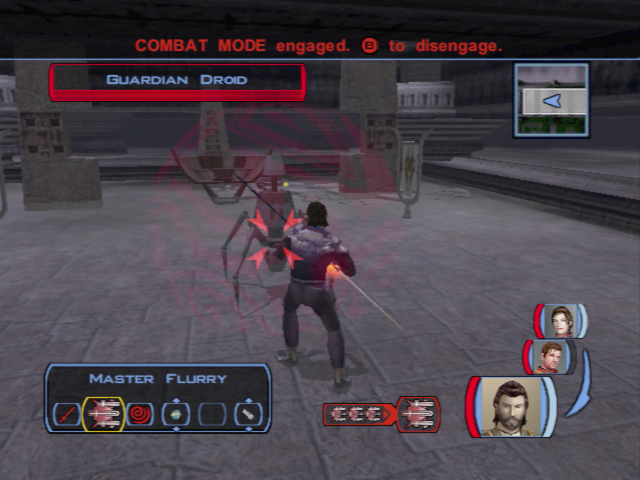
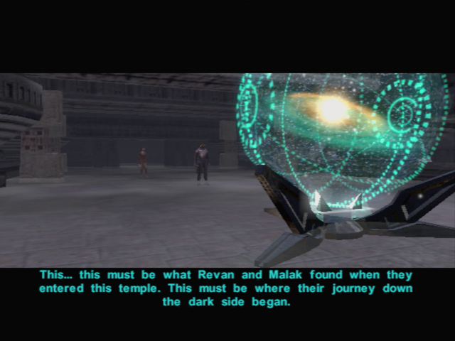
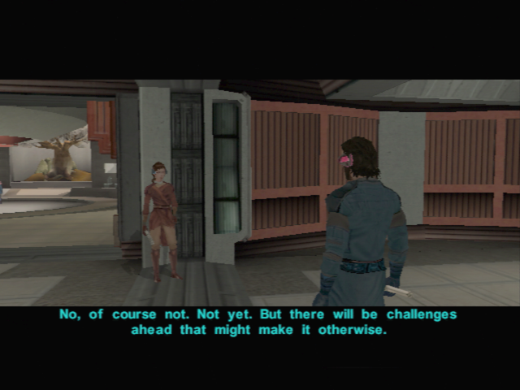

# Dantooine - On the Trace of the Sith Lords

[< Previous Page](034_Dantooine.md)
| [Back to the Index](../index.md)
| [Next Page >](036_Dantooine.md)

## Go to Ruins first

- Go in ruins -> kill 2 monsters (in the wild)
- Droid
	- What language is that? What are you trying to say?
	- Bastila, do you have any idea what this droid is saying?
	- Hey! I understood that.
	- Are you some type of guardian?
	- **How long have you been here?**
	- **Who are these Builders you keep talking about?**
	- **The droid speaks Selkath. Maybe they were the Builders.**
	- **Have you seen a Builder recently?**
	- What is the 'Star Forge'?
	- But what is it? What does it so?
	- **Could it have been a factory or weapons plant?**
	- What is your purpose here again? -> not logical otherwise
	- **Did you kill the Jedi over there?**
	- How can I open the sealed doors behind you?
- Loot NEMO
- Equip Echani Double Blade with Bastila and you the prototype blade !!
	- Light saber uneffective. + Davik armor 10% resistance Cold and Hot + Arkanian Shield
- Door near Nemo first
- Kill Droid -> Ion Grenade + Sword
- Don't forget to loot the droid (en face de l'ordi)
- Computer
	- Press a button.
	- Kick the computer.
	- **Talk to the computer.**
	-  Insert your datapad into the receptacle.
	- Talk to the computer.
- **Do same with Ice trial**

- Open the door, and discover the star map
	- What is it?
	- So what is the Forge, exactly?
	- Perhaps those worlds have more clues.

- Go back, kill the respawn mobs
- Bastila wants to talk just before entering the enclave
	- You look like something's bothering you.
	- **I still don't understand...**
	- **Our relationship? Is this some kind of clumsy come-on?**
	- **Whoa, guess I touched a nerve there, huh?**
	- Okay, I'll answer a few questions.
	- I was a scout. The fleet recruited me for my skills.
	- Deralia. It's in a remote system. Why?
	- Wasn't all this in my service records?
	- And what did you find out?
- Jedi enclave
	- We found an incomplete Star Map and mention of something called a Star Forge.
	- **Sounds like a suicide mission to me.**
	- Am I to undertake this task alone?
	- There are others I want to join me.
	- When do I leave?
- Speak to Carth (with Bastila)
	- You've been quiet lately...
	- Left out of the loop? I don't understand.
	- **Why should anything the Jedi do seem strange to you?**
	- They thought it was more important that I help find the Star Maps than stay.
	- They said there's a bond between Bastila and myself.
	- Are you saying I'm not needed?
	- **I** am *not* going to betray you! I am *not* Saul!
- Speak to Bastila
	- You have something you want to ask me?
	- Educated guess, from the way you keep staring. -> Otherwise harcellement
	- **No, I doubt it.**
	- What do you think I should do?
	- Why are you getting so upset?
	- It works both ways, doesn't it? You could help me stay strong.
	- **I don't need your help.**

[< Previous Page](034_Dantooine.md)
| [Back to the Index](../index.md)
| [Next Page >](036_Dantooine.md)
