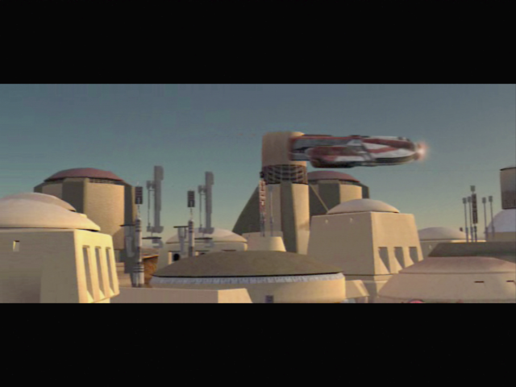

# Tatooine

- **Bastilla**
	- **Maybe Tatooine wasn't always a desert.**
- Zalbar -> talks -> go to food chest
    - Not right? What do you mean?
- Go to the supplies
- Go to Hyperdrive -> footsteps
- Go to infirmerie left, bedrooms
- Go back storage
	- Hey! What are you doing here?!
	- Calm down, little girl. I won't hurt you.
	- I still don't understand you.
- Retalk (might be different)
	- Can you tell me your name?
	- [Point to yourself.] My name is Name. You are...?
	- Sasha... your name is Sasha, right?
	- 
	- [Try to learn Sasha's strange language.]
	- Many of the words you're speaking are Mandalorian...
	- Manlorey... that's your word for Mandalorian? So you do know of them.
	- But are you a Mandalorian child, then?
	- Sasha isn't Mandalorian. Got it. But why don't you speak Basic, then?
	- 
	- [Try to learn Sasha's strange language.]
	- Esowon? Na esowon?
	- I see you? Or you see me?
	- I understand. "Esowon" is "see" but "na esowon" is "hide".
	- 
	- Bristag? What is that?
	- It's your home? Is that it?
	- "Bristag"... it means "starship", doesn't it?
	- 
	- **You're hiding in the starship. It's your home. I understand.**
	- **
**
	- You've said that before. What is "gon-disen"?
	- Something about me, yes, but what?
	-  It's... something you like. Yes, "gon-disen" means you like it!
	- 
	- "Na abds"... you said that when I first found you.
	- "Abds" means "hit"? Is that it?
	- So... "abds" is "to hurt"? "Na abds" means "not hurt"? Is that it?
	-  I understand. No, I won't hurt you.
	- Yum? What kind of word is that?
	-  It's... a part of the ship? A room?
	- Yum... you mean food, don't you? "Yum" is "food".
	- Nuh ghis? Is that all one phrase?
	- You're not speaking... now? "Nuh ghis" means "now"! "Na nuh ghis" is not now... or "before"?
	- You... want some food now. You're hungry.
	- Tabed you? What do you mean?
	- You... want me to tell you a story? About what?
	- So... 'tabed' means 'tell me about'. I get it.
	- 
	- **[Communicate with Sasha in her language.]**
	- **Why are you hiding on my ship? Sasha na esowon in bristag?**
	-  You came to the ship before. You were very scared. Why?
	- You left the Mandalorians? And hid here on the ship.
	-  You don't want to leave. The Ebon Hawk is your home.
	- 
	- **Why are you scared of the Mandalorians? Hoot bad liaz Manlorey?**
	- ...
	- **You sleep here on the ship? Yooba stin-quiw in bristag?**
	- **No, you don't have to go. For now.**
	- **The Ebon Hawk is not your home, Sasha. Not your first home, anyway. Bristag na Sasha laesfa.**
	- Tell me about your home before. Tabed me Sasha laesfa na nuh ghis.
	- Dantooine? Maybe someone on Dantooine remembers you?
- Retalk with Bastila ? -> YES -> cut scene on Taris
	- Stowaway first ? -> More sense to talk again
	- You wish to talk to me?
		- //Harcellement ? nO
		- //I think we both know the real reason you've been watching me.
		- //I make you tremble? Do you get all tingly inside, too?
	- **My progress?**
	-  **We're not going to go over this again, are we?**
	- **You seem to know that temptation very well.**
	- **Are you saying the light side is innocent of killing?**
	- **Do whatever is required? Such as?**
- Juhani
	- Are you doing alright?
	- **You're too fragile, Juhani.**
	- Perhaps you just need more time.
	- **If I see you begin to slip back, I will intervene.**
**SAVE** (persuade incoming)

## Tatooine - Spatioport

- Leave the Ebon Hawk
- With Bastila and Mission
	- Carth? Lines while buying HK
- Czerka
	- What do I get for my 100 credits?
	- What if I don't have the money?
	- What if I say no?
	- Is there any way you could reconsider the fee?
	- [Persuade] The money I save I'll spend in your stores. (ez)
	- Give me some background on Tatooine.
	- What is known about the history of the planet?
	- What species do you mean?
	- Have you had trouble with the Sand People?
	- Any other sentient races?
	- Tell me about Czerka Corporation's operations here.
	- [Persuade] Come now friend, let me in on the details.
	- So Czerka Corporation set up shop on a barren planet.
	- What do you mean when you say the ore is "peculiar"?
	- What other forms of business are being looked at here?
	- 
	- Where should a person look for opportunity?
	- I'm looking for very specific things. Who should I ask?
	- I'm looking for older things. Antiques. Artifacts.
- Loot right chest
- A twilek appears: Bastila's mother 
	- Don't be rude, Bastila.
	- I guess we should go see your mother, Bastila.
- See shop
	- **Buy Bothan Sensor Visor**
- Talk to the Aqualish
	- What shipment? What are you talking about?
	- Excuse me, did you say "gizka"?
- Go pet Gizka
	- Pick up
	- Pet it
	- Play
	- Leave
- Chest on the left
- Go out

## Anchorhead

- See girl
	- What do you need? I'm Name, I'll help if I can.
	- What is a wraid plate? Where did you get it?
	- Why do you need the money? (reask, other questions)
	- I wouldn't be able to sell it. I'm no hunter. (reask)
	- Where would I get a license? What's the cost?
	- I want to ask you about your husband's death.
	- **Who was he? Tell me about him.**
	- Any leads on who killed him?
	- You aren't looking for vengeance?
	- Let's talk about what to do with this plate.
	- **Perhaps I will buy it from you.**
	- **I'll pay that, and an extra 200. Good luck. + 4PCL (banther Bastila+Mission)**
- Go to hunting Lodge -> NO NOT UNTIL LICENCE
- Go to Czerka Office
- Maana
	- I'm sorry? What are you talking about?
	- **Helena? Bastila, isn't that your mother's name?**
	- Is she still there?
- Swoop bike guy juste devant entrée
	- I just want to ask you some questions.
	- Describe your job and who you work for.
	- What attacks do you mean?
	- Where can I learn about these bounties?
	- When do the sandcrawlers head out?
	- What can you tell me about Tatooine and Anchorhead?
	- Why have previous settlements failed?
	- Czerka Corporation isn't doing well here?
	- That's all I need. Goodbye.
- Czerka Office -> guy angry -> don't want sand people killed
	- What's going on here? Who are you?
- Girl : Protocol Officer
	- I want to ask about hunting licenses.
	- Have there been a lot of people leaving the city?
	- Why would I need a license anyway?
	- **There is no way to get a license?**
	- Why pay for the gaffi sticks? Why not their heads?
	- I will agree to do this for you.
	- 
	- I'm looking for a miner named Griff.
	- [Persuade] Are you certain of that? I would leave sooner if I knew.
	- So you fired him?
	- You mean he's dead?
	- **So your workers are all expendable?**
	- Is there some type of reward for saving him?
	- Never mind. I want to ask you about something else.
	- 
	- Czerka activities ?
	- May I ask ?
	- [Persuade] Why the secrets? The company stuck you here. Tell me.
	- What makes the ore substandard?
	- Does this mean you have plans to pull out?
	- What do you mean the planet was abandoned before?
	- Let's go back to my first questions.
	- 
	- Anything out of the ordinary happening?
	- **No desire to mistakenly associate with the losing side, hmm?**
	- Know about anything more local? -> learn about the Jawa
- Talk to mission
	- I want to talk to you about your brother.
	- Don't worry Mission - we'll get him back.
- Talk to Greeta -> contoir -> NOT NOW ?
- Exit
	- **Is this about Czerka wanting the Sand People chieftain killed?**
	- **The Czerka said that the Sand People attacked first.**
	- **What would you suggest, then?**
	- Who would have a capable droid? -> **LEARN ABOUT HK**
	- Where would that enclave you mentioned be?
	- Where would you get robes to match theirs? -> **DISGUISE INTO SAND PEOPLE**
	- Maybe I'll look into it.

## Hunter Lodge

- Meet Ithorian
	- I have something to sell you
	- Yes, that will do nicely.
	- See shop, Sell ?
- Komad
	- Just a few questions, if that's all right?
	- Who are you? What do you do?
	- Where is the best hunting?
	- So dragons are rare? Are they dangerous?
	- Who uses battle droids?
	- How long have you been at this?
	- You really don't know anymore?
	- What can you tell me about the other hunters?
	- Wouldn't the guards have something to say about that?
	- What about the hunters besides the Gamorreans?
	-  Let's go back to my first questions.
	- I'm looking for something. Who knows this planet best?
	- Have you ever seen the Sand People with anything odd?
	- What kinds of ruins were these? Where were they?
	- What about the Jawas?
	- I have to leave. Goodbye.
- Dorak
	- It's just as well. You probably couldn't teach me anything.
	- Who are you? What is it you do?
	- Where is the best hunting?
	- Why are there fewer wraid?
	- Who uses battle droids?
	- How long have you been at this?
	- What do you want to learn?
	- What can you tell me about the other hunters?
	- What makes you say that?
	- Let's go back to my first questions.
	- I'm looking for something. Who knows this planet best?
	-  I have to leave. Goodbye.
- Gurke
	- What if I wanted advice? I'm sure you are very smart.
	- So, can I ask what you do?
	- Some of the other hunters say you don't know how to hunt.
	- I'm looking for something. Are you good scouts?
	- Why don't you let him speak?
	- Fine, I'll just leave.
- Tanis (Will find him later in the desert)
	- I'm looking for experts. You seem knowledgeable.
	- I'm looking for something. Who knows this planet best?
	- Have you ever seen the Sand People with anything odd?
	- Where did this happen?
	- What about the Jawas?
	- I have to leave. Goodbye.
- Kudos -> NOT NECESSARY -> INFINITE PAZAAK + only 75c par parties
	- What do you do?
	- Why do you play?
- Replace Mission by Carth -> YES Carth more lines when buying HK and in the Cantina ?
- Level up Carth (11)
- -> Program IA -> Scripts -> Jedi Support

## Go to the Cantina

- Meet Siths
	- Hard -> speed + force aura + heal with bastila
	- Level up Bastila during the combat if needed 
- Cantina
- Czerka Officer
	- I wanted to ask a few questions, if you have the time.
	- You're not much of a spokesman for Czerka Corporation.
	- Let's go back to my first questions.
	- I'm looking for something. Who knows this planet best?
	- I have to leave. Goodbye.
- Jawa Server
	- **Please, could you try to speak more clearly?**
	- **"Of your missing?" Have some of your people gone missing?**
	- You two agreed? Somebody mark this day down.
	- (reask)
	- Iziz... is that your leader? Where is he?
- Gandroff
	- I wanted to ask a few questions, if you have the time.
	- I'm looking for something. Who knows this planet best? -> Jawas again
	- **I want to ask about you and racing.**
	- Is this the best place for racing?
	- What made Taris any different than here?
	- How long did you race?
	- Why do you think that?
	- What can you tell me about the other racers?
	- What makes him any different than the others?
	- Other questions…
	- I have to leave. Goodbye.
- **Helena**
	- **My mother is long dead, if you must know.**
	- **Why don't you get the holocron yourself, Miss... er... Helena?**
	- **Don't you want to find your father's remains, Bastila?**
	- What about your mother's sickness?
- Furko Nellis -> 3 pazaak plays
	- I want to ask you some questions.
	- You must have an opinion about what happened on Taris.
	- Okay, let's talk Pazaak.
	- **I'll play. What is the wager?**
	- (50, 200, 500)
- **Junix Nard**
	- **Do you have anything for sale?**
	- Buy hair trigger
	- reask
	- I want to ask about things here on Tatooine.
	- I've got some questions about hunting.
	- ...
	- Anything out of the ordinary happening?
	- **Know about anything more local?**
	- "No" you don't know, or "no" you won't tell me?
	- I have to go. Goodbye.
- **Speak to Bastila**
	- Do you want to talk?
	- **Why didn't you ask about her sickness?**
	- **Why would she lie about it?**
	- You sound bitter.
    - (Reask)
    - You which to talk?
	- You don't think we should look for the holocron?
	- Why do you think she wants it so badly?
	- You'd keep it for yourself?

## Droid Shop

- Take T3 (and Carth) in group
- Level up T3 (11)
- Go to the droid shop
- Yuka Laka
	- What do you have available in your shop?
	- Let me ask a few questions about HK-47.
	- What does the HK-47 designation mean?
	- What functions have you tested?
	- _What does the HK-47 designation mean?_
	- Where did you get this HK-47? (Carth speaks)
	- You don't seem to know much about it.
	- Let's get back to my other questions.
	- Goodbye.
- Inspect Droids and HK-47
	- **I'm not familiar with Systech Corporation. What else do they make? -> better informations here**
	- Why are you keeping information to yourself?
	- Access to your memory is restricted?
	- How do I know you'll be loyal once the restraining bolt is removed?
	- Why would you assume that?
	- Doesn't Yuka question you about your reluctance to reveal your functions?
	- **Let's go back to my previous questions.**
	- Sell yourself, droid. Why would I need you?
	- **So you translate? I understand most languages well enough.**
	- Why would you be better than an armored battle droid?
	- **You are beginning to sound like an assassin.**
	- You don't sound very convincing.
	- **All right, I'll see about purchasing you.**
	- Does Yuka Laka know you talk about him like this?
- Yuka Laka (SAVE -> one try for persuade)
	- Let me ask a few questions about HK-47.
	- You don't seems to know much about this droid
	- Why haven't you wiped its memory?
	- I'm interested. Let's talk price.
	- Could I convince you to lower the price a bit?
	- Perhaps I can convince you to go lower?
	- Come now, think of the advertising you'll get from me. (Medium 50%)
	- 2500c
- HK-47
	- **Kill something for me?**
	- Travel with me now.
- Replace T3 with HK
- Level up HK (7 to 11)
- Retalk Yuka -> HK-47 Intervention !
	- //Buy Heavy Plating Type 2 -> 1500c -> sell if needed ! (Sell short light sabre ?) 
	- **NOOO ! Will be looted in Enclave of Sand People !!!**
- Go to Iziz the Jawa (with Carth and HK)
	- **Could you be clearer? I'm having trouble understanding you.**
	- Why wouldn't I understand your true language?
	- **What is it that you want, Jawa?**
	- **HK-47, can you help me out here?**
	- **What about the other 2%.**
	- So, Iziz, what do you want me to do?
	- Tell me about where your people are. Maybe I'll help.
	- A few more questions, all right ?
	- **Tell me about "those who came before". (Carth trouve le temps long…)**
	- I'll check it out when I leave the city. Goodbye.
	- (Replace HK with Bastila)
	- **I'm looking for something called a Star Map. Can you help? -> IMPORTANT !**
	- **You'll tell me after I help you? Why should I believe this? -> Bastila + Carth se disputent**
- Go back in direction of the Ebon Hawk
- Banther Carth + Bastila
    - What did they see, exactly?
- Transit Back to Ebon
	- Improve light sabers
	- Speak ?
	- HK-47
		- I would like to know more about your functionality.
		- I thought you said that removing your restraining bolt would restore your memory?
		- So you lied to me.
		- How can you not know parts of your functionality?
		- Are you damaged?
		- Tell me what you can, then.
		- An assassin?
		- Err… I won't tell anyone.
		- Is there any way to reactivate that function?
		- **Is there any way to repair you?**
		- So I can restore your memory?
		- So you're saying your memory might just… come back?
		- So how do I go about restoring part of your memory?
		- **I would like to try restoring some of your memory. (Repair+)**
		- Are you implying I am inept?
		- I happen to be very good at what I do.
		- Let's get started.
		- **Yes, let me hear it.**
		- Why can't you identify his acquaintance?
		- **This man needed a bodyguard?**
		- You mentioned this Systech Corporation when I purchased you.
		- This man… is he still alive?
		- **You killed your own master?**
		- Wait… tell me about this assassination protocol.
		- **Why not?**
		- **Why didn't he just deactivate you?** -> Most interesting
		- And that's when you killed him?
		- **I don't think he was as lucky as you think.**
		- Didn't they know what you had done?
		- What a horrible story!
		- I'm just glad I acquired you myself.
		- Are you sure this actuator can't be fixed?
		- Did you recover any other memories?
	- Ask T3 for spike
	- Ask Mission for spikes too
	- **Improve max for Canderous**
- Go out with Bastila and Mission ? **Canderous ?**
- Travel Back ? Or à pied => banter on xbox with cancerous
	- **Okay, let's not get into this.**
- Gate Guard Billan
	- I have proper authorization.
	- Here is my hunting license.