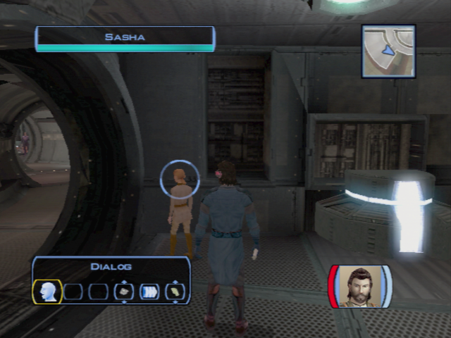

# Tatooine - An Unexpected Passenger

[< Previous Page](038_Dantooine.md) 
| [Back to the Index](./000_Index.md) 
| [Next Page >](./041_Tatooine.md)

- **Bastilla**
	- **Maybe Tatooine wasn't always a desert.**
- Zalbar -> talks -> go to food chest
    - Not right? What do you mean?
- Go to the supplies
- Go to Hyperdrive -> footsteps
- Go to infirmerie left, bedrooms
- Go back storage
	- Hey! What are you doing here?!
	- Calm down, little girl. I won't hurt you.
	- I still don't understand you.

	

- Retalk (might be different)
	- Can you tell me your name?
	- [Point to yourself.] My name is Name. You are...?
	- Sasha... your name is Sasha, right?
	- 
	- [Try to learn Sasha's strange language.]
	- Many of the words you're speaking are Mandalorian...
	- Manlorey... that's your word for Mandalorian? So you do know of them.
	- But are you a Mandalorian child, then?
	- Sasha isn't Mandalorian. Got it. But why don't you speak Basic, then?
	- 
	- [Try to learn Sasha's strange language.]
	- Esowon? Na esowon?
	- I see you? Or you see me?
	- I understand. "Esowon" is "see" but "na esowon" is "hide".
	- I didn't get it all...
	- 
	- Bristag? What is that?
	- It's your home? Is that it? // or else
	- "Bristag"... it means "starship", doesn't it?
	- 
	- **You're hiding in the starship. It's your home. I understand.**
	-
	- You've said that before. What is "gon-disen"?
	- Something about me, yes, but what?
	-  It's... something you like. Yes, "gon-disen" means you like it!
	- 
	- "Na abds"... you said that when I first found you.
	- "Abds" means "hit"? Is that it?
	- So... "abds" is "to hurt"? "Na abds" means "not hurt"? Is that it?
	-  I understand. No, I won't hurt you.
	- Yum? What kind of word is that?
	-  It's... a part of the ship? A room?
	- Yum... you mean food, don't you? "Yum" is "food".
	- Nuh ghis? Is that all one phrase?
	- You're not speaking... now? "Nuh ghis" means "now"! "Na nuh ghis" is not now... or "before"?
	- You... want some food now. You're hungry.
	- Tabed you? What do you mean?
	- You... want me to tell you a story? About what?
	- So... 'tabed' means 'tell me about'. I get it.
	- 
	- **[Communicate with Sasha in her language.]**
	- **Why are you hiding on my ship? Sasha na esowon in bristag?**
	-  You came to the ship before. You were very scared. Why?
	- You left the Mandalorians? And hid here on the ship.
	-  You don't want to leave. The Ebon Hawk is your home.
	- 
	- **Why are you scared of the Mandalorians? Hoot bad liaz Manlorey?**
	- ...
	- **You sleep here on the ship? Yooba stin-quiw in bristag?**
	- **No, you don't have to go. For now.**
	- **The Ebon Hawk is not your home, Sasha. Not your first home, anyway. Bristag na Sasha laesfa.**
	- Tell me about your home before. Tabed me Sasha laesfa na nuh ghis.
	- Dantooine? Maybe someone on Dantooine remembers you?
- Retalk with Bastila ? -> YES -> cut scene on Taris
	- Stowaway first ? -> More sense to talk again
	- You wish to talk to me?
		- //Harcellement ? nO
		- //I think we both know the real reason you've been watching me.
		- //I make you tremble? Do you get all tingly inside, too?
	- **My progress?**
	-  **We're not going to go over this again, are we?**
	- **You seem to know that temptation very well.**
	- **Are you saying the light side is innocent of killing?**
	- **Do whatever is required? Such as?**
- Juhani (personal 2/9)
	- Are you doing alright?
	- **You're too fragile, Juhani.**
	- Perhaps you just need more time.
	- **If I see you begin to slip back, I will intervene.**
**SAVE** (persuade incoming)

[< Previous Page](038_Dantooine.md)
| [Back to the Index](./000_Index.md)
| [Next Page >](./041_Tatooine.md)
