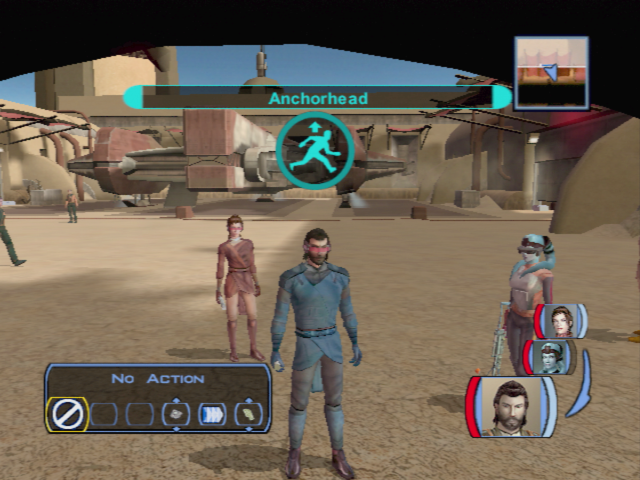

# Tatooine - Anchorhead Spatioport

[< Previous Page](040_Tatooine.md) 
| [Back to the Index](./000_Index.md) 
| [Next Page >](./042_Tatooine.md)

- Leave the Ebon Hawk
- With Bastila and Mission
- Czerka
	- What do I get for my 100 credits?
	- What if I don't have the money?
	- What if I say no?
	- Is there any way you could reconsider the fee?
	- [Persuade] The money I save I'll spend in your stores. (ez)
	- Give me some background on Tatooine.
	- What is known about the history of the planet?
	- What species do you mean?
	- Have you had trouble with the Sand People?
	- Any other sentient races?
	- Tell me about Czerka Corporation's operations here.
	- [Persuade] Come now friend, let me in on the details.
	- So Czerka Corporation set up shop on a barren planet.
	- What do you mean when you say the ore is "peculiar"?
	- What other forms of business are being looked at here?
	- 
	- Where should a person look for opportunity?
	- I'm looking for very specific things. Who should I ask?
	- I'm looking for older things. Antiques. Artifacts.
- Level up Mission and Bastilla
- Loot right chest
- A twilek appears: Bastila's mother 
	- Don't be rude, Bastila.
	- I guess we should go see your mother, Bastila.
- See shop
	- **Buy Bothan Sensor Visor**
- Talk to the Aqualish
	- What shipment? What are you talking about?
	- Excuse me, did you say "gizka"?
- Go pet Gizka
	- Pick up
	- Pet it
	- Play
	- Leave
- Chest on the left
- Go out

[< Previous Page](040_Tatooine.md)
| [Back to the Index](./000_Index.md)
| [Next Page >](./042_Tatooine.md)
