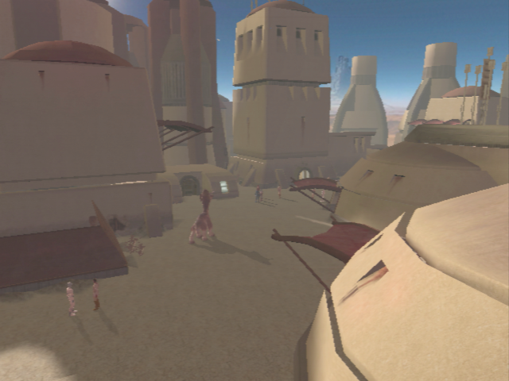

# Tatooine - Anchorhead City

[< Previous Page](041_Tatooine.md)
| [Back to the Index](./000_Index.md)
| [Next Page >](./043_Tatooine.md)

- See girl
	- What do you need? I'm Name, I'll help if I can.
	- What is a wraid plate? Where did you get it?
	- (reask, other questions)
	- Why do you need the money?
	- I wouldn't be able to sell it. I'm no hunter. (reask)
	- Where would I get a license? What's the cost?
	- I want to ask you about your husband's death.
	- **Who was he? Tell me about him.**
	- Any leads on who killed him?
	- You aren't looking for vengeance?
	- Let's talk about what to do with this plate.
	- **Perhaps I will buy it from you.**
	- **I'll pay that, and an extra 200. Good luck. + 4PCL (banther Bastila+Mission)**

- Go to Czerka Office on the right
- Maana
	- I'm sorry? What are you talking about?
	- **Helena? Bastila, isn't that your mother's name?**
	- Is she still there?
- Swoop bike guy juste devant entrée
	- I just want to ask you some questions.
	- Describe your job and who you work for.
	- What attacks do you mean?
	- Where can I learn about these bounties?
	- When do the sandcrawlers head out?
	- What can you tell me about Tatooine and Anchorhead?
	- Why have previous settlements failed?
	- Czerka Corporation isn't doing well here?
	- That's all I need. Goodbye.
- Czerka Office -> guy angry -> don't want sand people killed
	- What's going on here? Who are you?
- Girl : Protocol Officer
	- I want to ask about hunting licenses.
	- Have there been a lot of people leaving the city?
	- Why would I need a license anyway?
	- **There is no way to get a license?**
	- Why pay for the gaffi sticks? Why not their heads?
	- I will agree to do this for you.
	-
	- I'm looking for a miner named Griff.
	- [Persuade] Are you certain of that? I would leave sooner if I knew.
	- So you fired him?
	- You mean he's dead?
	- **So your workers are all expendable?**
	- Is there some type of reward for saving him?
	- Never mind. I want to ask you about something else.
	-
	- Czerka activities ?
	- May I ask ?
	- [Persuade] Why the secrets? The company stuck you here. Tell me.
	- What makes the ore substandard?
	- Does this mean you have plans to pull out?
	- What do you mean the planet was abandoned before?
	- Let's go back to my first questions.
	-
	- Anything out of the ordinary happening?
	- **No desire to mistakenly associate with the losing side, hmm?**
	- Know about anything more local? -> learn about the Jawa

- Talk to mission
	- I want to talk to you about your brother.
	- Don't worry Mission - we'll get him back.
- Exit
	- **Is this about Czerka wanting the Sand People chieftain killed?**
	- **The Czerka said that the Sand People attacked first.**
	- **What would you suggest, then?**
	- Who would have a capable droid? -> **LEARN ABOUT HK**
	- Where would that enclave you mentioned be?
	- Where would you get robes to match theirs? -> **DISGUISE INTO SAND PEOPLE**
	- Maybe I'll look into it.

## Hunter Lodge

- Meet Ithorian
	- I have something to sell you
	- Yes, that will do nicely.
	- See shop, Sell ?

- Dorak
	- It's just as well. You probably couldn't teach me anything.
	- Who are you? What is it you do?
	- Where is the best hunting?
	- Why are there fewer wraid?
	- Who uses battle droids?
	- How long have you been at this?
	- What do you want to learn?
	- What can you tell me about the other hunters?
	- What makes you say that?
	- Let's go back to my first questions.
	- I'm looking for something. Who knows this planet best?
	- I have to leave. Goodbye.
- Komad
	- Just a few questions, if that's all right?
	- Who are you? What do you do?
	- Where is the best hunting?
	- So dragons are rare? Are they dangerous?
	- Who uses battle droids?
	- How long have you been at this?
	- You really don't know anymore?
	- What can you tell me about the other hunters?
	- Wouldn't the guards have something to say about that?
	- What about the hunters besides the Gamorreans?
	-  Let's go back to my first questions.
	- I'm looking for something. Who knows this planet best?
	- Have you ever seen the Sand People with anything odd?
	- What kinds of ruins were these? Where were they?
	- What about the Jawas?
	- I have to leave. Goodbye.
- Gurke
	- What if I wanted advice? I'm sure you are very smart.
	- So, can I ask what you do?
	- Some of the other hunters say you don't know how to hunt.
	- I'm looking for something. Are you good scouts?
	- Why don't you let him speak?
	- Fine, I'll just leave.
- Tanis (Will find him later in the desert)
	- I'm looking for experts. You seem knowledgeable.
	- I'm looking for something. Who knows this planet best?
	- Have you ever seen the Sand People with anything odd?
	- Where did this happen?
	- What about the Jawas?
	- I have to leave. Goodbye.
- Kudos -> NOT NECESSARY -> INFINITE PAZAAK + only 75c par parties
	- What do you do?
	- Why do you play?
- Replace Mission by Carth -> YES Carth more lines when buying HK and in the Cantina ?
- Level up Carth (11)
- -> Program IA -> Scripts -> Jedi Support

[< Previous Page](041_Tatooine.md)
| [Back to the Index](./000_Index.md)
| [Next Page >](./043_Tatooine.md)

