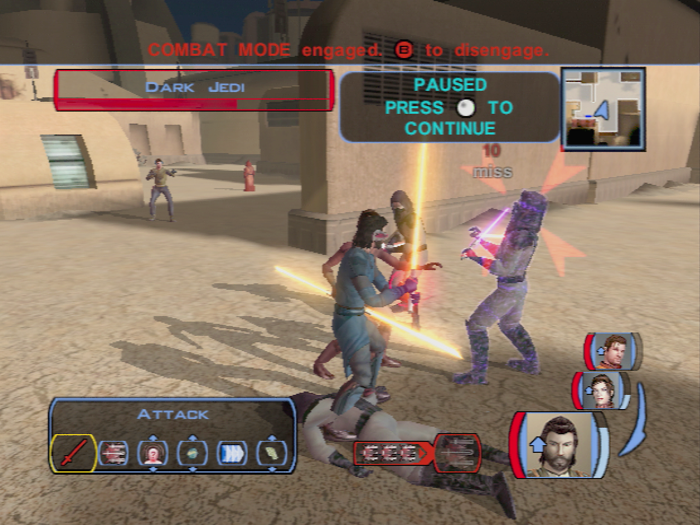

# Tatooine - The Cantina of Anchorhead

[< Previous Page](042_Tatooine.md)
| [Back to the Index](../index.md)
| [Next Page >](044_Tatooine.md)

- Meet Siths
	- Hard -> speed + force aura + heal with bastila
	- Level up Bastila during the combat if needed

- Equip Bastila with Dark Jedi Knight Robe
- Cantina
- Czerka Officer
	- I wanted to ask a few questions, if you have the time.
	- You're not much of a spokesman for Czerka Corporation.
	- Let's go back to my first questions.
	- I'm looking for something. Who knows this planet best?
	- I have to leave. Goodbye.
- Jawa Server
	- **Please, could you try to speak more clearly?**
	- **"Of your missing?" Have some of your people gone missing?**
	- You two agreed? Somebody mark this day down.
	- (reask)
	- Iziz... is that your leader? Where is he?
- Gandroff
	- I wanted to ask a few questions, if you have the time.
	- I'm looking for something. Who knows this planet best? -> Jawas again
	- **I want to ask about you and racing.**
	- Is this the best place for racing?
	- What made Taris any different than here?
	- How long did you race?
	- Why do you think that?
	- What can you tell me about the other racers?
	- What makes him any different than the others?
	- Other questions…
	- I have to leave. Goodbye.
- **Helena**
	- **My mother is long dead, if you must know.**
	- **Why don't you get the holocron yourself, Miss... er... Helena?**
	- **Don't you want to find your father's remains, Bastila?**
	- What about your mother's sickness?
- Furko Nellis -> 3 pazaak plays
	- I want to ask you some questions.
	- You must have an opinion about what happened on Taris.
	- Okay, let's talk Pazaak.
	- **I'll play. What is the wager?**
	- (50, 200, 500)
- **Junix Nard**
	- **Do you have anything for sale?**
	- Buy hair trigger
	- reask
	- I want to ask about things here on Tatooine.
	- I've got some questions about hunting.
	- ...
	- Anything out of the ordinary happening?
	- **Know about anything more local?**
	- "No" you don't know, or "no" you won't tell me?
	- I have to go. Goodbye.
- **Speak to Bastila**
	- Do you want to talk?
	- **Why didn't you ask about her sickness?**
	- **Why would she lie about it?**
	- You sound bitter.
	- (Reask)
	- You which to talk?
	- You don't think we should look for the holocron?
	- Why do you think she wants it so badly?
	- You'd keep it for yourself?
- Take T3 instead of Bastila
- Level up T3 (11)

[< Previous Page](042_Tatooine.md)
| [Back to the Index](../index.md)
| [Next Page >](044_Tatooine.md)

