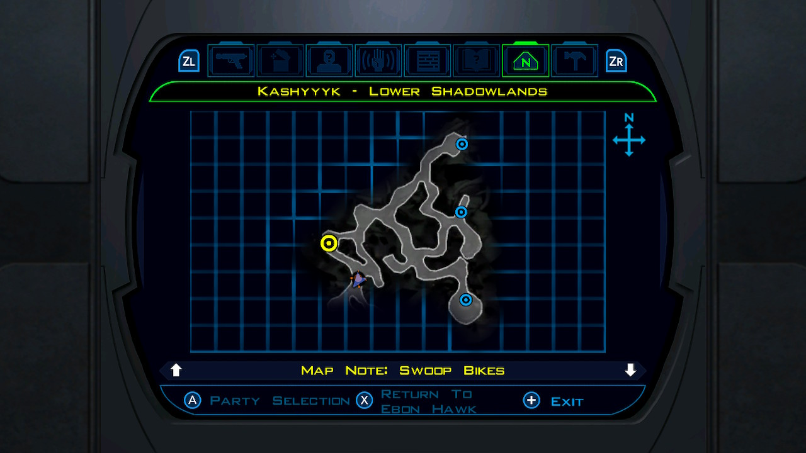
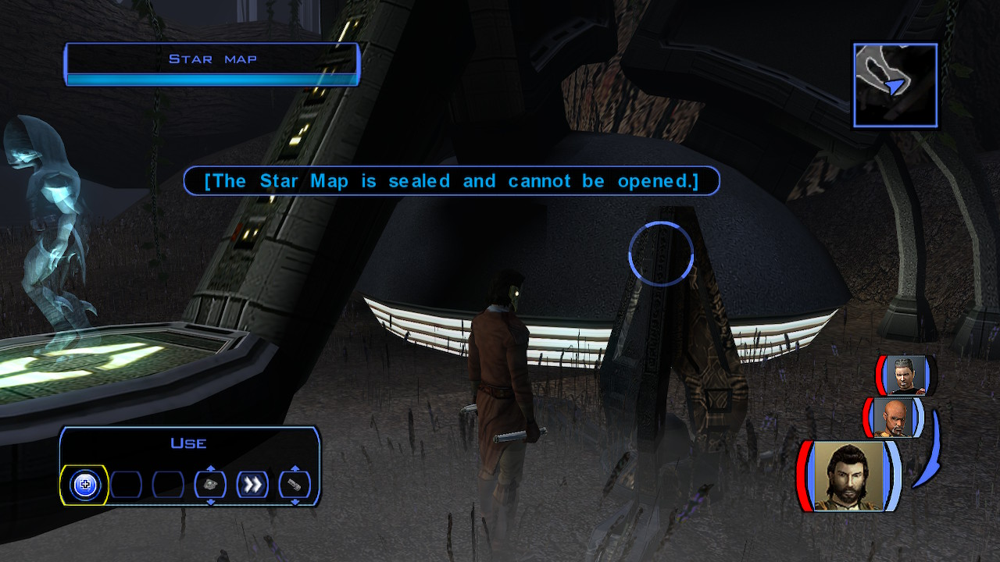

# Kashyyyk - The Star Map

[< Previous Page](054_Kashyyyk.md)
| [Back to the Index](./000_Index.md)
| [Next Page >](./056_Kashyyyk.md)

- Recover mines past the Czerka base (3 + 2 mines at the door)

- Czerka door
    - Why place this thing here?
    - Whatever. Just shut it down. (on Switch -> this trigger the loading)
    - Very well. Why did Czerka put this here?
    - Have you gone past it …
    - I trust …

- …
- Meet mandalorians
    - What happened here?
    - I have the means to heal you. Here. (Canderous comments)
    - What can you tell me about your attackers? -> Canderous ?
    - I'll look into it.
- Loot + remove weapons -> Mandalorians will popup

- Go to the right
- Ambuscade -> Focus sur 1

- Continuer vers les Kinrath (right)
- Go left next intersection: under the log (right is the swoop bikes)
    - Après cookie mort -> ambuscade -> remove weapons
- Remonter vers les swoop bikes (right) -> Boucle -> kill last mob
- Bike -> module -> last mands
    - Equip cancerous with belt?

- Go back to wookie
  - The Mandalorian hunters are dead. I killed them all.
  - I hope it does. Goodbye.

Echani Vibroblade (_https://strategywiki.org/wiki/Star_Wars:_Knights_of_the_Old_Republic/Melee_weapons#Echani_Vibroblade_)
- Prendre l’autre passage near the wookie (right)
- Suivre à gauche/kill
- Freyrr
- Attack
    - I'm not here to kill you. Just listen!
    - Do you know Zaalbar and Chuundar?
    - My name is Name. I came to Kashyyyk with Zaalbar.
    - No, he follows because of a life-debt.
    - Go over exactly what happened with Zaalbar.
    - So Zaalbar was exiled. When did you learn the truth?
    - Back to my other questions.
    - Why would Chuundar want you dead now?
    - Well, what happens now?
    - How? Everyone is on his side.
    - Where might I find it?
    - Describe the creature. Where can I find it?
    - I will try to find it. Can you give me any direction?
- Tuer kinrath on the left devant Freyr
- Go south right where you’ve seen mobs
    - Level up Canderous and Jolee (14)
- Next intersection en face -> kill Kinrath -> Viper Kinrath Body
- Go back right -> south
- See gravas
- Attacher Kinrath

- Kill monster
  - Loot circlet of Saresh +6Wisdom!!
- Go back Freyrr
    - I have other questions.
    - I'm looking for something called a Star Map.
    - …
    - I have found the blade of Bacca's sword.
    - Here, take it. I'm sure it is the one.
    - We should proceed carefully.
- +675PX

- Go to the south

- Get mines

- The star map can't be opened manually

- Talk to the hologram (few options are missing in the Switch version?)
    - What is your purpose?
    - What do you mean by behavioral reconfiguration?
    - And I don't fit that pattern?
    - That seems very helpful. Why have I been allowed access?
    - Do you not know why, or are you restricted from saying?
    - I want to ask questions about you and this installation.
    - Who built this installation in the first place?
    - If this place was built 30,000 years ago it predates the Republic.
    - Why was agricultural reformation needed?
    - That is a short period for adaptation of native creatures.
    - …
    - Who installed this holo-interface?
    - Who last accessed this installation?
    - Five years ago is about the time Revan passed this way.
    - But there was an entry at some time?
    - Was there any further contact with the installer of this interface?
    - …
    - What's the current function of this installation?
    - Defense of what?
    - 
    - I want to go back to my general questions.
    - What limitations have been placed in your programming?
    - What gaps are missing?
    - 
    - I seek information about a Star Map.
    - Original system memory? So the map is as old as this installation?
    - What do I need to do to get access to the Star Map?
    - How can I match them when I don't know what they are?
    - What do you mean by that?
    - What if I fail? (not on XBox nether Switch)
    - You may begin evaluation.
    - 
    - How did you know Zaalbar's name?
    - Can I confer with someone else?
    - **I trust Zaalbar. I would say nothing, and neither would he. -> Wrong but LS**
    - Then I will change my answer.
    - Continue your evaluation then.
    - I subtly reinforce the city while preparing to attack.
    - **I prepare my forces to attack in ten days. I do nothing in the city.**
    - **The victory is irrelevant. Stopping the war saved many more people. + 2LSP**
    - I do nothing so I can attack their weak spot later and save more lives.
    - **I stop the attack. I will appear to be a hero.** + 2PCL
- Full buffer + Echani shield + Krath double sword 
    - easy with powers of droid++ with Jolee

- 2*500 = 1000PX
- Retalk
    - What did your scan during the battle reveal?

- Star map opens (level 16 on Switch!!)
- Jolee talk

[< Previous Page](054_Kashyyyk.md)
| [Back to the Index](./000_Index.md)
| [Next Page >](./056_Kashyyyk.md)
