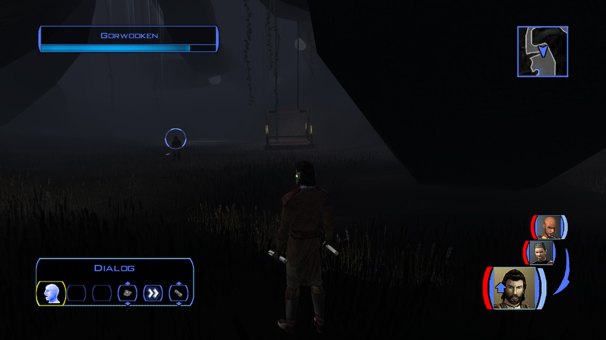
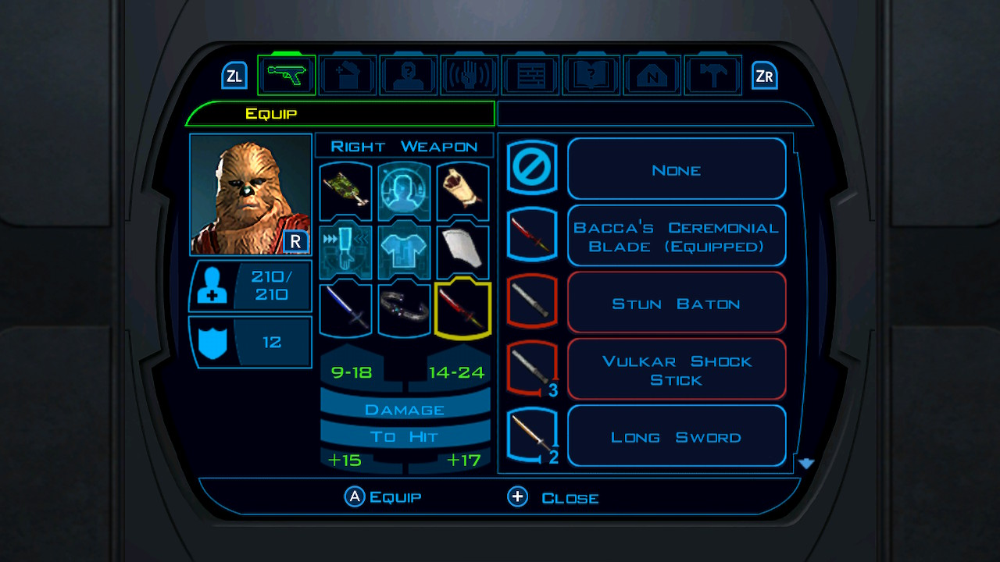
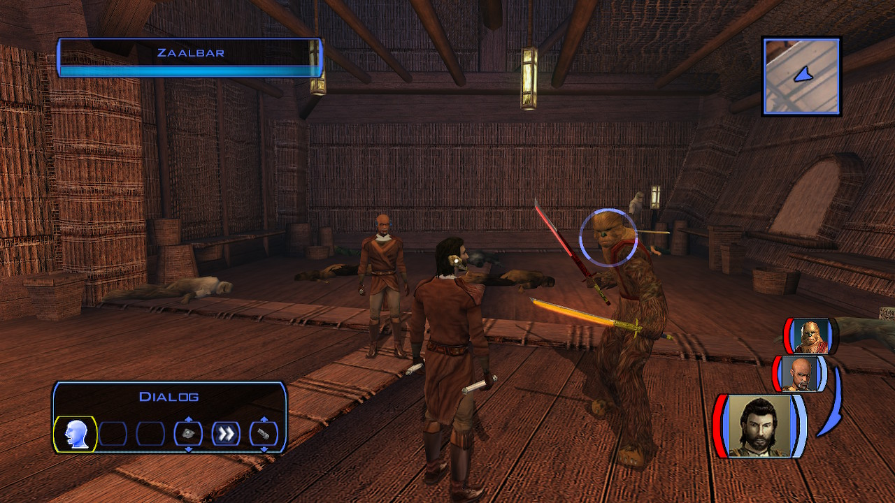
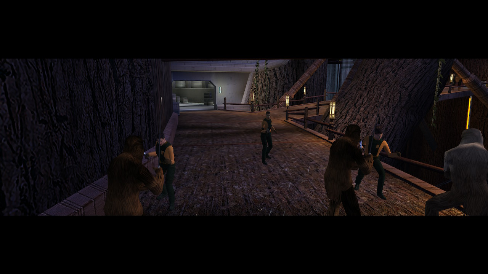

# Kashyyyk - Free Zaalbar

[< Previous Page](055_Kashyyyk.md)
| [Back to the Index](./000_Index.md)
| [Next Page >](./058_YavinStation.md)

- Go back to the village
- Before taking the elevator:
    - Kill Wookiie
    - Level up (16)

- Go Up
- Talk Chorrawl
    - Why should I follow you ?
    - (loading)
    - Quiet down. We'll use this to our advantage.
    - Do you have to fight? Talk it through!
    - **Convince them! Avoid this needless slaughter!** (+6LSP)
- Kill all

- Freyr
    - I have a few questions about Kashyyyk, Freyyr.
    - What will you do about the slavers?
    - I think it's time I was leaving.
    - That would be fitting, I think.
- (+6LSP) -> now close to full LS!
- Zaalbar + Jolee (Bastila + Jolee -> no trigger for banther)
- Levelup Zaalbar (14)
    - Equip him with Bacca's ceremonial Blade + Echani

- Go back à pied -> kill Czerka

- EBON

## Back to Ebon

- Improve Zaalbar sword
- Canderous (6/6)
  - Tell me more about the Mandalorian Wars.
  - How much did you lose?
  - And you eventually came to Taris.
  - **Opponents who could easily kill us.**
- _Could improve HK (14 repair) there instead of before_
- Zaalbar
  - Have anything more about..
  - Bacca’s Sword ?
  - Sorry can’t stay more ?
- Jolee (can't start the conversation for now)
  - Ask for med
- Juhani (5/6) (level 16)
  - I was wondering if we could talk.
  - What happened after your father died?
  - What happened?
  - Did she die?
  - You were enslaved?
  - And they freed you?
  - What was the dream?
  - You became a Jedi.
- Carth
    - Do you want to talk ?
- Go to Yavin

[< Previous Page](055_Kashyyyk.md)
| [Back to the Index](./000_Index.md)
| [Next Page >](./058_YavinStation.md)
