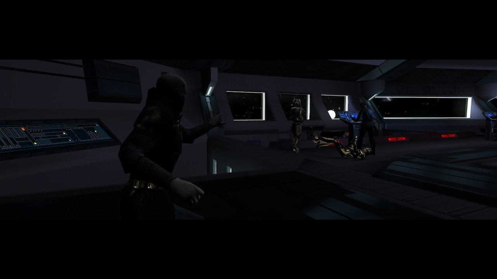
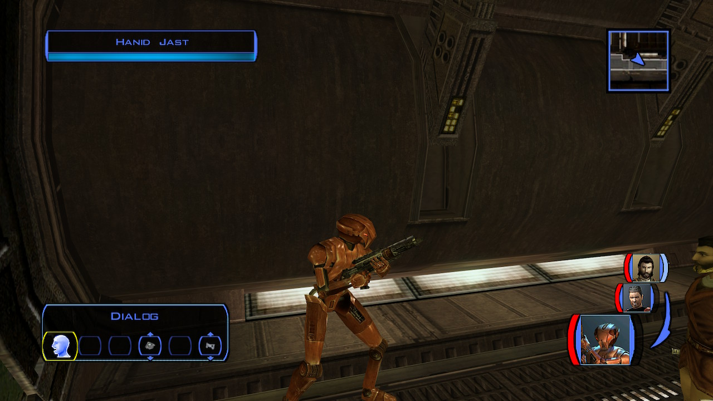
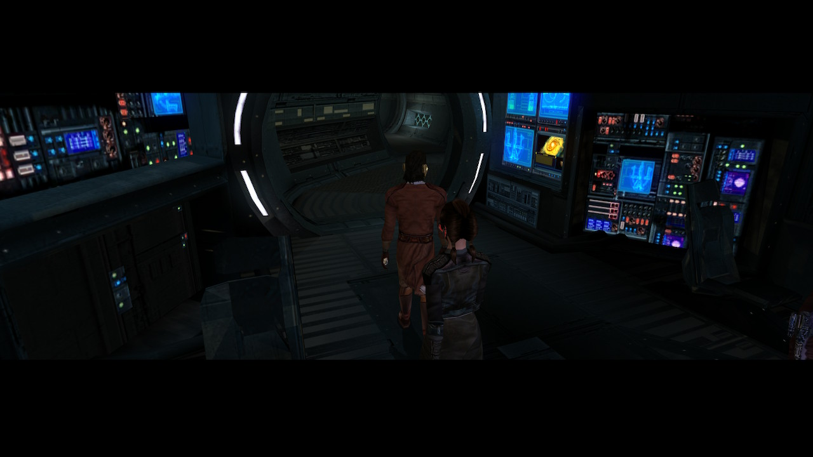
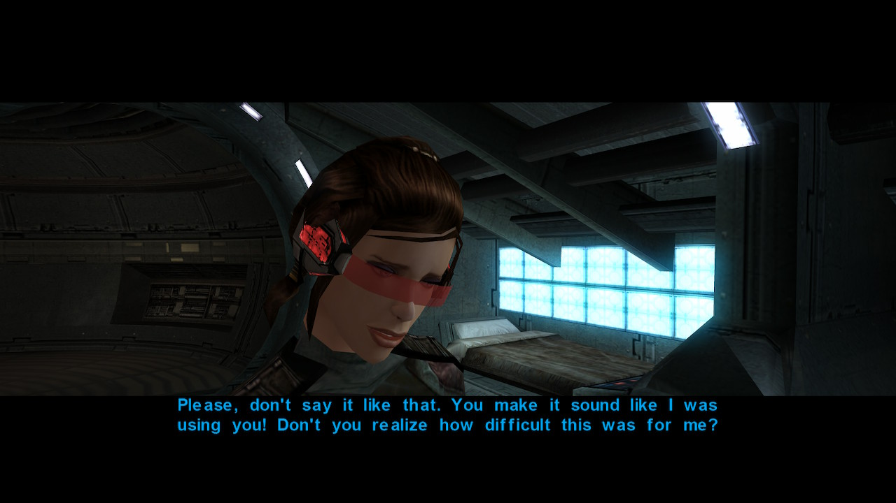
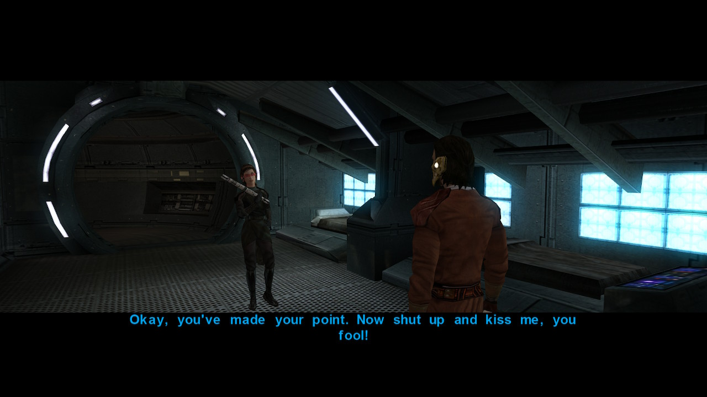
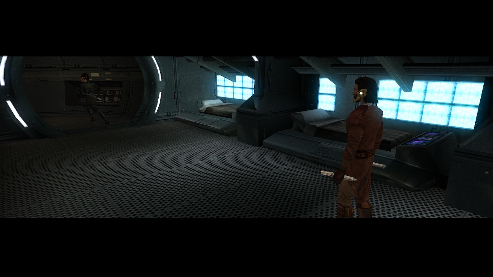

# Yavin - A Second Stop

[< Previous Page](056_Kashyyyk.md)
| [Back to the Index](./000_Index.md)
| [Next Page >](./059_Tatooine.md)

## Yavin - 3rd star map

- Cinematic 
  - Calo nord is dead 
  - Malak presents darth Bandon (the one who kill Trask Ulgo at the very beginning...)



- Leave the Ebon Hawk
  - Canderous + HK-47
- Level up HK to 14
- equip him with **mandalorian riffle**



- Talk -> no sound on Xbox
    - What's going on here, Suvam?
    - I think you guys better leave.
    - Or I will ask you again. Very politely.


- Buy for HK ?
    - _**Composite Heavy Plating**_ -> later -> why? loot somewhere? -> no only here -> now? 2400c -> yes on Switch (test)
    - Baragwin Assault Gun?? -> later?
- Buy for Zaalbar
    - Baragwin Assault Blade? Bof -> Later
    - Advanced Bio-Stabilizer Implant -> NOT NECESSARY ? -> poison immunity in Sith Base Manaan ?


- Back to Ebon
- Jolee (0/8)
  - Why did you decide to come with me?
  - So you wanted a ride on my ship?
  - No, seriously, tell me.
  - Is this a comment on my breath?
  - I never heard of him.
  - You're making all of this up!
  - How young are we talking?
  - Andor killed Kraat, I take it?
  - You're kidding…
  - But how can you even be sure Andor was responsible?

```
    - Juhani (5/6) (level 16)
        - I was wondering if we could talk.
        - What happened after your father died?
        - What happened?
        - Did she die?
        - You were enslaved?
        - And they freed you?
        - What was the dream?
        - You became a Jedi.
```

- Bastila (8/9) (or 8/8 without a mod that fixes the last conversation)
  - When we last talked you said you needed time to think. So?
  - Yes, I think so.
  - **What is it supposed to be like?**
  - Are you interested in me or in my ability to use the Force?
  - **You could leave, if you had to.**



> You both leave the cockpit

- …
  - So what does this mean for us?
  - So that's it? It's all over?
  - Great - you learn a lesson and I get dumped!
  - **So I was just a stepping stone to you becoming a Master?**



- ...
  - Difficult for you? What about me?
  - I'm going to stop Malak, Bastila. But I want to do it with you at my side.
  - You know I'm right, Bastila.
  - **I love you Bastila. And I know you love me.**
      


- ...
  - It didn't feel wrong to me. 



- Go to Manaan

[< Previous Page](056_Kashyyyk.md)
| [Back to the Index](./000_Index.md)
| [Next Page >](./059_Tatooine.md)
