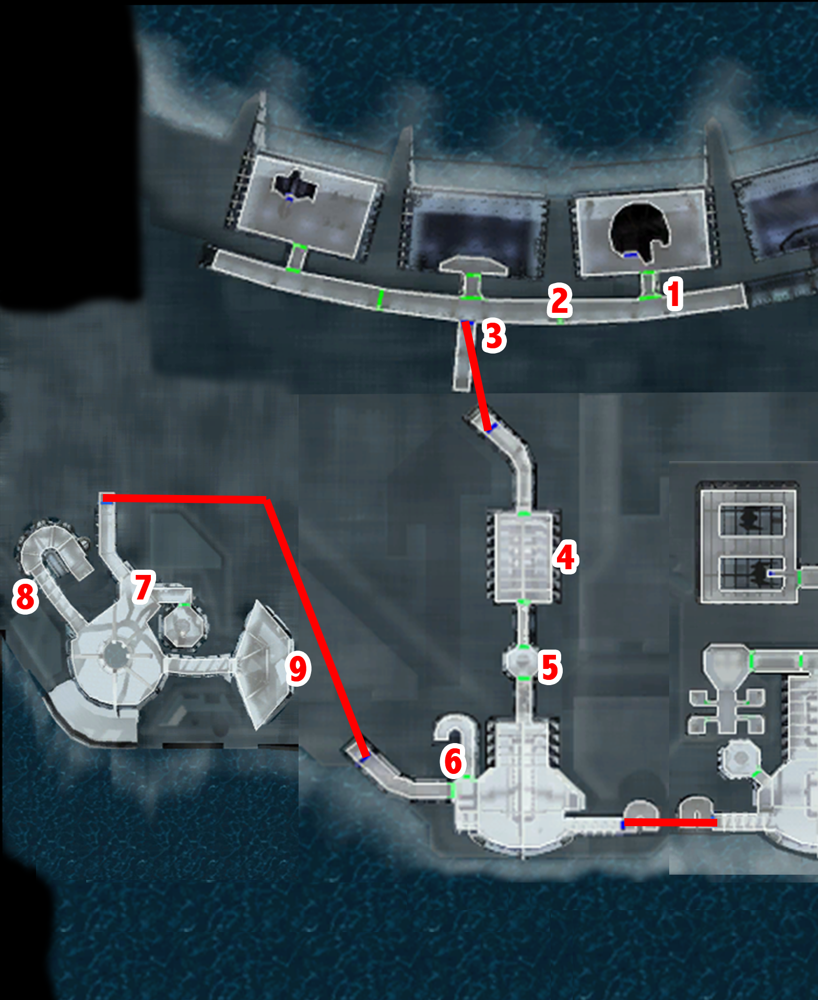

# Manaan

- Bastila
	- **Maybe the land was once above the surface.**
- Take Jolee + Canderous

- Go out
	- It is alright.
	- I would like to ask a few questions.
	- Why are there Sith on Manaan?
	- What is kolto?
	- The Republic and the Sith both stay here?
	- Why do the Sith upset you so much?
	- Breaking the law?
	- The Sith and the Republic coexisting peacefully? Well… relatively…
	- Tell me about Ahto City.
	- …
	- Have you seen an ancient Star Map?
	- Never mind. I must go.
	

	
- Go left -> Talk to republic soldier
- Jolee -> proposition (1/8)
	- You never did actually say why you decided to come with me...
	- **Are you always going to be this elusive?**
	- **You looked plenty happy there, to me.**
	- Damn right it is.
	- What interest do you have in my future?
	- You got that right. I have enough Jedi watching me.
	- Nomi? Who's Nomi?
	- So... you're along as some kind of observer?
- Go toward door near merchant -> Canderous !
	- Get out of our way!
	- Who is this guy?
	- You lived.
	- If you face Canderous, you face me as well!
- Talk to Canderous
	- What happened out there? Why is Jagi so mad at you?
- Merchant
	- Let me see your inventory.
		- -> parts / spikes
		- -> hyper stimulants
- Nubassa (SAVE)
	- Exotic species? What sorts of exotic species?
	- Why would you want to buy animals?
	- So you want me to smuggle them in?
	- **I have some gizka, if you're interested.**
	- **[Persuade] Is there no way I can convince you to take them off my hands? -> both medium**
	- **[Persuade] I was hoping to sell them. How about we just call it even?**
- Meet Deadeye Duncan!!
    - **Deadeye Duncan. I remember.**
    - You overpowered a dozen Sith?
    - You were pretty easy to slow down inside the dueling ring.
    - So what are you doing here?
    - So what are you going to do now?
    - You want to tell them you're the champion?
    - Okay, the name is yours. (+LSP)
- Go left (West Central)

## West Central

- Jolan Aphett - 10
	- 11 paazak (10x200c + cards)

- Accueil
	- What are the rules, exactly?
	- That's it? Only two laws?
	- How can you be neutral when the Sith are trying to conquer everything?
	- That seems awfully short sighted…
	- Very well... -> Impossible persuade -> need force persuade
- Talk to droid
- Enter city -> left fountain -> Talk to humans -> admire view
- Go right
- Open door -> selkath -> private conversation -> talk to sith + republic shifters
- right corridor -> Atho West
- Jolee’s friend
- Talk to Jolee
	- Tell me about Sunry. How do you know him?
- Right -> bar
	- Nilko Bwaas (Republic Hiring Mercenaries)
		- You're a lot more friendly than most of the Selkath here.
		- Cut the small talk. What do you want?
		- What do you want me to do?
		- Why do you need me for this?
		- I'll look into it for you, Nilko.
	- Traveler
	- Gonto Yas -> Pazaak 10 (3 on XBox)
	- Talk to le mec bourré au comptoir (SAVE)
	- Go to Shaelas en face du comptoir -> interpellation 
		- Actually, I kind of like the Sith. They've got style.
		- What task?
		- [Persuade] I was only kidding! (Medium)
		- What are you talking about?
		- You want me to investigate these disappearances?
		- I shall look into the disappearances for you, Shaelas.
	- Aller dans le fond du bar -> discussion -> Sith recruiting
	- Fille bourrée
		- I don't have much use for the Republic.
		- I hear you Sith are taking an interest in the Selkath youth.
		- I'll be going now.
	- Mercenary Ergeron (Canderous)
		- Can I ask you some questions?
		- Do you know anything about ancient ruins or a Star Map?
		- Don't you hate the Republic for defeating your people?
		- What do you have against the Echani and the Iridorians?
		- Why is the Republic hiring so many mercenaries?
		- I'll be going now.
	- Mercenary Iridonian (SAVE)
		- A mercenary who's not for hire. That's strange.
		- What do you have against the Echani and the Mandalorians?
		- I want to ask you some questions.
		- Why is the Republic hiring so many mercenaries?
		- Have you heard anything about young Selkath going missing?
		- Maybe the Selkath would be interested in your activities?
		- **[Persuade] Maybe I'll just gut you like a Selkath preparing an Orchana ray for lunch.** (Medium)
		- What were you doing for the Sith?
		- I am seeking an ancient Star Map or some alien ruins.
		- I’ll be going
	- Shaelas
		- I have information for you, Shaelas.
		- The Sith hired an Iridorian mercenary to lure the Selkath youth to the Sith base.
		- Does this mean I don't get paid?
		- I'll infiltrate the Sith base, Shaelas.
- Right -> republic recruiting -> learn about the embassy
- Talk to Republic Recruter
	- Why ? -> more logical now

- Go to court
- Talk to Republic Diplomat
- Talk to Sith Diplomat
- Talk to judge
	- How did you know I was from the Republic?
	- No, no… perfectly legitimate.
	- Is there a Star Map on this world?
	- What do you know about the young Selkath who have been going missing?
	- I would like to investigate the murder case involving Sunry.
- Go back to Elora
	- Can you tell me anything about Sunry?
	- Are you saying someone your age couldn't overpower a woman?
	- **Your husband might not be so innocent, Elora.**
- Go back to West Central -> transit to Ebon 
- Jolee (2/8)
	- You mentioned something about your 'adventuring days'?
	- So you weren't an adventurer?
	- But you've already said so much... I'm curious.
	- Yeah? Well old people love to talk about history. Proven fact.
	- *You* were a smuggler?
	- Was it very dangerous?
	- You were a pilot, too?
	- I still can't believe you actually did that.
	- How about nothing?
	- Where did you get the credits for all the supplies?
	- So you stole it?
	- **Well that was pretty stupid of you. -> LOL!**
	- That was the day you what?
	- Your wife? You were married?
- Transit Back

- Go to East Central alone
- Hulas 
	- That's a rather strange greeting.
	- Answers? Answers to what?
	- Who are you?
	- My name is none of your business.
	- I want to ask you some questions.
	- Senni Vek gave me a message to see you.
	- I've never heard of you.
	- I understand.
	- I will preserve the secrecy of your order.
	- How does anybody hire you if nobody knows you exist?
	- You're nothing but common assassins!
	- How will killing innocent people help the Republic?
	- This is a little hard to believe.
	- Why would I want to join you?
	- Okay, what do I have to do to join?
	- I'm ready to prove myself worthy of the Genoharadan.
	- What happens if I tell someone about this?
	- I understand. Who is my target?
	- Tell me about Zuulan Sentar. -> On Dantoine
	- Tell me about Lorgal. -> Here on Manaan
	- Is there anything else?
- Go to Shady Rodian -> pazaak cards seller
	- See inventory
- Rappeler Bastila et Jolee (levelup Bastila 14)
- Go to the general store
    - Buy Advanced Stun Ray for T3
- Go to Hotel -> Banter (right side of the funtain ?)
	- So you don't have a problem with Malak and the Sith?
- Hotel man
	- Who are the witnesses in the hotel?
	- What do you know about Sunry and Elassa?
	- Tell me what you saw the night of the murder.
	- Are you sure?
	- Could it have gone off after he left?
	- I have no more questions for now.
- Room left (SAVE)
	- What did you see the night of the murder?
	- What do you know about Sunry and Elassa?
	- Elassa roomed here often?
	- You mean Sunry was having a relationship with Elassa?
	- Sith Master?
	- **[Persuade] What did you see?** (HARD)
	- **I have a lightsaber too, you know.**
- Open next room -> take violet LS -> défoncer la porte
- Gluupor the Rodian
	- I have questions about the murder of Elassa.
	- Why were you at the hotel?
	- What did you see?
	- What about Elassa's room?
	- [Persuade] Did someone pay you to do something in that room Gluupor? (EASY)
- Mysterious Man
	- **Why are you telling me this?**
	- Huh?
	- **Why should I believe you?**
- Follow advice -> go to the embassy
- Roland
	- I'm investigating the Sunry case.
	- Are you so sure it was the Sith?
	- I am on a mission from the Jedi Council, perhaps you can help me with it.
	- I seek a Star Map, the remnant of an ancient and forgotten race.
	- You know something?
	- [Persuade] Come on, tell me. -> Impossible
	- What do you want me to do?
	- **What is this recording?**
	- **I'm not your errand runner!**
	- How do I get in the Sith base?
	- Interrogating the prisoner sounds good.
	- Is there another way?
	- I think I'll decrypt the passcard.
- Take T3-M4 instead of Jolee 
    - level up 12 to 14
    - equip computer -> >30 skill points lol!
    - Advanced Stun Ray
    - Mandalorian Heavy Pistol + Sith Assasin pistol
- Go to computer room
	- Terminal sequences?
- Computer with T3 2 spikes
	- [Computer] Slice Republic system. (1 spike)
	- [Computer] Access restricted data archives. (5 spike(s) -> 1 for T3)
	    - What is the 125 spikes option ???
- Again
	- Decrypt Sith passcard.
	- 22
	- 18
	- 64
	- 2
	- 6
	- 7
	- Log off.
- Genoharadan: Lorgal
	- Liberator? You're nothing but a murderer!
	- It's not the same! You kill civilians and children!
	- I've got better things to do than argue with prisoners.
- (SAVE)
- Interogatoire (_https://strategywiki.org/wiki/Star_Wars:_Knights_of_the_Old_Republic/East_Central#Prisoner_) -> Need to do a +9 -> Serum = reset
	- What was he doing out there?
	- What did they do to him?
	- I will interrogate him now. / Yes.
	- Let's get started.
	- A catch?
	- I detect a pattern here...
	- Yes.
	- Inject...
	- Interogate...
	- We know about your companion. + 2
	- [Persuade/Lie] Perhaps we would give you back to the Sith, but keep him. +2
	- …
	- Maybe we should do something about Tela. +3
	- [Persuade/Lie] We have her already. She may be spared if you talk. +2
	    - If it fails go back -> reinject -> reinterogate
- Go to Atho East (before going to the Sith Base) -> make sence since we have to take a shuttle. Wait for the shuttle ;)
- Sith intercept -> we gonna go back latter -> threaten her
	- This is a public street!
- Go to droid shop
	- I'm interested in buying something.
	    - Buy Droid Heavy Plating Type 1 (1250c) +9 defense bonus 
- Sith base talk to the guard
    - I want to ask you some questions.
    - Do you know about the Sunry case?
    - Why is the Republic hiring so many mercenaries?
    - Why have the Sith taken such an interest in the Selkath youth?
    - I'll be going now.
- Transit back to the Ebon Hawk
    - TODO: bug to fix -> deadeye not desappearing
- Last door of the Corridor (behind Deadeye)
- Kill -> easy -> monter dans navette
