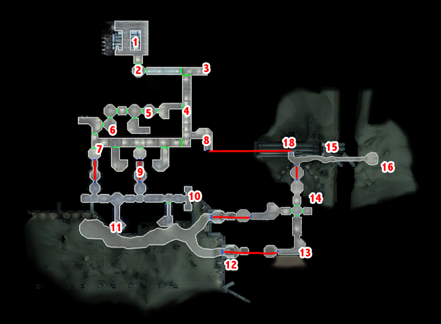

# Manaan - Court

[< Previous Page](064_Manaan.md)
| [Back to the Index](./000_Index.md)
| [Next Page >](./066_Manaan.md)

# Court

- Interpellation
	- What? Why?
	- …
	- Get me out of here!
	- Arbiter?
	- I don't need anyone to represent me!
	- What have I been charged with?
	- It's all the Sith's fault!
	- How will you get me free?
	- **I had authorization to enter.**
	- I have no prior association.
	- Um... Don't you need to ask more questions?
	- How can you expect to defend me without getting more information?
	- **I think I'd rather represent myself.**
	- No, I'll represent myself.
	- …
	- Not guilty.
	- **I was investigating the disappearances of young Selkath.**
	- I have this datapad as proof that the Sith are up to no good!


## Show proof to Shaelas

- Replace T3 with Jolee (level up to 15)
- Shaelas (Jolee + Bastila intervine)
	- I have information for you, Shaelas.
	- The Sith are training the Selkath youth in the ways of the Dark Jedi.
	- I've convinced your daughter to turn her back on the Sith ways.
	- I hope so.
	- **Keep your credits, Shaelas. A Jedi has no need of such rewards.** +2PCL sinon 500c -> PCL vont être important…
- 2 LSP + 600 PX
- Elora (SAVE)
	- [Persuade] Was Sunry having an affair? 
	    -> NEED SUCCEED -> otherwise fail -> Jolee saves -> but NO XP -> in fact ok (patch on XBox ?)
	- He has killed many Sith before.
	- Don't worry... I’ll save him (other already)
- 500 PX


- Open prison door -> closed
- Talk to selkath -> unlocked
- Sunry (Jolee interviene)
	- There's a few things we have to clear up.
	- The judges said you left after the shot was fired.
	- … (clear up)
	- There was a Rodian who planted evidence at the murder scene.
	- I know you're guilty, Sunry. I've got the Republic's data recording.
	- But the Sith found out the truth, didn't they?
	- **I don't know.**
	- Killing your lover while she sleeps is murder - even if she is a Sith!
	- These are just excuses, Sunry. We both know you have to own up to your crimes.
- 500 PX
- Talk to other prisoner
- SAVE
- Selkath Warden
	- **I want to begin Sunry's trial now.**
	- Yes, let's begin the trial.
- **Court (**_https://strategywiki.org/wiki/Star_Wars:_Knights_of_the_Old_Republic/Sunry_Murder_Trial_**)**
	- **I will find Sunry innocent.**
	- (Firith Me)
		- Objection, your Honors!
		- **Did you actually see the murder happen?**
		- **Elassa is a Dark Jedi, isn't she?**
		- **Was the medal left at the crime scene not a little too obvious?**
		- I have no additional questions.
		- (Yes.) -> Judges poll -> does not make sense -> Cut
	- (Gluupor)
		- **Did you see Sunry kill Elassa?**
		- **Isn't the medal at the crime scene too obvious a clue?**
		- **Did you plant the medal on Elassa?**
		- I have no additional questions.
		- (Yes.) -> Judges poll -> does not make sense -> Cut
	- (Elora)
		- **Was it true your husband was having an affair with Elassa?** -> no bonus but needed
		- I have no additional questions.
		- (Yes.) -> Judges poll -> does not make sense -> Cut
	- (Sunry)
		- **How could Elassa have got a hold of your medal?**
		- **You were going there to end the affair. Would the Sith object?**
		- I have no additional questions.
		- (Yes.) -> Judges poll -> does not make sense -> Cut
	- (Closing)
		- **No one actually witnessed the murder.**
		- **Sunry was ending the affair, so the Sith killed her.**
	    - My arguments are complete.
- INNONCENT !! -> 500XP (the max) -> saved the republic -> + Sith guilty
- Jolee
	- So what do you think of Sunry's verdict?
	- No, not really.
- Jolee (3/8) -> Talk the MAXIMUM !!! -> 8 before the leviathan !!!
	- You mentioned something about your wife before?
	- I don't want to pry, but...
	- Is that why you went to Kashyyyk?
	- Well...
	- **What's this? Love advice from an old Jedi?**
	- **Not even a Jedi? You mean not anymore, right?**
	- You seem to have all the abilities of a Jedi...
	- So what happened between you and your wife, then?


- Go to the Republic Embassy -> East Atho
- Roland Wann
	- Yes, here it is.
	- What has the Republic done?
	- **This is dangerous...**
	- **What happened down there?**
	- How will I get down there?
- Go back near the fountains (trigger the Banther if not already ?)
- Transit back to Ebon
  

## Hukas Quests

- Workbench
    - LS -> Blaster Deflection +5 (Jenruax)
    - short LS -> Against droid (Jenruax + Luxum)
    - Blaster for HK -> trigger
- **Talk with Juhani (6/6)** (level 17) (rare talk since grinding is necessary to reach it)
    - I was wondering if we could talk.
    - Tell me more about your past.
    - **Why would I react badly?**
    - Of course I remember.
    - Well what?
    - Revan?! You mean…
    - Why did you tell me now?
- Jolee (4/8) -> Talk the MAXIMUM !!! -> 8 before the leviathan !!!
	- Why did you leave the Jedi?
	- You did. You said you weren't a Jedi any longer.
	- So are you a Jedi or not?
	- So you're just some rogue Jedi. Big deal.
	- I certainly don't think that.
	- So the Jedi wronged you in some way, I take it?
	- **Is this going to have a point?**
	- **And? I don't get it.**
	- So... you knew this Master Hortath? Or the Padawan?
	- I don't understand...
    
    
- Go out with T3
- Transit back
- Out of the embassy -> Solo mode T3
- Kill prisoner (2 slices)
- End solo mode
- Wait for T3 to return


- Change your party to remove T3 
- Hulas
	- Lorgal is dead.
	- Vorn ?
		- Any tips for this mission?
	- Rulan
		- So how do I find someone who look like anyone ?
	- Ithorak
		- Sure. I'll just tell him I want to kill his boss and book an appointment.
	- Anything else ?
	- Back later
- You get a Poison blade !


- Go East with Juhani and HK (level up 13-15 and 15 respectively)
- Ithorak Quest
- Go to Cantina (Est)

```
- If you choose DARK SIDE path: Sith retalk!! (SAVE)
    - You better change your attitude, or the Selkath might find your body floating in the ocean! (+2DSP)
    - The Sith and I are exchanging meaningless taunts.
    - **[Force Persuade (HIGH)] This argument was the fault of the Sith. She should be arrested.** (+2DSP)
```

- Sith Base Entrance
- Droid
	- **I heard the Embassy was attacked ?** -> LOL response du droid
    - _BUG : still can go in the Sith base_
- Go back to the central place of the area
- Go in direction of the Sith woman recruiting -> auto -> don't trust you
- Talk to Sith man (with a woman Sith)
	- Could I ask you a few questions?
	- You mentioned the races.
	- There are no racers you like?
	- I have to leave. Goodbye.
- Go to swoop 
- SAVE
- Talk to Vek (Ithorak) 
	- Who are you?
	- You're wearing a Sith uniform. Are you with the Sith?
	- Don't you think the Sith might take exception to that?
	- Yes, I can see how it would be very stressful.
	- …
	- I need to meet with Ithorak Guldar. Can you set it up?
	- [Persuade] I represent an anonymous buyer from Coruscant. (MEDIUM)
- Queedle
	- I just want to ask a few questions.
	- I want to ask about you and racing.
	- Is Manaan a good course for racing?
	- How long have you been at this?
	- What do you mean by that ?
	- How much do you think you need?
	- There's no way you can earn the money?
	- **Here, I can give it to you.** +4PCL
- Save(/Load?) -> so time ingame
    - il va vouloir rendre l’argent
    - première race -> save load -> reparler -> no keep it. +2PCL
- Swoop reception (Sslamoth)
    - Tell me about what goes on here.
    - I have raced on Tatooine.
    - I want to talk about the rewards.
    - Tatooine uses tiers instead of rounds. Why the difference?
    - What does each round pay?
    - Describe the current crop of racers.
    - Let's go back...
    - I'm ready to race.
    - [Persuade] Lowering the fee would encourage new racers. (easy)
        - 50c now
- ... race
    - Back later
- 450c (500 - 50c) +200PX
- Talk to Queedle
    - **You keep it. Use it for more upgrades.** (2LSP + 500c)
- Go to console -> see times
    - +200PX -> Queedle won!
- Swoop -> best at 22:50 then 22:48 -> if Ithorian helped
    - 2000 - 100c
	- 5000 - 100c
- 7250c in total!!
- Juhani (personal 7/9) k_hjuh_p07, k_hjuh_p07l, k_hjuh_p07d
    - At least 3 star maps -> should be ok by this time
    - -> different if light/dark/neutral -> light:
        - You should not be so hard on yourself.
        - You have nothing to be ashamed of.


- Transit back to the Ebon
- Go to the meeting
- Xor spawns
    - Just ignore him, Juhani.
    - We should just leave, Juhani.
    - She is her own person.
    - Calm down, Juhani.
    - You bought Juhani?
    - She is not for sale!
    - There is no emotion...
- Ithorak
	- You don't need to do that. I won't cause any trouble.
	- Personal feelings? Do you mean you don't like Ithorak?
	- Okay, let's go in and see Ithorak.
	- ...
	- My buyer wishes to remain anonymous.
	- Nothing specific. I'm just browsing on behalf of my patron.
- Kill them all -> take geonosian sword for the droid
- Loot le datapad
- Leave and go end this quest
    - Ithorak Guldar is dead.
    - Back later
        - +1000XP
        - gands -> strength +4


- Transit back to the Ebon Hawk
- Jolee (5/8)
    - What do you know about the Sith?
    - You must know more than that.
    - You're being elusive on purpose.
    - You did. You said you fought them.
    - **Are these the same Sith that we're fighting now?**
    - Who is this Exar Kun?
    - And he was killed?
    - **So tell me what you know about the Sith.**
    - **What happened during the war with Exar Kun, then?**
    - But you exterminated all the traitors, right?
- IF PATCHED
    - Bastila
        - I want to talk to you about what happened between us.
- (SAVE)
- Go to Dantooine


## Go to Dantooine (LAST TIME)

- Go out and take HK and Zaalbar (level up 15)
- Buy
	- Calrissian's Utility Belt ? -> On Xbox not present -> need to have put a mod when first loaded this area!!
    - Equip -> 17 Repair
- HK
    - I would like to try restoring some of your memory.
    - Let's get started.
    - ...
    - What? Why not?
    - Are you sure your core isn't just damaged?
    - You are eager to find your origins, are you?
    - Well…
    - So tell me about this last owner, then.
    - It appears no one could resist using your protocol.
    - I suppose I would, at that.
    - Oh? Why is that?
    - So you killed *that* master directly.
    - You are just a travelling piece of bad luck, aren't you?
    - You don't want to hear the answer to that.
    - So you couldn't kill Mandalore, hey?
    - So can you remember anything else?
    - [Because of your repairs, HK-47 will now regenerate at a rate of 1 vitality point every 3 seconds and has gained an additional +2 bonus to his dexterity.]
- Go to Matale's Mention -> Speeder
	- [Slice into the speeder and activate its alarm system.] [1 spike]
	- I don't know who set off the alarm. I was just passing by.
- Kill -> Then auto stop
	- You must pay for your crimes, Zuulan.
	- That's a small price to spare your life.
	- I can't just let you go. You are a slaver.
- Transit back
- Back to Ebon
    - Jolee (6/8)
		- Do you want to talk about the war now?
		- **[Persuade] No time like the present? -> easy**
		- Um... no, I don't remember.
		- What does your wife have to do with the war?
		- The war...?
		- And what did she think of all this?
		- So what happened?
		- **So she had fallen to the dark side?**
		- You killed her?
		- But... she was a Sith then, right?
		- They put you on trial?
		- So that's the source of all this bitterness? They found you guilty?
		- I don't understand...
		- And you still believe love is worth the risk?
    - SAVE
    - Go to Tatooine
    - (can't go to Kashyyyk : meet Bandon too soon)


## Go to Tatooine

- Take and level up Canderous (15) and Mission (14 to 15)
- Level up -> Mission equip with Chundar Bowcaster
- Czerka -> Griff
	- **// I’m not giving you the gland until I see some credits!**
	- Here's the tach gland. Take it.
	- You already promised me a few thousand credits.
	- **I've done more than enough for you already!**
	- **I don't need business advice from you, Griff.**
- Talk to Mission (Griff gone)
- Renvoyer Mission pour Zalbaar -> non trop chaud pour Z -> HK
- Go to the dune sea
    - Kill Wraids? before and after the talk? (still 300PX each)
- Dunes (SAVE) -> 1800XP + XP du suicide lol !! sinon 50 +30 +30 en kill c’est tout
	- You talk too much and do little.
	- I think you both need to calm down.
	- Why do you need to fight him, Canderous?
	- You sent your own men to die, Canderous?
	- **[Persuade] People die in war, Jagi.** HARD
	- He may have saved other lives by doing what he did.
	- No!


- Kill rodians
- Talk Canderous -> need time
- Go near the big truck -> assault of sand people
- Kill Wraids (still 300XP * 4) but a lot easier
- Level Canderous + HK (16)
- Go toward San People Enclave
- Behind dune 
- Sand people -> kill -> easy with stasis
- -> droid -> kill
	- -> could add frag grenade to bike ? -> no less XP
	- Re-prog droid -> **6 parts needed** with the belt
	- I've reprogrammed your droid, Vorn.
- 1105 PX
- Rather hard to kill -> stasis++
- -> get data pad 


- Back to Ebon -> à pied
- Kill wraids -> level up!! (18)
    - Shock power + 2hands+ !


- Hunter lodge -> sell wraids 24c -> no, Yavin? -> does not make sense...
- Ebon
	- Canderous -> ask again
	    - What are your thoughts now?
    - Jolee (7/8)
        - So when did you go to Kashyyyk?
        - The Jedi just let you go?
        - **With good reason, I imagine.**
        - So that's when you went to Kashyyyk?
        - You survived a crash-landing on Kashyyyk?
        - Why didn't you just fix your ship and keep going?
        - So you crashed... and stayed?
        - How did you survive in the Shadowlands?
        - It couldn't have been easy.
        - You're completely insane, you know that?
        - And the Wookiees didn't mind your presence?
        - You seemed on fairly peaceful terms with them.
        - You helped them?
        - Why didn't you stop the slavery of the Wookiees, then?
        - It sounds like you enjoyed being a god.
        - A few bruises?
        - Wasn't it all a bit primitive for you?
        - You spent two decades living like that?
        - The Wookiees?
        - **You sound quite fond of them.**
        - Gardeners?


## Back to Manaan

- Go out alone (Juhani quest end does not trigger)
- Hulas
	- Zular Sentar is dead. (Dantooine) + Blaster + 500XP
	- Vorn (Tatooine) + 1000XP + Stealth 


## To The Manaan Star Map

- Take Bastila + T3 -> levelup 16
    - Equip T3 with GenoHaradan Blaster
- Go to the Republic Ambassy
- Take the back door -> submarine
- SAVE


## Hrakert Station

- Repair parts needed : 5 + 5 - 3 - 3 = 4 -> 10 on XBox
- Spikes needed ? 0 - 2 -> 14 on XBox (T3 is overpowered lol)



- 1
    - Loot
- 2 
- Open door -> Mercenary
	- Why? What happened?
	- **I have to find the Star Map.**
	- The Selkath?
	- Let's get you back to the surface.
	- Wait here while I go into the station.
	- You call yourself a mercenary?
- 3
- Go to the computer -> T3 (SAVE)
	- **Central Storage** -> Gas
	- **West Storage** -> Gas
	- Don’t corrupt droid -> no XP -> items lost and kind of useless
	- **Security Room** -> Deactivate Shield on Sentry Droid -> 180PX
- 4
	- Kill droids
	- On the left -> EXIT door
	- Deadly mine -> equip -> get
	- Footlocker
	- Go door -> sealed from other side (18)
	- A droid can be repaired -> LATER
	- Go back to 4
	- Kill 2 Selkath -> Get Master Jedi Robe + Crystal + 3 parts
- 5
	- Repair droid (5parts (8left on XBox) +1170PX)
	- Kill droids next room -> shield -> bastila use destroy droid
	- Suivre droid -> kill the last droid
	- Go back door on the right -> DEADLY MINE -> coffre avec anti requin + datapad
- 6
	- Loot (locked -> T3)
	- Crazy man in closet
		- I'm Name and I've been sent by the Republic to investigate what's happened here.
		- What made the Selkath insane?
		- [Persuade] Come out - we'll protect you from the Selkath. -> Always fail
		- If you don't come out, I'll just leave you in there.
	- Loot everywhere
	- Next room -> mine near chest -> again anti shark device + memo scientist
	- **SAVE HERE** -> the droid can walk here
	- Next -> corridor -> see on the left -> droids -> send T3 in solo mode
	- SAVE 
        - -> attention aux 2 mines -> mettre Awarness a fond avec Bastila and PC
        - Ouvrir la porte avec le T3 -> locked -> droid juste derrière 
        - Avancer avec Revan 1er droid -> contrôler B pour ne pas marcher sur les mines !! -> 2nd droid
        - Déminage -> commencer par la mine vers T3 et le droid réparé -> sinon le droid réparer va marcher dessus
        - Disable solo mode
	- Rejoindre T3 -> salle avec les Selkath -> kill loot
	- faire les salles dans l’ordre (near T3 first)
		- 1 ere -> 5 Selkaths
		- 2nd -> Mine
		- 3rd -> Locked
		- 4th -> Mine + Selkath -> Solo mode !!!
		- Go back to 2!
    - Go outside


## Underwater

- Left 
	- Door -> locked
	- Footlocker -> 2 mines in it
- Meet the guy
	- Who are you?
	- What are you doing in the underwater section of the facility?
	- You wait here - I'll go check it out.
- Follow him -> nothing to loot around
- Kill the fishs
- Enter ther room -> kill -> loot -> nerve amplifier
- Take the more far door (right) -> better -> gas mask
- SAVE -> XBox crashing... -> mod among man26_*.dlg probably "exit"


# Facility 2

- Kill Zelkath behind the mine
- Get mine loot
- Breath mask -> republic soldier
- Meet guys en face -> will try to kill you (1spike)
- Take breath mask -> go to console -> abort
	- Calm down... everything will be okay.
	- **You tried to kill me!**
	- How about I ask the questions.
	- What was the Republic doing here?
	- Did this have something to do with a Star Map?
	- What happened?
	- **Turned on you?**
	- **And no one knew about this thing?**
	- **I have to get to the kolto machinery.**
	- So what can I do about it?
	- What does this compound do?
	- What else could I do?
	- OK. I'll vent the toxin into the Rift to kill the giant shark.
	- **I am not so sure...**
	- I will try to destroy the harvesting machine.
- Go left -> kill Selkath -> WARNING 2 MINES!!! -> TAKE EQUIPMENT -> level up
- Go right -> loot
- Retalk ? NO -> bug
- Go outside


## Manaan Star Map

- Kill 2 Firaxan
- Computer
	- Access fuel tank pressure control.
	- Display pressure status.
	- Fill container pod.
	- Transfer from container to injector.
	- Dump injector pod.
	- Transfer from container to injector.
	- Fill container pod.
	- Transfer from container to injector.
- 1500PX
- Star map
- Go back -> take the door on the right


## Back to Surface

- Sith Lord happened !
- Darth Bandon -> the guy who killed Trask Hulgo at the beginning of the game !!!!
	- **How did you get down here? -> good infos !**
	- You were on the Endar Spire! You killed Trask. You'll pay for that! -> not on Xbox ?
		- You're Malak's apprentice? Can't say I'm impressed. -> else
- Take belt -> immunity mind affect -> found underwater
- Take double LS + armor


- Take ship
- Republic talk
	- **The Selkath went insane.**
	- They killed almost everyone on the Station.
	- Your construction woke something up.
	- A gigantic firaxan shark that drove all the Selkath insane.
	- **A few scientists have survived.**
	- The harvesting machine was destroyed.
	- Yes I did!
- Outside -> Selkath Police
	- Very well. I will come peacefully.
	- …
	- The explosions were at the research station both our governments set up there.
	- **The entire station had been driven mad.**
	- The machinery had woken up a giant firaxan shark. // or similar…
	- I destroyed the machinery to save it.
- Go to the bar -> Nilko Bwaas
	- Yes - they're sending them down to a secret base on the Hrakert Rift.
	- They couldn't. They had lost contact with the science facility.
	- They awoke a creature which fed on the kolto.
	- The creature is alive.
- Replay Pazaak -> 1 time -> le mec va redire triche
- Teleport back to Ebon


## Ebon Hawk - 4th SM

- Improve -> Take now bigger red LS 
- Jolee (8/8) -> REVEAL!
	- So if you liked Kashyyyk so much, why did you want to leave?
	- I find it hard to believe you left the Wookiees just for some adventure.
	- Oh, no, not another story!
	- This is a very long story.
	- Am I supposed to be the snake?
	- **Are you saying you're frightened of me?**
	- **Thank you, Jolee. I'm glad you came.**
- Carth -> Talk
- OPTIONNAL : Make everyone look great for the next cut scene !
	- Carth -> Use armor of Bandon
- Go to Kashiik (to finish the quest)
- You will be tracked by the Leviathan!

[< Previous Page](064_Manaan.md)
| [Back to the Index](./000_Index.md)
| [Next Page >](./066_Manaan.md)
