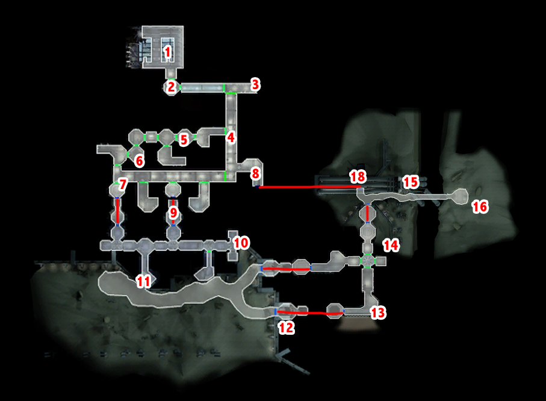

# Manaan - Hrakert Station

[< Previous Page](066_Tatooine.md)
| [Back to the Index](./000_Index.md)
| [Next Page >](./070_Leviathan.md)

- Take Bastila + T3
- Transit back to the Embassy
- Take the back door -> submarine
- SAVE

## Hrakert Station

- Repair parts needed : 5 + 5 - 3 - 3 = 4 -> 10 on XBox
- Spikes needed ? 0 - 2 -> 14 on XBox (T3 is overpowered lol)

- 1
    - Loot
- 2 
- Open door -> Mercenary
	- Why? What happened?
	- **I have to find the Star Map.**
	- The Selkath?
	- Let's get you back to the surface.
	- Wait here while I go into the station.
	- You call yourself a mercenary?
- 3
- Go to the computer -> T3 (SAVE)
	- **Central Storage** -> Gas
	- **West Storage** -> Gas
	- Don’t corrupt droid -> no XP -> items lost and kind of useless
	- **Security Room** -> Deactivate Shield on Sentry Droid -> 180PX
- 4
	- Kill droids
	- On the left -> EXIT door
	- Deadly mine -> equip -> get
	- Footlocker
	- Go door -> sealed from other side (18)
	- A droid can be repaired -> LATER
	- Go back to 4
	- Kill 2 Selkath -> Get Master Jedi Robe + Crystal + 3 parts
- 5
	- Repair droid (5parts (8left on XBox) +1170PX)
	- Kill droids next room -> shield -> bastila use destroy droid
	- Suivre droid -> kill the last droid
	- Go back door on the right -> DEADLY MINE -> coffre avec anti requin + datapad
- 6
	- Loot (locked -> T3)
	- Crazy man in closet
		- I'm Name and I've been sent by the Republic to investigate what's happened here.
		- What made the Selkath insane?
		- [Persuade] Come out - we'll protect you from the Selkath. -> Always fail
		- If you don't come out, I'll just leave you in there.
	- Loot everywhere
	- Next room -> mine near chest -> again anti shark device + memo scientist
	- **SAVE HERE** -> the droid can walk here
	- Next -> corridor -> see on the left -> droids -> send T3 in solo mode
	- SAVE 
        - -> attention aux 2 mines -> mettre Awarness a fond avec Bastila and PC
        - Ouvrir la porte avec le T3 -> locked -> droid juste derrière 
        - Avancer avec Revan 1er droid -> contrôler B pour ne pas marcher sur les mines !! -> 2nd droid
        - Déminage -> commencer par la mine vers T3 et le droid réparé -> sinon le droid réparer va marcher dessus
        - Disable solo mode
	- Rejoindre T3 -> salle avec les Selkath -> kill loot
	- faire les salles dans l’ordre (near T3 first)
		- 1 ere -> 5 Selkaths
		- 2nd -> Mine
		- 3rd -> Locked
		- 4th -> Mine + Selkath -> Solo mode !!!
		- Go back to 2!
    - Go outside

## Underwater

- Left 
	- Door -> locked
	- Footlocker -> 2 mines in it
- Meet the guy
	- Who are you?
	- What are you doing in the underwater section of the facility?
	- You wait here - I'll go check it out.
- Follow him -> nothing to loot around
- Kill the fishs
- Enter ther room -> kill -> loot -> nerve amplifier
- Take the more far door (right) -> better -> gas mask
- SAVE -> XBox crashing... -> mod among man26_*.dlg probably "exit"

# Facility 2

- Kill Zelkath behind the mine
- Get mine loot
- Breath mask -> republic soldier
- Meet guys en face -> will try to kill you (1spike)
- Take breath mask -> go to console -> abort
	- Calm down... everything will be okay.
	- **You tried to kill me!**
	- How about I ask the questions.
	- What was the Republic doing here?
	- Did this have something to do with a Star Map?
	- What happened?
	- **Turned on you?**
	- **And no one knew about this thing?**
	- **I have to get to the kolto machinery.**
	- So what can I do about it?
	- What does this compound do?
	- What else could I do?
	- OK. I'll vent the toxin into the Rift to kill the giant shark.
	- **I am not so sure...**
	- I will try to destroy the harvesting machine.
- Go left -> kill Selkath -> WARNING 2 MINES!!! -> TAKE EQUIPMENT -> level up
- Go right -> loot
- Retalk ? NO -> bug
- Go outside

## Manaan Star Map

- Kill 2 Firaxan
- Computer
	- Access fuel tank pressure control.
	- Display pressure status.
	- Fill container pod.
	- Transfer from container to injector.
	- Dump injector pod.
	- Transfer from container to injector.
	- Fill container pod.
	- Transfer from container to injector.
- 1500PX
- Star map
- Go back -> take the door on the right

## Back to Surface

- Sith Lord happened !
- Darth Bandon -> the guy who killed Trask Hulgo at the beginning of the game !!!!
	- **How did you get down here? -> good infos !**
	- You were on the Endar Spire! You killed Trask. You'll pay for that! -> not on Xbox ?
		- You're Malak's apprentice? Can't say I'm impressed. -> else
- Take belt -> immunity mind affect -> found underwater
- Take double LS + armor

- Take ship
- Republic talk
	- **The Selkath went insane.**
	- They killed almost everyone on the Station.
	- Your construction woke something up.
	- A gigantic firaxan shark that drove all the Selkath insane.
	- **A few scientists have survived.**
	- The harvesting machine was destroyed.
	- Yes I did!
- Outside -> Selkath Police
	- Very well. I will come peacefully.
	- …
	- The explosions were at the research station both our governments set up there.
	- **The entire station had been driven mad.**
	- The machinery had woken up a giant firaxan shark. // or similar…
	- I destroyed the machinery to save it.
- Go to the bar -> Nilko Bwaas
	- Yes - they're sending them down to a secret base on the Hrakert Rift.
	- They couldn't. They had lost contact with the science facility.
	- They awoke a creature which fed on the kolto.
	- The creature is alive.
- Replay Pazaak -> 1 time -> le mec va redire triche
- Teleport back to Ebon

## Ebon Hawk - 4th SM

- Improve -> Take now bigger red LS 
- Jolee (8/8) -> REVEAL!
	- So if you liked Kashyyyk so much, why did you want to leave?
	- I find it hard to believe you left the Wookiees just for some adventure.
	- Oh, no, not another story!
	- This is a very long story.
	- Am I supposed to be the snake?
	- **Are you saying you're frightened of me?**
	- **Thank you, Jolee. I'm glad you came.**
- Carth -> Talk
- OPTIONNAL : Make everyone look great for the next cut scene !
	- Carth -> Use armor of Bandon
- Go to Kashiik (to finish the quest)
- You will be tracked by the Leviathan!

[< Previous Page](066_Tatooine.md)
| [Back to the Index](./000_Index.md)
| [Next Page >](./070_Leviathan.md)
