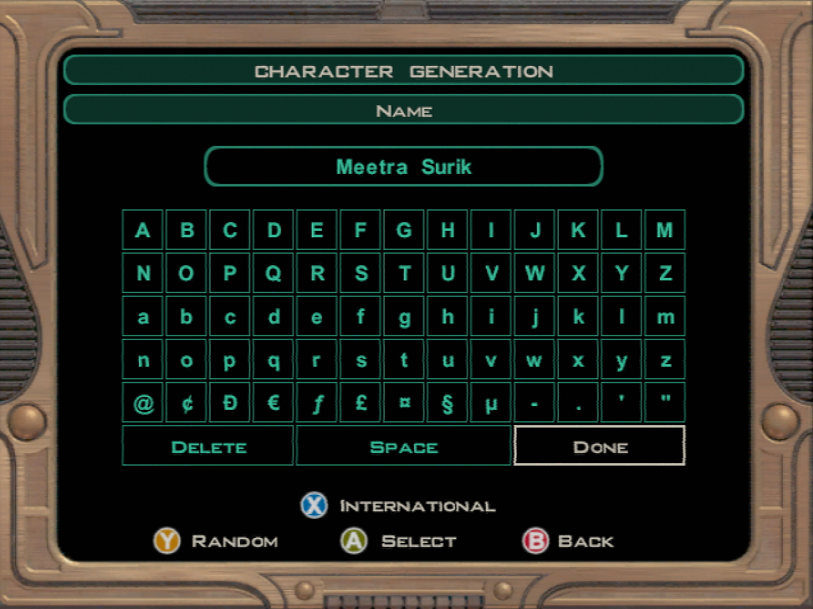

# New Game
 
[Back to the Index](./000_Index.md) | 
[Next Page >](./011_Prologue.md)

## Assumptions

This guide is (originally) intended to make a "canon" playthrough of Star Wars - Knights
of the Old Republic II. It means that main character you play is a female which will make
light-side (LS) actions to complete the story.

In the future dark-side (DS) choices as well as a male character options will be added to
this guide in parallel of the original configuration.

## Character Creation

- Let's start a new game!

> Contrary to K1, you start the game by directly selecting a "Jedi" class.
> Indeed, the character you are about to play is former Jedi who got retired
> after the war, and thus is referred as "the Exile" by the other characters.
> So technically the Exile is still a Jedi, but she(-he) has radically stopped
> using it.
> 
> While you will progress through the story, your character will slowly learn
> again to use the force.

- Create a **Female Jedi Sentinel**

- Choose **Custom Character**

- The common consensus on the appearance of the Exile is this one.

> Originally, this character appearance has blond hair but as she is described
> in the Revan Novel, we've applied a mod to match the official version :).

- Here are the **Attributes**:

> All the stats are precisely followed in the Excel files [here](../leveling/Kotor2_Leveling_v2.xlsx).
> As it is the first level, you can also refer to those screenshot. (careful, they could be outdated!!)

- Here are the **Skills**:

- Here is the selected **Feat**:

- The Canon name of the Exile is **Meetra Surik**.

> However you can put any name you want :) The name does not affect the game.

- You're now ready to start the game :D

[Back to the Index](./000_Index.md) |
[Next Page >](./011_Prologue.md)
