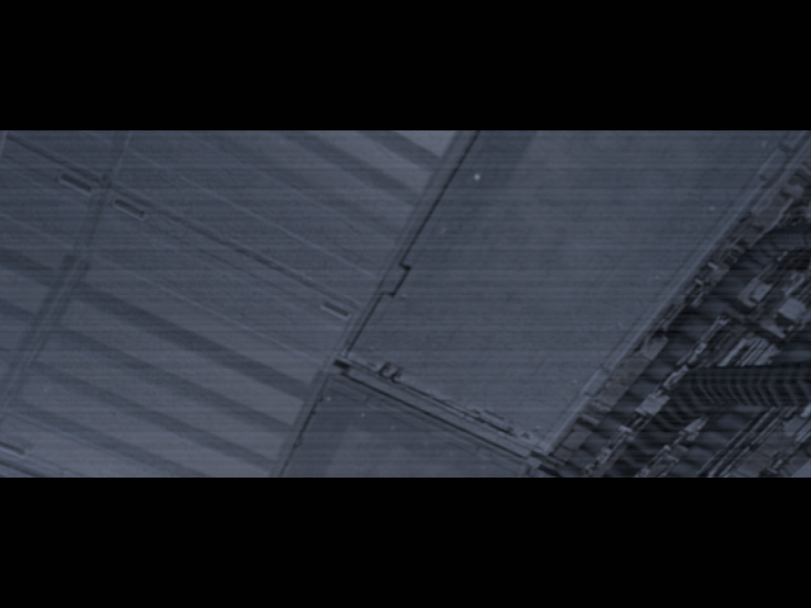

# Prologue

[< Previous Page](../00_Misc/010_CharacterCreation.md) |
[Back to the Index](../index.md) |
[Next Page >](02_Prologue.md)

## Traditional Opening


```text
THE SITH LORDS

It is a perilous time for the
galaxy. A brutal civil war has
all but destroyed the Jedi
Order, leaving the ailing
Republic on the verge of collapse.

Amid the turmoil, the evil
Sith have spread across the
galaxy, hunting down and
destroying the remaining
Jedi Knights.

Narrowly escaping a deadly
Sith ambush, the last known
Jedi clings to life aboard a
battered freighter near the
ravaged world of Peragus....
```

Those paragraphs are actually pretty interesting since at this moment of the game,
you don't actually have all the clues necessary to understand its meaning properly.
 
This is why it will be discussed while making a rundown of the beginning of the game a bit later,
after the first planet (Peragus) will be done.


You recognize the **Ebon Hawk** from the first game! But you can see its drifting in a straight line, 
with a damaged part: the garage.


Then you realize the ship is drifting toward an asteroid cluster which have been scattered
around because of the explosion of the planet you see on the right: **Peragus**.

Peragus is actually a fuel-soaked planet that exploded due to a mistake made by the mining
colony. The colony is now attempting to extract the fuel directly on the asteroids.




You wake up in the Ebon Hawk as the infamous droid **T3-M4** who was already present in K1!


Most of its crew actually means this old woman and the Exile. The other members of the ship
are all droids.


One of the objectives of T3-M4 will be to treat the injuries of the Exile which seems to be
on the verge of death...


Here you can understand that your main mission will be to **make just the necessary repairs
on the hyperdrive to reach the mining facility** on an asteroid.


- [Continue the Prologue.]

You also have the choice of skipping the prologue at any time.


Let's start the prologue!

[< Previous Page](../00_Misc/010_CharacterCreation.md) |
[Back to the Index](../index.md) |
[Next Page >](02_Prologue.md)
