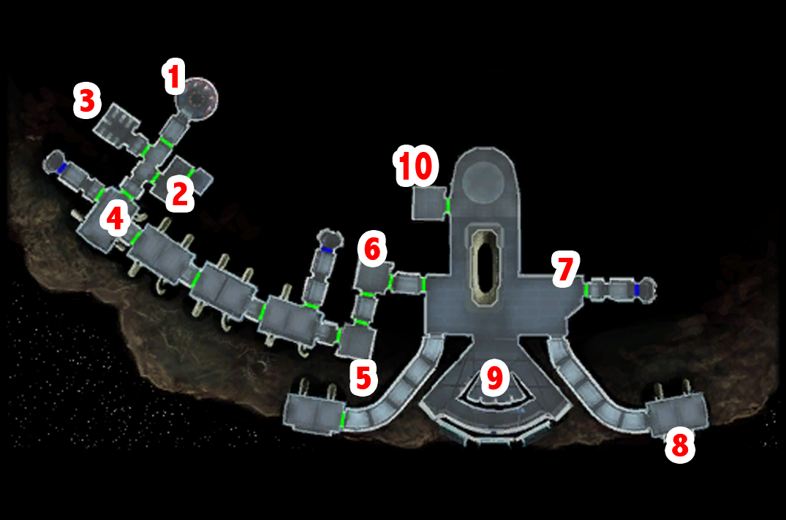

# Peragus - Waking up

[< Previous Page](../01_Prologue/04_Prologue.md) |
[Back to the Index](../index.md) |
[Next Page >](./02_Peragus.md)


## Waking up from your coma

> "Link... Open your eyes..." (cf. botw)

## The route



<details>
<summary><b>Best dropped items summary</b></summary>

```txt
  - Sonic Discharge Cell (u_m_cell_04)
  - Droid Optimized Interface (d_interface_01)
  - Agrinium Grip (u_m_grip_01)
```
</details>

## Walkthrough

- Kreia (to REVIEW)
  - I thought you were dead.
  - A little disoriented... was it your voice I heard in the kolto tank?
  - Enough with the false concern - what do you want?
  - I'm the one asking the questions. How did I get here?
  - If you think I'm a Jedi, you're mistaken.
  - That is no business of yours.
  - All right - what's going on? How did we get here?
  - Care to explain why you're in such a hurry?
  - [Awareness] You seem nervous, worried. Is something wrong?
  - We'll see. There's got to be someone left alive around here.
  - **[Persuade] The patients in the medical bay were killed with a lethal dose of sedatives. Know anything about that?**
  - I wasn't. I got the same dose, but I survived for some reason.
  - You seem to know a lot about Jedi techniques.
  - And maybe when I return you'll actually answer my question.
  - **I'll return soon to make sure you're all right. (PCL)**

- Test the emergency exit -> Kreia talk
  - Kreia?
- Kreia -> droids
  - Kreia? Wh-?


- Kill all droids
- Equip belt
- Kill all droids in admin level execpt the one near the elevator of the fuel depot
- Deactivate droids
- See the one you didnt kill
  - [Computer] Examine the unit's behavior core.
  - [Computer] Check last received commands.
  - [Computer] Switch mining protocol to defend organics.
  - [Repair] Scavenge the mining droid for spare components.
- +50 PX + comp


- Atton
  - I'd keep those eyes up, and tell me who you are.
  - Care to explain why you're locked up?
  - What is this place?
  - Blowing yourself up?
  - Peragus II?
  - This facility's deserted. What happened?
  - There's a bounty on captured Jedi? Why?
  - What's the Exchange?
  - Why would they offer a bounty on Jedi?
  - Did the Exchange wipe them all out?
  - I had heard rumors of a war - but a war between Jedi?
  - I've been... away since the Mandalorian Wars.
  - I was led to believe that Revan saved the Jedi - and the Republic.
  - How long have you been in that cage? Revan was a man, not a woman.
  - I had some more questions for you.
  - Don't you know what happened to them?
  - [Persuade] Tell me your plan, and we can go from there.
  - [Persuade] One thing first... the patients in the medical bay were killed with a lethal dose of sedatives. Know anything about that?
  - Wanted to know if you knew anything - and you don't.
  - I trust you. And if we work together, we may be able to get out of this mess.
  - Alright let's go.
  - ...
  - Sounds like you're about to tell me something I don't want to hear.
  - [Repair] That wouldn't be standard procedure in an emergency lockdown.
  - There must be some way to end the lockdown from here.
  - Can we contact the miners?
  - Let's see if we can try and reach someone on the comm.


[< Previous Page](../01_Prologue/04_Prologue.md) |
[Back to the Index](../index.md) |
[Next Page >](./02_Peragus.md)
 
