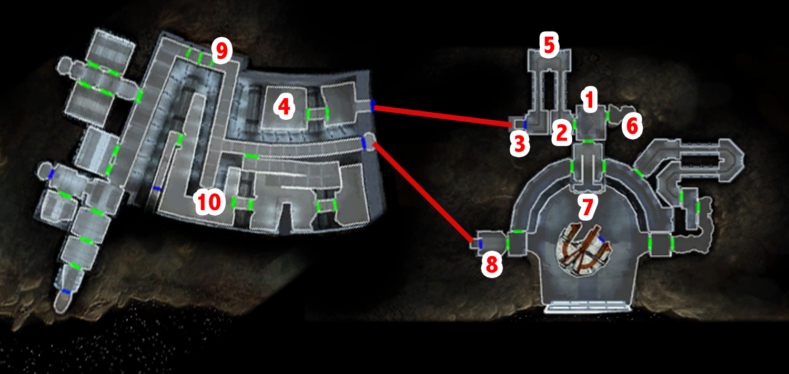
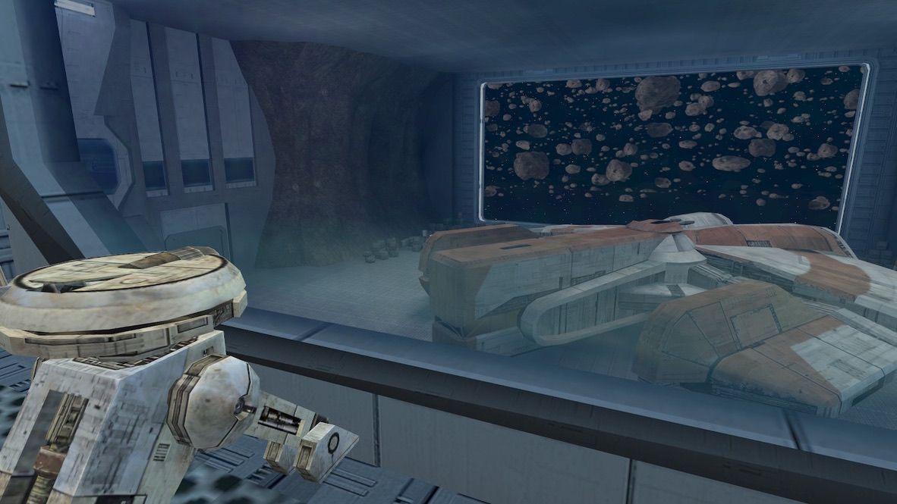

# Peragus - T3-M4 comes to the rescue

[< Previous Page](./01_Peragus.md) |
[Back to the Index](../index.md) |
[Next Page >](./03_Peragus.md)

- Admin console
  - Check administration logs.
    - ...
  - Access comm system.
  - Dormitories.
  - Hangar Bay 25.
  - Try to access the dormitories.
  - Can you read me?
- **T3-M4 communication**
  - Are you operational?
  - We're trapped up on the administration level. Can you unlock the turbolifts?
  - Is there some other way out of here besides the turbolifts?
  - I'd rather risk it than be trapped up here.

- Reequip from the prologue
- Loot room
- South door
- The Ebon Hawk!

- Computer
  - [Repair] Replace the missing parts. [1 Part(s)]
  - Access hangar logs.
    - Access Log 253-12: Contraband
    - Access Log 253-14: Maintenance Violation
    - Access Log 253-17: Navicomputer Lock
    - **Access docking and takeoff procedures.**
    - Transmit asteroid orbital drift charts to Ebon Hawk navicomputer.
    - Download asteroid orbital drift charts.
    - Return to main functions.
  - Access remote camera controls.
    - Hangar 25.
    - Main Cargo Hold.
      - [Computer] Check 3C-FD status.
    - Security Cargo Room.
    - Decontamination Area.
    - Return to main functions.
  - Access comm system.
    - [Repair] Run diagnostic on damaged systems.
    - Return to main functions.
- + 50 XP
- Go to the down ramp -> kill droids
- SAVE

- Load Fuel depot map
- Kill + loot
- Datapad: Peragus Depot Survey

> ...purged the fuel lines, and I found three sonic charges attached *inside.*
> I checked the work logs, and only droids have been in the area.
> I tried to contact security as soon as I found the explosives,
> but I can't seem to get a signal through.
> 
> I've removed the remote detonators, and I'll keep the explosives on me until
> I can put them in a secure hold in the hangar.

- Back -> kill the droids
  - Use flame thrower -> one shot
- Open the security door that goes to 6 -> sonic mine
- Loot + 3C-FD
- Back to the computer
  - Access emergency control commands.
  - [Repair] Run diagnostic on damaged systems.
  - [Computer] Check status of emergency sub-systems.
  - [Computer] Open blast door to the fuel depot. [1 Spike(s)]
    - DONT OPEN HANGAR 25 -> waist of Spike
- Leave -> kill 5 droids + loot
- Fuel depot -> console (SAVE)
    - Access remote cameras.
        - See all
    - Call up system log.
    - Call up emergency system schematics.
    - Open emergency hatch on Peragus Administration Level.
    - Logout

[< Previous Page](./01_Peragus.md) |
[Back to the Index](../index.md) |
[Next Page >](./03_Peragus.md)