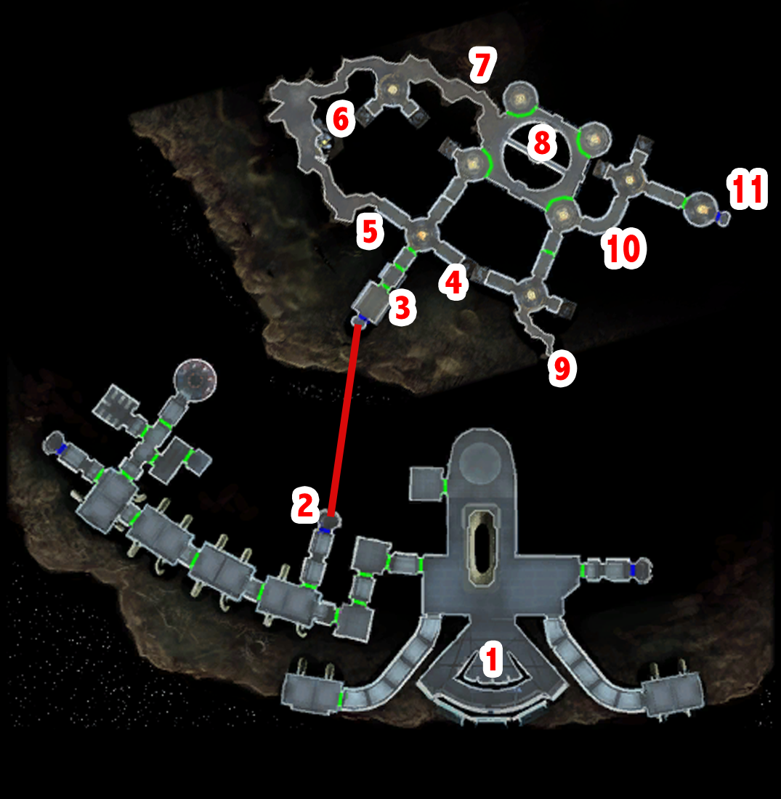

# Peragus - Mining galleries

- Atton
    - **No tougher than enduring your false sympathy while you're staring at my chest.**
    - It looks like it. But it's strange he didn't contact us on the comm.
    - The turbolifts are locked down manually, so I had him open the emergency hatch.
    - **If it's dangerous in those tunnels, then you're the one going, not me.**
    - You're right, I'll take the risk. No sense in both of us risking our lives.
    - Got it. See you soon.

Level 3 -> leave 3 skill points so next level we level up "Repair"

- Mining zone
    - Atton
        - **Yes... for a minute, I thought you and Kreia were telepathic.**
        - I'll be careful, then. If you detect anything, signal me.
    - Loot emergency supply
        - Looks like some mining gear - and a uniform.
        - There's some kind of mining energy shield in this crate, too.
        - How comforting. Tell me how it works.
        - Understood. Anything else?
        - **Can I sneak by them?**
        - **And if they spot me?**
        - Shielded?
        - I'll do that. Anything else?
    - Spot mines
        - Why are there so many charges down here?
        - Understood. <FullName> out. [End Dialog]
    - Loot mines + droids
    - Sneak by every droid - don't loot the mines YET - XP optimization
    - Heat tunnel
        - I'll do that. [End Dialog]
    - Near end tunnel
        - There aren't just mining droids down here - there are sensor balls, too.
        - Any chance of sneaking by the droids ahead?
    - Raise temperature of tunels
        - Call up droid command functions.
          - Check droid schematics.
          - [Computer] Raise the temperature in the tunnels to blind droid thermal sensors. (0 spike(s))
          - Continue.
          - Return to main functions.
        - Access camera functions.
          - Unidentified Holorecord Camera: Work Claim 12-34.
          - Return to main functions.
        - Access fuel containment functions.
          - Shut down containment fields.
          - Log out. [End Dialog]
    - Kill every droid on your way back to the begining
    - + Get all mines once leveled up
    - Repair droid after the level up! 9 parts needed -> very tight
      - Reactivate the droid. (1 repair part)
      - Optimize droid's weaponry. (2 repair part(s))
      - Optimize droid's targeting systems. (2 repair part(s))
      - Engage droid in patrol mode. (4 repair part(s))
    - +200PX
    - Trigger
        - What kind of readings?
        - How much time do I have?
    - kill all -> leave

[< Previous Page](../02_Peragus.md) |
[Back to the Index](../index.md) |
[Next Page >](./04_Peragus.md)
