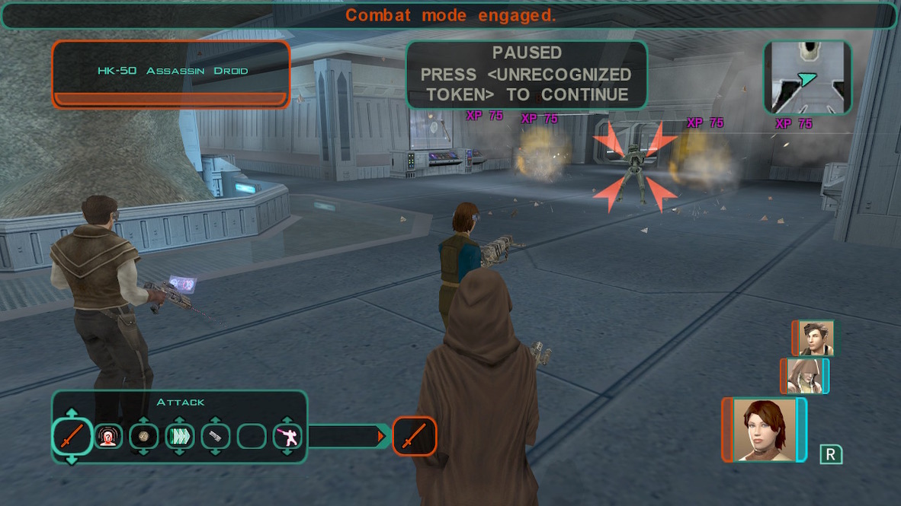

# Peragus - Preparation for the next step

[< Previous Page](./05_Peragus.md) |
[Back to the Index](../index.md) |
[Next Page >](./07_Peragus.md)

- Back to admin
- Kreia joins
  - **Enemy?**
  - **Wait - who is this enemy?**
  - Then let's go.
- Level up Kreia
- Siths are following you (don't attack yet)
- HK-50
  - Atton, there's no time to explain - grab a weapon, and follow me.
  - **No, you were clear, I just don't listen to assassin droids.**
  - **Whatever you say, "murder" still means "murder" to me.**
  - So you mimicked the maintenance officer's voice to control the droids and kill all the miners in the medical bay?
  - And so you ordered the mining droids to kill me?
  - **Why did you want to capture me?**
  - You found me. Obviously I didn't do a good job.
  - **Who is this client of yours?**
  - So what now? Are you going to kill me?
  - Enough of this - you won't take me without a fight.

- Prepare for the Harbinger
- Go to workbench -> equip skill enhanced on characters -> found Czerka utiliy belt
    - Create Vibrosword (with Exile) -> For Exile
    - Enhanced Energy Cell (Exile, Computer 8, 4 Components) -> For Exile
    - Scout Enforcer (Exile, Repair 11, 25 Components) -> For Kreia
    - Blaster Riffle (Exile, Repair 7, 5 Components) -> For Atton
    - Moderate Devaronian Edge (Kreia, Stealth 12, 20 Components) -> For Exile
    - Nagai Grip (Kreia, Stealth 12, 20 Components)
    - Biorestorative Underlay Mark II (Kreia, Treat Injury 9, 12 Components)
- Lab
  - Implants? next section is hard

[< Previous Page](./05_Peragus.md) |
[Back to the Index](../index.md) |
[Next Page >](./07_Peragus.md)
