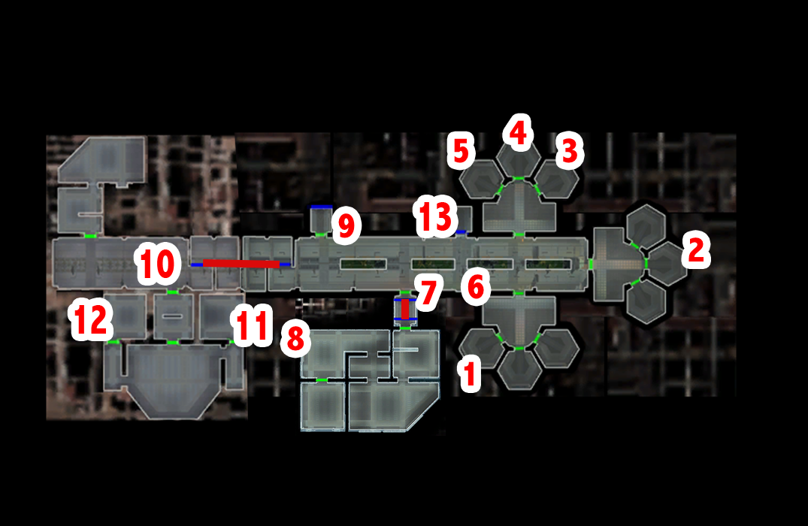

# Telos - Under house arrest

[< Previous Page](./01_Telos.md) |
[Back to the Index](../index.md) |
[Next Page >](./03_Telos.md)

- Leave your appartment
- Loot all appartments in the complex
- Dobo -> inventory
- Civilian appear (203tel.mod/civilian.dlg)
    - Just looking around.
    - Sorry, I just figured...
    - When you put it that way...
    - I'll be going now. [End Dialog]
- Harra
  - Who are you?
  - What do you do here?
  - Let me guess - you have a gambling debt you must pay off.
  - Then what's the problem?
  - But you did.
  - Of course, you did make her a slave.
  - What is the price for her?
  - I'll see what I can do.
- Terminal -> TP
- Enter Czerka office (Czerka Offices 209tel.mod)
- B-4D4
  - I'm here to see Jana Lorso.
  - What can you tell me about Czerka?
- Talk to the mercenaries and Czerka employees
- Jana Lorso
  - What do you have to say about the Ithorians' complaints?
  - The planet's own resources?
  - Very well, what can I do?
  - Wait, you want me to steal the Ithorians' droid?
  - If you want me to do this, it'll cost you.
  - [Persuade] You'll have to do better than that.
  - I'll have to think about it.

> DS alternative: if possible?
>
> Special discussion with criminals if (a_setm1status == 5)
> - Lorso start conversation (should be the first time you speak) (c_mission1status == 3) -> "Excellent, I see my faith in your abilities was well founded." -> a_setm1status -> 5
> - c_mission1status -> 3 -> should be a_setm1status == 3?
>
> Special discussion with criminals

- Go toward the Bumani Exchange Corp.
  - I'll be going now
- To residential west -> Ithorians
- Transit system
- Enter Ithorian building
- Ithorian (204TEL_dlg.erf/204ithr.dlg)
  - What is this place?
  - What can you tell me about the restoration process?
  - Moza sent me to speak with Chodo Habat.
- Left -> plants -> useful later (204TEL_dlg.erf/ithplant.dlg)
  - What do you do here?
  - I'll be going now. [End Dialog]
- Other side -> Moza and Chodo
- Moza
  - What do you do here?
  - What will you do when your project is completed?
  - I'll be going now. [End Dialog]
- Chodo
  - But you did not see fit to visit me in person.
  - You said you "sensed" my arrival?
  - Moza said you could "heal" me. What did he mean?
    - NO -> I once felt the Force, yes... and it is slowly returning. -> repetition with Kreia
  - I don't want to talk about this. What do you want from me?
  - I'd like to hear your perspective on the matter.
  - Why would the Telosian government allow this to happen?
  - What do you intend to do?
  - Vanished? How?
  - What would I get out of this?
  - Healing? What do you mean?
  - I was thinking of something more... substantial.
  - I'll help you.
  - I'll return with the droid intelligence. [End Dialog]
- Entertainment module

[< Previous Page](./01_Telos.md) |
[Back to the Index](../index.md) |
[Next Page >](./03_Telos.md)
